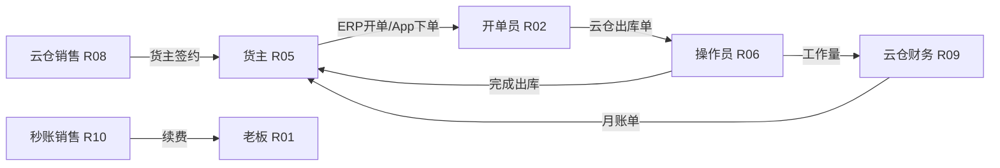

# 用户角色 — 三系统

> **文档层级**：L0 全局上下文（影响分析：谁在用、什么端、什么权限边界）
> **读者**：PRD Agent、产品经理
> **证据源**：MCP v1.4.5-1/4、v1.3.7-2、v1.3.9-1；`员工权限.md`；`V5.4.0`；`系统定位-三系统.md`
> **模块命名**：见 `_模块词典.md`

---

## 目录

1. [角色总览与协作关系](#1-角色总览与协作关系)
2. [秒账 ERP 角色](#2-秒账-erp-角色)
3. [货主（跨三系统）](#3-货主跨三系统)
4. [WMS 角色](#4-wms-角色)
5. [BSS 角色](#5-bss-角色)
6. [角色 × 系统 × 端矩阵](#6-角色--系统--端矩阵)
7. [身份与账号机制](#7-身份与账号机制)
8. [Agent 使用说明](#8-agent-使用说明)

---

## 1. 角色总览与协作关系

### 1.1 角色索引表

| ID | 角色 | 主系统 | 常用端 | 核心目标 | 与谁协作 |
|----|------|--------|--------|----------|----------|
| R01 | 商户老板/店长 | ERP | PC/App | 经营决策、配权限、看报表 | R02/R04、R10 |
| R02 | 开单员/业务员 | ERP | PC/App | 销售开单、送货、收款 | R03、R06 |
| R03 | 采购/仓管（商户侧） | ERP | PC/App | 采购入云仓、调拨、查库存 | R06 |
| R04 | 商户财务 | ERP | PC/App | 收付款、对账、费用报表 | R01、R05 |
| R05 | 货主 | ERP+WMS+BSS | 秒账App/货主App/小程序 | 看库存账单、付月账、跟进度 | R08/R09 |
| R06 | 库内操作员 | WMS | PDA/App/车载 | 执行上架/拣货/绑托盘 | R07 |
| R07 | 仓库主管/组长 | WMS | PC/App/PDA | 审单、排产、最后一票协调 | R06、R09 |
| R08 | 云仓销售/销售主管 | BSS | 运营 PC/App | 拓展货主、维护签约 | R05、R09 |
| R09 | 云仓财务/管理员 | BSS+WMS | 运营 PC/App | 月账单审批重算、结账 | R08、R07 |
| R10 | 秒账销售/运营 | BSS | 秒账 BSS PC/App | 获客、续费、订单 | R01 |
| R11 | 实施/客服 | ERP+BSS+WMS | 多端 | 解释状态、协助配置 | 全部 |
| R12 | 劳务人员/劳务组长 | WMS | PDA | 贴标返工扫码作业 | R07 |
| R13 | 投资人/分店角色 | ERP | PC/App | 查看为主（权限受限） | R01 |

### 1.2 典型协作链

---

## 2. 秒账 ERP 角色

### R01 商户老板 / 店长

| 维度 | 内容 |
|------|------|
| **用户画像** | 小商贸老板；关心利润、欠款、云仓费用；不一定亲自开单 |
| **核心目标** | 控制经营模式（仅秒账/仅云仓/混合）；购买增值服务；看汇总报表 |
| **典型任务** | 商户设置→行业属性/秒账服务/云仓模式；看销售欠款汇总、净利润；BSS 购买模板/签章 |
| **使用端** | PC（配置）、App（看数） |
| **检索路径** | 报表 → 销售欠款汇总；商户设置 → 秒账服务 → 秒账云仓 |
| **权限边界** | 可编辑商户设置；投资人等多为查看（`员工权限.md`） |
| **云仓相关** | 切换「仅云仓模式」强制全员退出；互斥能力不可与云仓同开 |
| **证据** | `V5.4.0` §运营模式；`员工权限.md` |

### R02 开单员 / 业务员

| 维度 | 内容 |
|------|------|
| **用户画像** | 档口/门店日常开单；高频矩阵开单、扫码开单 |
| **核心目标** | 快速开单、送货、对账收款；云仓仓自动/手动触发出库 |
| **典型任务** | 销售单/矩阵开单；送货触发云仓出库（自动模式）；客户对账 |
| **使用端** | PC/App（**Pad 不可用**若已签云仓） |
| **检索路径** | 销售单 → 客户 → 库存；云仓进度按钮 → 云仓出库单列表 |
| **权限边界** | 超级业务员/业务员角色差异见 `员工权限.md`；云仓专属：新建/操作云仓出/入库单（`V5.4.0` §1.3） |
| **云仓约束** | 账期超限 → 无法生成云仓出库（自动模式保存也拦）；手动模式可先保存业务单 |
| **证据** | MCP v1.3.9-1；`V4.9.0` |

### R03 采购 / 仓管（商户侧）

| 维度 | 内容 |
|------|------|
| **用户画像** | 负责进货、调拨；云仓场景下发入库意图 |
| **核心目标** | 采购收货入云仓；调拨/加工走云仓；查云仓库存 |
| **典型任务** | 采购单→云仓入库单；调拨单云仓调出/调入；手工创建云仓单（手动模式） |
| **检索路径** | 采购单 → 云仓入库单；库存 → 云仓库存 |
| **云仓约束** | 同 R02 账期规则；加工单出库产品选云仓仓时校验 |

### R04 商户财务

| 维度 | 内容 |
|------|------|
| **用户画像** | 商户侧财务；不操作 PDA |
| **核心目标** | 收付款核销；客户/供应商对账；云仓费用查看 |
| **典型任务** | 收款单/付款单；客户对账单；云仓费用表；月账单支付（秒账端） |
| **权限边界** | 一般不操作 WMS/BSS 后台；月账单支付在秒账/App |
| **证据** | `秒账核心功能.md` §报表 |

### R13 投资人 / 分店相关角色

| 维度 | 内容 |
|------|------|
| **定位** | 分店模式下投资人/分店员工；**分店与云仓互斥** |
| **权限** | 多为查看或受限编辑（`员工权限.md` 各版本） |
| **注意** | 分析分店需求时不要假设云仓能力可用 |

---

## 3. 货主（跨三系统）

### R05 货主

| 维度 | 内容 |
|------|------|
| **用户画像** | 仓储客户；可能是秒账商户（绑定同账号）或独立货主 App 用户 |
| **身份定义** | BSS **审批通过**的货主签约主体；未审批不算货主（MCP v1.4.5-4） |
| **核心目标** | 掌握库存与出入库进度；按时付月账；申请改套餐 |
| **使用端** | 秒账 App（云仓账单/套餐/部分出库）；货主 App/小程序（出库、库存、账单） |
| **典型任务** | 查云仓库存；跟出库状态；付月账单/预收款；申请下月套餐变更 |
| **检索路径** | 云仓库存 → 云仓出库单 → 月账单 |

**能力边界（端不对等）**

| 能力 | 秒账 App | 货主 App | 说明 |
|------|----------|----------|------|
| 下入库单 | ✓ | 受限/须回秒账 | `V5.4.0` 进口/非进口规则 |
| 下出库单 | ✓ | ✓ | 账期锁定则禁 |
| 看库存 | ✓ | ✓ | 账期锁定则货主 App 禁 |
| 付月账单 | ✓ | ✓ | 三端展示同步 |
| 质检菜单 | — | 可屏蔽 | `V5.4.0` |

**账期状态对 R05 的影响**（MCP v1.3.9-1）

| 状态 | 标识 | 能力影响 |
|------|------|----------|
| 正常 | 无 | 全功能 |
| 即将到期 | 距到期 <3 天 | 提醒；功能仍可用 |
| 已过账期 | 已审核未付超账期 | **禁**新建出库、**禁**看库存 |
| 临时解锁 | 销售/管理员解锁 N 天 | 恢复上述能力 |

**证据**：`V5.4.0`；MCP v1.3.3-2 套餐自助变更；v1.3.9-1

---

## 4. WMS 角色

### R06 库内操作员

| 维度 | 内容 |
|------|------|
| **用户画像** | 仓库一线；PDA 扫码为主；不关心计费公式 |
| **核心目标** | 按时完成指令；准确上架/拣货/复核 |
| **使用端** | PDA、WMS App、车载 |
| **典型任务** | 指令列表执行；托盘详情扫码；快捷上架/拣货；待出库区确认 |
| **检索路径** | 指令列表 → 出库单/入库单 → 托盘详情 |
| **权限边界** | 无货主签约/月账单编辑权；批量操作可能需授权码（MCP v3.0.1-23） |
| **不关心** | BSS 套餐、ERP 商户设置、月账单审批 |
| **证据** | MCP 模块：指令列表、托盘详情 |

### R07 仓库主管 / 组长

| 维度 | 内容 |
|------|------|
| **用户画像** | 排产与异常处理；协调销售催账 |
| **核心目标** | 保障出库 SLA；处理最后一票货；控制优先级 |
| **使用端** | WMS PC/App + 现场 PDA |
| **典型任务** | 出库单审核/优先级；合并拣货；最后一票货结账协调；账期解锁（WMS 管理员/客服） |
| **检索路径** | WMS 首页/库存总览 → 出库单 → 指令列表 |
| **云仓关键** | 「完成出库可结账」标记 → 结束拣货前先手工结账（MCP v1.6.0-3） |
| **证据** | MCP v1.6.0-3；v3.1.2-10 出库优先级 |

### R12 劳务人员 / 劳务组长

| 维度 | 内容 |
|------|------|
| **定位** | 贴标返工外部作业人员（MCP v1.7.9-10） |
| **典型任务** | 扫码开始/完成贴标；产生劳务外包费用 |
| **权限** | 仅贴标相关 PDA 流程；不涉及完整审单权限 |

---

## 5. BSS 角色

### R08 云仓销售 / 销售主管（四级～一级）

| 维度 | 内容 |
|------|------|
| **用户画像** | 拓展仓储客户；跟进签约、催账、维护关系 |
| **登录要求** | **云仓身份**员工；否则无法登录运营系统 |
| **核心目标** | 意向→预售→货主签约；维护跟进销售；账期解锁 |
| **典型任务** | 新建货主签约并走审批；绑定货主微信；跟月账单；申请套餐变更 |
| **数据范围** | 销售：跟进销售=自己；销售主管：自己+下级；管理员：全部（MCP v1.4.5-4） |
| **审批权限** | 销售主管可审批下级发起的签约；可跳过下级；管理员可跳过全部 |
| **检索路径** | 货主签约 → 月账单 → 消息中心 |
| **证据** | MCP v1.4.5-4、v1.3.7-2 销售角色与业绩 |

**销售主管级别与审批链**

| 发起人 | 审批链（简化） |
|--------|----------------|
| 销售人员 | 直属上级(销售主管)...→ 管理员 |
| 非一级销售主管 | 上级销售主管链 → 管理员 |
| 一级销售主管 | 管理员 |
| 管理员 | 自动通过 |

### R09 云仓财务 / 管理员

| 维度 | 内容 |
|------|------|
| **用户画像** | 仓储侧财务；掌控账单审批与结账 |
| **核心目标** | 月账单准确、及时收款、财务结账 |
| **典型任务** | 月账单审批/重算/改优惠；财务结账；预收款退款；坏账标记；最后一票货重算督促 |
| **与 WMS 分工** | WMS **仅查看**月账单；**重算/审批在 BSS**（MCP v1.4.5-5） |
| **特殊能力** | 新建上期调整月账单；重算优惠（流转率/sku 档位变更）；异步重算中禁收款 |
| **检索路径** | 月账单 → 日账单 → 财务报表 → 财务结账 |
| **证据** | MCP v1.4.5-5、v1.6.5-1、v1.6.7-2、v1.7.5-15 |

### R10 秒账销售 / 运营

| 维度 | 内容 |
|------|------|
| **用户画像** | 秒账 SaaS 销售；与云仓销售**身份分离**（可同人双身份） |
| **登录要求** | **秒账身份**；登录秒账 BSS PC/App |
| **核心目标** | 商户续费、模板/VIP 销售、试用跟进 |
| **典型任务** | 用户管理、待续费；订单；向客户收款；退款审批 |
| **与 ERP** | 购买成功 → 商户设置/打印/签章等到期回写 |
| **与云仓** | 弱关联；秒账用户申请云仓 → BSS 待审核列表（`V5.4.0`） |
| **证据** | MCP v1.4.5-6、v1.4.5-8、v1.6.6 |

### R11 实施 / 客服

| 维度 | 内容 |
|------|------|
| **定位** | 跨三系统解释；协助行业配置与异常 |
| **典型任务** | ERP 商户设置；解释 WMS 状态/云仓消息；BSS 账期临时解锁；协助仅云仓模式切换 |
| **解锁权限** | 运营销售(自己货主)、管理员、WMS 管理员/客服（MCP v1.3.9-1） |

---

## 6. 角色 × 系统 × 端矩阵

| 角色 | ERP PC | ERP App | WMS PC | PDA | 货主 App | 运营 BSS | 秒账 BSS |
|------|--------|---------|--------|-----|----------|----------|----------|
| R01 老板 | ● | ● | ○ | ○ | ○ | ○ | ○ |
| R02 开单员 | ● | ● | ○ | ○ | ○ | ○ | ○ |
| R05 货主 | ● | ● | ○ | ○ | ● | ○ | ○ |
| R06 操作员 | ○ | ○ | ○ | ● | ○ | ○ | ○ |
| R07 主管 | ○ | ● | ● | ● | ○ | ○ | ○ |
| R08 云仓销售 | ○ | ○ | ○ | ○ | ○ | ● | ○ |
| R09 云仓财务 | ○ | ○ | ● | ○ | ○ | ● | ○ |
| R10 秒账销售 | ○ | ○ | ○ | ○ | ○ | ○ | ● |

图例：● 主用端　○ 一般不用或只读

---

## 7. 身份与账号机制

| 机制 | 规则 | 影响分析要点 | 证据 |
|------|------|-------------|------|
| **员工双身份** | 同一员工可有秒账身份 + 云仓身份；运营↔秒账 BSS 员工双向同步 | 改员工/角色 → 强制退出、货主交接 | MCP v1.4.5-1 |
| **货主绑定秒账** | BSS「与同账号秒账绑定」；**审批通过后**才生效 | 待审批时 ERP 无云仓功能 | MCP v1.4.5-4 |
| **账号合并** | 货主 App 注册可与秒账同用户名合并 | 身份统一后账单/库存同视图 | MCP v1.4.3-13 |
| **三方标识** | 货主列表显示秒账/网店管家标记 | 第三方接入走 API 账期校验 | MCP v1.4.5-4 |
| **ERP 角色权限** | 字段/按钮/数据范围 | 纯 ERP 需求读 `员工权限.md` | 本地 L3 |

---

## 8. Agent 使用说明

1. **先映射角色 ID**：用户说「销售」→ 区分 R02（ERP 开单）vs R08（云仓销售）vs R10（秒账销售）。
2. **货主歧义**：「货主」默认 R05；若未签约云仓则可能是 R01 普通商户。
3. **审批/账期/账单** → R08/R09 + `跨系统功能关联关系.md` CS-07～CS-14。
4. **PDA/托盘/指令** → R06/R07；不写 ERP 商户设置细则。
5. **写 PRD 场景**时引用：`角色 ID` + `用户场景矩阵.md` 场景 ID。

---

## 维护说明

- 新增 BSS/WMS 角色（如劳务）补 R 编号与 §6 矩阵
- 与 `员工权限.md` 保持 ERP 侧权限引用，不在本文复制全量权限表
