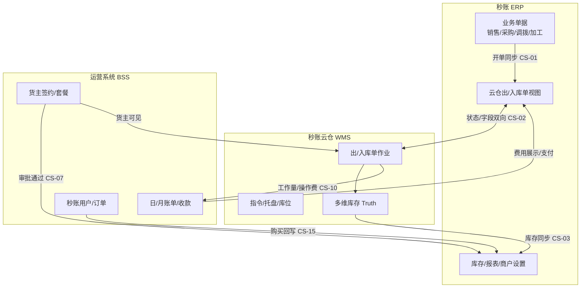
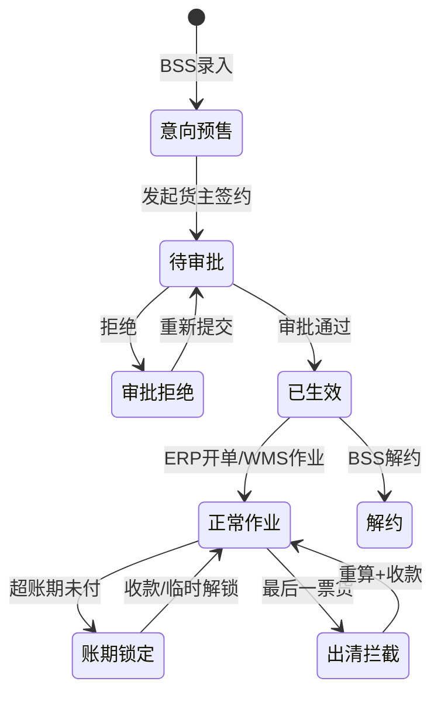

# 系统定位 — 三系统

> **文档层级**：L0 全局上下文（影响分析第 0 步）
> **读者**：PRD Agent、产品经理、影响分析 Skill
> **证据源**：`user-wmsfileserver`（1629 条 / 181 版本 / 408 模块维度）、本地 `V4.9.0` / `V5.4.0`、 `秒账核心功能.md`
> **模块命名**：统一见 `_模块词典.md`；跨系统语料优先读 `_跨系统语料索引.md`

---

## 目录

1. [三系统一句话与纽带](#1-三系统一句话与纽带)
2. [货主生命周期（三系统视角）](#2-货主生命周期三系统视角)
3. [秒账 ERP](#3-秒账-erp)
4. [秒账云仓 WMS](#4-秒账云仓-wms)
5. [运营系统 BSS](#5-运营系统-bss)
6. [跨系统数据对象与视图映射](#6-跨系统数据对象与视图映射)
7. [端能力矩阵（谁在哪能做什么）](#7-端能力矩阵谁在哪能做什么)
8. [PRD 判定 checklist](#8-prd-判定-checklist)
9. [MCP 与本地文档索引](#9-mcp-与本地文档索引)

---

## 1. 三系统一句话与纽带

| 系统 | 对外名称 | 一句话定位 | 核心 Truth |
|------|----------|------------|------------|
| **秒账 ERP** | 秒账 | 商户进销存：开单、收付款、库存视图、对客履约入口 | 业务单据与商户侧库存视图 |
| **秒账云仓 WMS** | 秒账云仓 / 两万方云仓 | 库内作业与多维库存：入出库、拣货、托盘、指令 | 实物库存与作业状态 |
| **运营系统 BSS** | 运营系统 / 秒账 BSS | 货主签约计费 + 秒账用户商业化 | 签约配置、账单审批、收款规则 |

**三系统纽带（必须同时记住）**

| 纽带 | ERP 侧 | WMS 侧 | BSS 侧 |
|------|--------|--------|--------|
| 身份 | 秒账商户账号 | WMS 货主管理 | BSS 货主签约（审批通过后生效） |
| 出入库 | `[ERP]云仓出/入库单` 视图 | `[WMS]出/入库单` 实体 | 收费项/套餐决定计费字段 |
| 库存 | 云仓可用/在途汇总 | 产品/货物/库位/托盘库存 | 日/月账单计价数据源 |
| 账单 | 云仓账单查看/支付 | 月账单只读展示 | 月账单审批/重算/收款主控 |
| 商业化 | 商户设置功能开关 | — | 秒账订单/续费/模板 |



---

## 2. 货主生命周期（三系统视角）

影响分析时，先判断需求落在生命周期的哪一段。

| 阶段 | 主系统 | 关键状态 | 未满足时的系统表现 | 证据 |
|------|--------|----------|-------------------|------|
| **L0 意向/预售** | BSS | 意向客户、预售 H5 | ERP/WMS 无货主能力 | MCP v1.4.1-1 |
| **L1 签约待审** | BSS | 货主签约「待审批」 | **不算正式货主**：无账单、WMS 不可见、无法建单、ERP 无云仓功能 | MCP v1.4.5-4 |
| **L2 签约生效** | BSS→ERP+WMS | 审批通过 | ERP 出现云仓开关；WMS 货主管理可见；可产生日/月账单 | MCP v1.4.5-4 |
| **L3 正常作业** | ERP+WMS | 开单→同步→拣货/上架 | 按开单模式 CS-01 流转 | 本地 `V4.9.0` |
| **L4 计费周期** | BSS+WMS | 日账单→月账单 | WMS 提供作业事实；BSS 审批/重算 | MCP v1.2.5-3、v1.4.5-5 |
| **L5 账期约束** | BSS | 已审核未付超账期 | 三端禁新建出库/货主禁看库存 | MCP v1.3.9-1 |
| **L6 出清/解约** | WMS+BSS | 最后一票货、解约 | 须重算/收款后才能完成出库 | MCP v1.6.0-3 |



---

## 3. 秒账 ERP

### 3.1 定位与边界

| 维度 | 负责 | 不负责 |
|------|------|--------|
| **服务对象** | 签约秒账的商户（货主若绑定秒账则同一用户名体系） | 未签约云仓的纯 WMS 货主（独立 App 注册） |
| **核心价值** | 行业化进销存、对账收付款、经营报表；云仓场景提供**单据入口与进度视图** | 库内拣货/上架/托盘绑定/指令执行 |
| **数据 Truth** | 业务单据、商户侧库存（实际/可用/在途 + 云仓可用/在途） | WMS 库位级库存；BSS 账单审批状态 |
| **接口依赖** | 调用 WMS 失败时终止操作并提示错误码（`V5.4.0`） | 不参与月账单公式定义与财务结账 |

### 3.2 三种运营模式（V5.4.0，影响功能可见性）

| 模式 | 条件 | ERP 能力 | 典型用户 |
|------|------|----------|----------|
| **仅秒账** | 未签约云仓 | 完整进销存；无云仓模块 | 纯线下仓商户 |
| **秒账+云仓** | 已签约且年费有效；未开「仅云仓模式」 | 进销存 + 云仓出/入库/库存/账单 | 自营+云仓混合 |
| **仅云仓** | 已签约云仓；手动开启或年费过期强制 | **仅**云仓相关；总店员工不可登录 | 纯仓储客户 |

**仅云仓模式要点**（`V5.4.0` §1）：
- 商户设置新增「仅云仓模式」；切换后全部账号强制退出
- 总店员工登录提示「只有老板账号才能登录」；分店若未过期可独立使用
- 年费过期且已开仅云仓 → 不可取消，须先续费

### 3.3 云仓开单模式（V4.9.0，CS-01 核心）

| 模式 | 触发时机 | 是否生成送货/收货单 | 典型单据链 |
|------|----------|---------------------|------------|
| **自动·流程一** | 保存销售/采购/退货/调拨/加工等业务单时（云仓仓+数量>0） | 是 | 业务单 → `[ERP]云仓出/入库单` → WMS |
| **自动·流程二** | 勾选「按云仓计划出入库数量通知云仓」；计划数量>0 时触发 | 销售/采购**不**生成送收货单 | 业务单 → 计划数量达阈 → 云仓单 |
| **手动** | 用户在 ERP 手工创建云仓出/入库单 | 视业务单 | 业务单 ↔ 手工云仓单 |

**跟随规则**（`V4.9.0`）：
- 复制新增读**最新**商户设置；**已生成**单据跟随**保存时**商户设置，不随后续变更
- 多商户设置模式混开时，合并送收货须拆单并提示

### 3.4 ERP 模块域（L1，来自 `秒账核心功能.md`）

| 域 | 模块 | 云仓相关触发 |
|----|------|-------------|
| 主数据 | 客户、供应商、产品 | 产品同步 WMS；云仓产品箱规不受 ERP 商户设置装箱影响（`V5.4.0` §1.2） |
| 业务单据 | 销售/采购/退货/调拨/加工/收送货 | 云仓仓行 → CS-01 |
| 云仓视图 | 云仓出/入库单、云仓库存 | 与 WMS 双向 CS-02 |
| 财务 | 收款单、付款单、报表 | 云仓费用表；月账单支付入口 |
| 配置 | 商户设置、员工权限 | 云仓开关/模式/仅云仓；云仓专属权限（`V5.4.0` §1.3） |
| 消息 | 云仓消息 | WMS 状态/异常回传 CS-05 |

### 3.5 与云仓互斥的能力（签约前/后双向）

| ERP 能力 | 与云仓关系 | 证据 |
|----------|-----------|------|
| 分店模式 | **不可同时** | `V5.4.0` |
| 布匹细码、平行多单位、SN、自定义公式 | 签约前已开 → 不可签云仓；已签云仓 → 不可再开 | `V4.9.0` |
| Pad | 已签约云仓时 **Pad 不可用** | `V4.9.0` |

### 3.6 ERP 主要客户端

| 端 | 云仓能力 | 限制 |
|----|----------|------|
| PC | 全功能 | — |
| App | 全功能含云仓账单 | — |
| Pad | 签约云仓后不可用 | `V4.9.0` |
| 云店小程序 | 弱云仓（下单接单） | 见 ERP PRD |
| 货主 App/小程序（嵌入秒账） | 出库/库存/账单 | 能力不等价于 WMS 作业端 |

---

## 4. 秒账云仓 WMS

### 4.1 定位与边界

| 维度 | 负责 | 不负责 |
|------|------|--------|
| **服务对象** | 仓主/仓库运营、库内操作员、货主（查看/下单） | 商户销售开单、客户对账 |
| **核心价值** | 实物仓储作业；计费**工作量数据源** | 货主套餐公式、月账单审批重算 |
| **数据 Truth** | 入库/出库/加工/盘点/移货；库位/托盘/指令；四维库存 | ERP 业务单据逻辑；BSS 秒账续费 |

### 4.2 作业主链（出库，分析用）

```
待审核 → 拣货中 → 复核 → 待出库 → 完成出库
         ↑ 指令列表/智能推荐/非指令拣货
         ↑ 托盘绑定、待出库区确认
```

**入库主链**：待审核 → 绑定托盘 → 上架/结束上架 → 库存入账

**关键拦截点**（须跨系统检查）：
- 结束拣货/完成出库/结束上架前：自定义费用项「有工作量但金额为 0」→ 拦截（MCP v1.6.0-3）
- 最后一票货：结束拣货须先结账；完成出库须收款（MCP v1.6.0-3）
- 已过账期：不可新建/审核通过出库（MCP v1.3.9-1）；**自动审核**不受账期限制

### 4.3 WMS 模块域（MCP 高频 Top + 影响范围）

| 域 | 代表模块 | MCP 需求量 | 跨系统关联 |
|----|----------|-----------|-----------|
| 单据 | 出库单(16)、入库单(9)、加工单(12) | 高 | CS-01/02/05/06 |
| 作业 | 指令列表、托盘详情、补货单 | 高 | CS-05 |
| 库存 | 产品/货物/库位/托盘库存 | impact 418 | CS-03 |
| 主数据 | 货主管理（=签约镜像） | 中 | CS-07/08 |
| 计费展示 | 月账单(17)、日账单(9) | 中 | CS-10～14；**不可审批/重算** |
| 报表 | 云仓费用表、库存报表、工作量 | 中 | CS-10 |
| 仓库 | 仓库管理、库位、AGV/拉车 | 中 | 仓流程差异大 |

### 4.4 WMS 客户端

| 端 | 用户 | 典型场景 |
|----|------|----------|
| WMS PC | 主管、财务查看 | 审单、月账单查看、报表 |
| WMS App | 主管、操作员 | 移动审单、指令 |
| PDA / 车载 | R06 操作员 | 扫码拣货/上架/绑托盘 |
| 货主 App | R05 货主 | 下单、看库存/账单（受账期约束） |

### 4.5 WMS 与 BSS 的账单分工

| 能力 | WMS | BSS |
|------|-----|-----|
| 月账单查看/分享/导出 | ✓ | ✓ |
| 月账单审批 | ✗ | ✓（主控） |
| 月账单重算/改优惠 | ✗ | ✓ |
| 优惠金额编辑（早期） | WMS 可改，BSS/秒账只读 | v1.2.5-3 |
| 日账单 | 展示+导出 | 展示+导出；与 WMS 字段一致 |

---

## 5. 运营系统 BSS

### 5.1 双入口架构

| 入口 | 登录身份 | 核心模块 | 与另入口关系 |
|------|----------|----------|-------------|
| **运营系统 PC/App** | 云仓身份员工 | 货主签约、套餐、月账单、预售、云仓销售 | 员工数据与秒账 BSS **双向同步** |
| **秒账 BSS PC/App** | 秒账身份员工 | 用户管理、待续费、订单、向客户收款、退款 | MCP v1.4.5-1 |

### 5.2 云仓运营模块域

| 域 | 模块 | 职责 | 跨系统 |
|----|------|------|--------|
| 获客 | 意向客户、预售管理 | H5/线下获客 → 转签约 | → 货主签约 |
| 签约 | 货主签约、套餐设置、优惠设置 | 计价公式、收费项、账期、预收款 | → ERP 云仓开关；→ WMS 货主管理 |
| 计费 | 日账单、月账单、上期调整月账单 | 审批、重算、滞纳金、财务结账 | ← WMS 作业事实 |
| 收款 | 收款单、预收款、线上支付 | 月账单/预售收款；自动分账 | → 秒账/App 支付 |
| 报表 | 财务报表、销售业绩表、测算平衡 | 应收固化、销售提成 | 取月账单折后价 |
| 组织 | 员工管理（双身份） | 跟进销售、数据范围 | CS-17 |

### 5.3 货主签约审批生效规则（MCP v1.4.5-4  distilled）

**未审批通过货主**：
- 仅存在于 BSS 货主签约列表（可搜全部审批状态）
- **不**生成账单、**不**在 WMS 显示、**不可**新建任何单据、**不**产出摊销
- 秒账用户 **不出现**云仓功能；「与同账号秒账绑定」须审批通过后

**审批链**（简化）：
- 销售新建 → 上级销售主管链 → 管理员
- 一级销售主管新建 → 管理员
- 管理员新建 → **自动审批通过**

**数据范围**：销售看自己的货主；销售主管看下级；管理员看全部

### 5.4 计价与优惠体系（概要，细节见 CS-10/11）

| 套餐/计价类型 | 影响范围 | 证据 |
|--------------|----------|------|
| 体积月保底、固定托盘、金额日保底 | 货主签约、日/月账单、ERP 云仓单 | MCP v1.3.3-1、v1.3.5-1 |
| 灵活计价、按重量/箱数/托盘个数 | 日账单租金公式 | MCP v1.6.3-3、v1.7.5-4 |
| 优惠设置（流转率/sku系数/单箱体积） | 出入库操作费、月租金折上折 | MCP v1.5.0-1 |
| 出入库费拆分 | 货主签约收费项 → WMS 单据 | MCP v2.2.7-7 |

### 5.5 秒账商业化（弱云仓）

| 模块 | 职责 | 回写 ERP |
|------|------|----------|
| 用户管理/待续费 | 秒账商户生命周期 | 到期提醒 |
| 订单管理 | VIP/模板/签章/数据恢复 | 商户设置/打印/签章开关 |
| 向客户收款/退款 | 秒账侧收款 | CS-15 |

---

## 6. 跨系统数据对象与视图映射

| 业务概念 | ERP | WMS | BSS | 同步方向 |
|----------|-----|-----|-----|----------|
| 货主 | 云仓功能开关载体 | 货主管理 | 货主签约（主数据） | BSS 审批 → ERP+WMS |
| 云仓出库 | 云仓出库单 | 出库单 | 收费项/操作费 | ERP→WMS 创建；WMS→ERP 状态 |
| 云仓入库 | 云仓入库单 | 入库单 | 品管/异形件标记 | 同上 |
| 云仓库存 | 云仓可用/在途 | 四维库存 | 日账单计价体积 | WMS→ERP 汇总 |
| 月账单 | 云仓账单/支付 | 月账单只读 | 月账单主控 | BSS 审批 → 三端展示 |
| 产品 | 产品/SKU | 货品 | — | ERP↔WMS 产品同步 CS-04 |
| 员工 | ERP 员工 | WMS 员工 | 运营/BSS 员工 | 双身份同步 CS-17 |

**虚拟库存规则**（`V5.4.0`）：新产品/新规格在途时 ERP 与 WMS 均可虚拟一条在途记录；每箱数量编辑后日志保留。

---

## 7. 端能力矩阵（谁在哪能做什么）

### 7.1 云仓核心能力

| 能力 | ERP PC/App | WMS PC/PDA | 货主 App | BSS 运营 | BSS 秒账 |
|------|------------|------------|----------|----------|----------|
| 销售/采购开单 | ✓ | ✗ | ✗ | ✗ | ✗ |
| 手工云仓出/入库单 | ✓ | ✗ | 部分 | ✗ | ✗ |
| 库内拣货/上架 | ✗ | ✓ | ✗ | ✗ | ✗ |
| 货主新建出库 | ✗ | ✓(仓主) | ✓(受限) | ✗ | ✗ |
| 月账单审批/重算 | ✗ | ✗ | ✗ | ✓ | ✗ |
| 月账单查看/支付 | ✓ | ✓只读 | ✓ | ✓ | ✗ |
| 货主签约 | 申请入口 | ✗ | ✗ | ✓ | ✗ |
| 秒账续费/模板 | 购买入口 | ✗ | ✗ | ✗ | ✓ |

### 7.2 账期锁定时能力变化（MCP v1.3.9-1）

| 端 | 锁定后不可用 | 仍可用 |
|----|-------------|--------|
| 货主 App | 新建出库、**查看库存** | 看已有出库单 |
| WMS | 新建/审核通过该货主出库 | 查看/编辑/审核拒绝 |
| ERP | 生成云仓出库单（自动模式保存也拦） | 手工模式可先保存业务单 |
| 第三方 | 提交新出库 | — |
| 临时解锁 | 上述能力恢复 N 天（最多 7 天） | 销售/管理员/WMS 客服可操作 |

---

## 8. PRD 判定 checklist

### 8.1 30 秒主系统判定

```
需求改什么？
├─ 商户开单/库存视图/云仓单据入口/仅云仓模式 → 主系统 ERP
│   └─ 是否同步 WMS？是否受 BSS 账期/签约约束？
├─ 拣货/上架/托盘/库位/指令/工作量 → 主系统 WMS
│   └─ ERP 云仓视图是否回显？是否产生日账单？
├─ 签约/套餐/账单/收款/账期/续费 → 主系统 BSS
│   └─ WMS 作业限制？ERP 功能开关？
└─ 涉及 未审批货主 / 已过账期 / 最后一票货 / 变更未重算月账单
    → 必读 跨系统功能关联关系.md 对应 CS 节
```

### 8.2 必问三问题

1. 货主是否 **BSS 审批通过**？（否 → 三系统均无正式能力）
2. 是否 **云仓仓** 且 **已过账期未付**？（是 → CS-08 全端限制）
3. 改的是 **视图/字段** 还是 **数量/状态/同步**？（仅前者可弱化 WMS/BSS）

---

## 9. MCP 与本地文档索引

| 系统 | MCP | 本地补充 |
|------|-----|----------|
| 秒账 ERP | `user-mzfileserver`（异常时用 `秒账核心功能.md` + `data/prd`） | `V4.9.0`、`V5.4.0`、`员工权限.md` |
| WMS + 运营 BSS | `user-wmsfileserver` | `_跨系统语料索引.md` |

**高频 MCP 版本**（影响分析优先 `get_requirement_detail`）：

| 主题 | 版本-序号 |
|------|-----------|
| 货主签约审批 | v1.4.5-4 |
| 月账单三端 | v1.4.5-5、v1.2.5-3 |
| 账期 | v1.3.9-1 |
| 最后一票货 | v1.6.0-3 |
| 删单/WMS 状态 | v3.1.5-22 |
| 优惠体系 | v1.5.0-1 |
| 开单同步 | 本地 `V4.9.0` |

---

## 维护说明

- 新跨系统 PRD 上线：更新 §2 生命周期、§6 映射表、§9 索引
- WMS/BSS 系统内 L2 细则后续写入 `WMS核心功能.md` / `BSS核心功能.md`；本文只保留**边界与定位**
