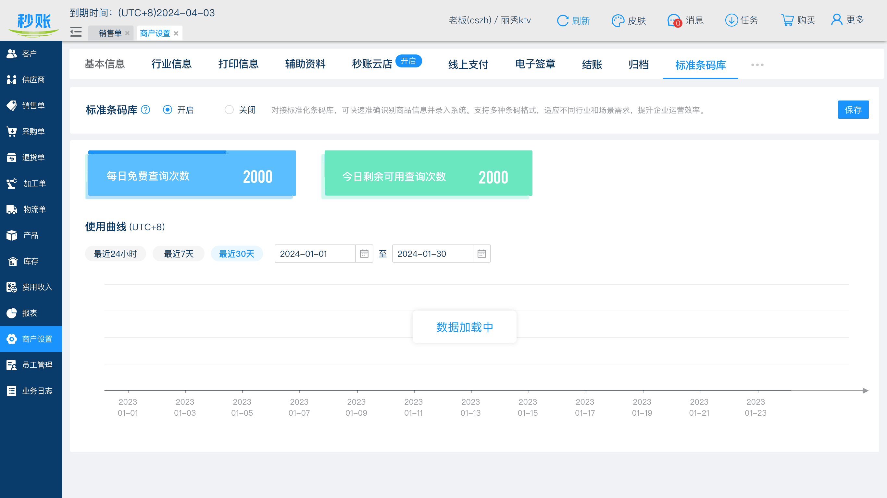

# 影响pad需求：

3.（陆）员工权限里面设置不允许员工查看客户的电话、地址保护客户信息安全

5.（吴）开单时间编辑权限

7.（吴）新增超收/超送状态

8.（吴）选择日期快捷键，增加上月，排到当月后面

9.（吴）APP/PAD/PC新建单位/多单位的时候新建的单位如果已经存在可以自动选中

10.（吴）在打印单据的时候可以自定义是否打印客户/供应商电话、客户/供应商地址

11.（吴）草稿单生成销售单，如果开启自动收送货模块，转为销售单时也自动送货

12.（吴）产品信息和组合信息增加附件

15.（吴）开启自动收送货，可以选择销售数量减少，已送数量自动减少

16. 延后需求会：（蔡）sn模式下的sn打印和全部模式下产品标签的打印

18.（蔡）自定义单据查询开始时间

23.（何）条码库需求

26.（常）pc/pad单据详情支持自定义字段位置

# 1. （陆）分店模式服务费用计算方式调整

影响模块：秒账-我的购买、BSS、商户设置

## 1.1. 我的购买

1. 规则：总店的分店服务费用由大型、小型固定的费用的计算模式，改为根据分店数量计算分店模式服务费。

1) 改版前：总店买断大型分店模式、小型分店模式，服务费用小型3000，大型5000

2) 改版后：可以用户自己定义购买几个分店，每个分店模式服务费用按照个数计算，每个分店500元，总店本身也算作一个分店，购买分店后，每个分店的第一年分店服务费用免费。每个分店第二年的分店服务费用200元，第三年及以后100/年。

2. 总店、分店，在增值服务包中移除分店模式，增加“分店购买”：

1) 位置：增值服务中排在第一个，始终展示此服务

2) 总店、分店购买都对这个商户生效

3) 累计购买分店数量：{购买的分店数量}，无论是否禁用，不包括总店，若为0，显示0，只会在总店展示

4) 启用分店数量：当前启用的分店数量，不包括总店，若为0，显示0，只会在总店展示

5) 总店数量：固定为1，累计购买分店数量>0时才会显示

6) 文案：

 开启分店模式，支持各分店独立经营，总店统筹把控

 每次购买的分店为新分店，每个新分店第一年免分店服务费。注：总店也算一个分店

7) 购买数量：

 自定义个数，默认为1，输入框中只能输入正整数，范围1~9999，超出长度不能输入

 填写的购买数量算作新增的/或者可以新启用的分店数量

 累计购买分店数量最多9999个，提交订单时，若超过9999，提示“抱歉，最多累计购买9999个分店，请减少购买数量”

8) 费用：

 第一次购买：500*{本次购买数量+1}，总店也算一个分店，bss赠送的分店数量也算，不区分购买还是赠送

 非第一次购买：500*{本次购买数量}

9) 分店购买，单号规则：

10) 分店购买后，从当前时间计算（无需考虑未购买前的分店服务订单的结束，所以日期可能会重复，以最晚的结束日期为准），自动赠送一年的分店服务费用，生成一条bss赠送的分店服务费用订单（订单记录分店个数，取购买本次购买分店个数），有效期为一年。

 开始时间：当前时间

 结束时间：开始时间+365天

11) 互斥：依旧和SN管理、布匹细码、生产日期、组合加工、批次管理、云仓互斥，勾选此项结算时，报错：抱歉，当前账号开启sn管理或布匹细码或生产日期或组合加工或签约秒账云仓或批次管理，暂不支持购买分店

12) 新建分店保存后：

 若当前分店服务未过期且购买分店服务数量足够，那么新建的分店自动启用。

 若当前分店服务未过期且购买分店服务数量不够，那么新建的分店自动禁用。

 若当前分店服务已过期，那么新建的分店同未过期一样自动启用。

3. 分店服务费用调整：

1) 移除大型分店、小型分店标记，及相关文案

2) 累计购买分店数量≥1时显示此费用项，否则不显示

3) 购买时长：目前仅支持一次买一年

4) 增加文案：

 每个分店的服务费用单独计算：分店自购买第一年不收取分店服务费用，第二年200元/个/年，第三年及以后100元/个。注：总店也算一个分店

5) 费用计算规则调整：

 启用分店个数：读取当前启用的分店数量+1（总店本身也算一个），取值：启用的现有分店数量+1，若当前未启用任何分店，那么此数据为0，即总店也不纳入计算。

 计算公式：

 每个分店第二年购买分店服务费用是200元/年（可配置），第三年及以后是100元/年（可配置）。所以每次购买要按分店个数分开计算

 查询全部订单续费第二年的累计分店个数：历史全部的线下支付类型和秒账购买的分店服务费用订单中的续费第二年的分店个数之和：

 若续费第二年的累计分店个数<启用分店个数，计算公式：[（启用分店个数-续费第二年的累计分店个数）*200+（续费第二年的累计分店个数）*100]+[启用分店个数*(购买年数-1)*100]

 若续费第二年的累计分店个数≥启用分店个数，计算公式：启用分店个数*100*购买年数

 分店服务费用计算金额时是根据分店个数计算，但是分店服务是否到期判定最后一笔分店服务订单的结束时间，不区分分店数量。

 购买成功后，订单记录续费第二年的分店个数和全部分店个数，包括总店

 购买成功之后订单时间：

 开始时间：max（结束时间最晚的分店服务费用订单（无论什么类型）结束时间，当前时间）+1

 结束时间：开始时间+购买时间

 举例：

 2023-01-01初次购买分店5个，那么赠送1年分店服务费用（记录分店6个），启用3个分店，总店自身一个

 2024-01-01，购买1年分店服务费用，启用分店3个，加上总店4个，200*（3+1）=800元，订单记录中续费第二年的分店个数：4个

 2024-06-01，启用第4个分店，需要补差价200*1=200元，订单记录中续费第二年的分店个数：1个

 分店服务费用结束时间为2025-05-31，不区分分店个数

6) 选中此费用项，弹出弹框：

 购买分店服务第2年的分店数量：{启用分店个数-续费第二年的累计分店个数}，一年200元，若为0，不显示此条文案

 购买分店服务第3年及以后的分店数量：{启用分店个数}，一年100元，若为0，不显示此条文案

 若上文两条为0，则此弹框不弹出。并提示“请先启用分店或者购买分店后再购买此费用项”，且不选中费用项。若未选中费用项，不显示费用金额。

 确定：关闭弹框，选中此收费项。

 取消：关闭弹框，不选中

7) 分店服务费用，单号规则：

8) 其他逻辑不变

4. 老数据处理：

1) 分店个数：功能上线前的开通分店模式的老账号，根据当前已经新建且未禁用的分店数量，给于对应账号初始化相应的分店数量。已禁用的分店不删除。针对我的购买页面的数据：

 累计购买分店数量：已经新建包括被禁用的的分店数量（不包含总店）

 启用分店数量：已经新建且启用的分店数量（不包含总店）

 总店数量：默认为1

2) 分店服务费用：分店服务时间不变，依旧是当前已购买的分店服务费用时间。不区分分店个数。新购买的区分分店个数。

5. 到期提醒：同现有分店服务过期逻辑。

6. 点击【新增分店】按钮，判断新建后的分店数量是否>累计购买分店数量：

1) 若否：可以新建

2) 若是：弹出弹框

 Pc和安卓：抱歉，您正在操作第N个分店，您当前只购买了{累计购买分店数量}个分店，请先购买分店后，再继续操作

 点击立即购买，跳转至我的购买页。选中分店购买

 取消：关闭弹框

 ios：抱歉，您正在操作第N个分店，您当前只购买了{累计购买分店数量}个分店，请先在PC端或者安卓端购买分店后，再继续操作

 我知道了：关闭弹框

3) 举例：2023年1月1号，第一次买3个分店，此时最多新增3个分店，新增第4个分店时弹出提示。

7. 针对禁用的分店，点击【启用】按钮：

1) 先判断启用后启用的分店数量是否>累计购买分店数量：

 若否：后续判断

 若是：弹出弹框

 Pc和安卓：抱歉，您正在操作第N个分店，您当前只购买了{累计购买分店数量}个分店，请先购买分店后，再继续操作

 点击立即购买，跳转至我的购买页。选中分店购买

 取消：关闭弹框

 ios：抱歉，您正在操作第N个分店，您当前只购买了{累计购买分店数量}个分店，请先在PC端或者安卓端购买分店后，再继续操作

 我知道了：关闭弹框

2) 再判断当前所有分店服务费用订单是否过期（当前时间>最晚一个分店服务订单的结束时间，无论个数），若过期，可以启用。

3) 若未过期（当前时间≤最晚一个分店服务订单的结束时间，无论个数），再判断启用后启用的分店数量+1（包含总店）是否>当前时间内有效分店服务费用订单中的分店数量之和（无论赠送、线下支付、购买类型的订单）：

 若否：可以启用

 若是：需要补当前启用分店的差价，默认按一个分店一年来计算，弹出弹框：

 Pc和安卓：抱歉，当前购买分店服务费用中包含的分店数量不足，无法启用分店，请先购买此分店的分店服务费用：{费用}元/年

 查询续费第二年的累计分店个数：历史全部的线下支付类型和秒账购买的分店服务费用订单中的续费第二年的分店个数之和：

 若续费第二年的累计分店个数<启用后的分店个数（包含总店），费用为200

 若续费第二年的累计分店个数≥启用后的分店个数（包含总店），费用为100

 点击立即购买，显示支付结果查询弹框。新页面打开支付二维码，价格带入。支付成功后，无需重新登录就可以启用分店。

 购买后生成分店服务费用订单，记录续费第二年分店个数和分店个数。

 开始时间：当前时间

 结束时间：开始时间+365

 取消：关闭弹框

 ios：抱歉，当前购买分店服务费用中包含的分店数量不足，无法启用分店  请在PC端或者安卓端购买分店后，再继续操作

 我知道了：关闭弹框

## 1.2. 商户设置-分店模式

1. 行业信息-增值服务-分店模式：

1) 累计购买分店数量=0时，点击弹出购买弹框（现有逻辑）

2) 累计购买分店数量≥1时才可以开启/关闭（现有逻辑）

3) 若当前开启sn管理或布匹细码或生产日期或组合加工或批次管理，则置灰不能点击（现有逻辑）

## 1.3. BSS

1. 向客户收款：

1) 增加“分店购买”：

 显示累计购买分店数量、启用分店数量、总店数量，显示、取值逻辑同上文秒账

 费用逻辑同上文秒账

 购买后，也会赠送一年分店服务费用的赠送订单。

2) 增加“分店服务费用”：

 价格计算逻辑同上文秒账

 选中时也会弹出弹框，弹框内容逻辑同上文秒账。

2. 产品列表

1) 移除大型分店模式、小型分店模式；

2) 新增分店购买，无论赠送还是线下支付，金额默认为空，置灰不能填写，后续根据弹框中数量自动计算带入。点击页面中【确定】时，弹出弹框：

 自定义个数，默认为1，输入框中只能输入正整数，范围1~9999，超出长度不能输入

 填写的购买数量算作新增的分店数量

 累计购买分店数量最多9999个，提交订单时，若超过9999，提示“抱歉，最多累计购买9999个分店，请减少购买数量”

 若是线下支付，输入框失去焦点，根据上文逻辑实时计算应收金额。

 显示应收金额字段，由于购买数量默认是1，所以应收金额默认也按一个分店计算。包含总店数量，即第一次购买分店，输入1，需要按2个分店计算。后面再次购买，输入1，按一个分店计算。

 显示固定文案：提示：请注意申请的审批中支付的金额和应收金额是否一致，若不一致请勿继续操作，直接驳回

 弹框中确认后，将应收金额代入订单中，作为订单金额。

 赠送成功后，从当前时间计算，自动赠送一年的分店服务费用，影响全部的分店，生成一条bss赠送的分店服务费用订单（订单记录分店个数，取购买本次购买分店个数），有效期为一年。

 若是赠送类型：

 应收金额固定为1

 不显示固定文案

 弹框中确认后，将应收金额代入订单中，作为订单金额

 赠送成功后，不赠送分店服务费用。

3) 分店服务费用，无论赠送还是线下支付，无论赠送还是线下支付，金额默认为空，置灰不能填写，后续操作自动计算代入点击页面中确定时，弹出弹框：

 查询启用的分店数量（包含总店），若未购买或未启用任何分店则为0（即总店也不算），置灰不支持修改。若数量为0，点击确认报错提示“当前启用分店数量为0，不能操作”

 若是线上支付，输入框失去焦点，根据上文逻辑实时计算应收金额。

 显示应收金额字段，根据启用分店数量自动个计算，计算逻辑同上文购买。

 显示固定文案：提示：请注意申请的审批中支付的金额和应收金额是否一致，若不一致请勿继续操作，直接驳回

 记录本次订单续费第二年分店个数，查询续费第二年的累计分店个数：历史全部的线下支付类型和秒账购买的分店服务费用订单中的续费第二年的分店个数之和：

 若续费第二年的累计分店个数<分店个数，本次订单续费第二年分店个数=分店个数-续费第二年的累计分店个数

 若续费第二年的累计分店个数≥分店个数，本次订单续费第二年分店个数=0

 弹框中确认后，将应收金额代入订单中，作为订单金额。

 赠送成功后，从当前时间计算，自动赠送一年的分店服务费用，影响全部的分店，生成一条bss赠送的分店服务费用订单（订单记录分店个数，取购买本次购买分店个数），有效期为一年。

 若是赠送类型：

 应收金额固定为1

 弹框中确认后，将应收金额代入订单中，作为订单金额

 无论线下支付还是赠送，有效时间：

 开始时间：max（结束时间最晚的分店服务费用订单（无论什么类型）结束时间，当前时间）+1，默认带出，固定置灰不能修改

 结束时间：开始时间+固定一年（365天），默认带出，固定置灰不能修改

 赠送成功后，订单记录分店个数

3. 绑定账号赠送

1) 移除大型、小型分店模式

2) 新增分店购买，读取对应账号的累计购买分店数量并显示。最多赠送4个，累计购买分店数量≥4，显示已增满。赠送时，不赠送分店服务费用时间。

3) 分店服务费用，每次赠送，赠送一年的分店服务费用，生成一条bss赠送的分店服务费用订单（订单记录分店个数，当前有几个分店，就赠送几个，包括总店），有效期为一年。

 开始时间：当前时间

 结束时间：开始时间+365天

4. 分店购买退款

1) 新建审批：

 退款订单号：

 分店购买模块的订单无需最后一笔，但是赠送的分店服务费用订单必须是最后一笔。失去焦点时，查询分店购买赠送的分店服务费用订单是否分店服务模块的最后一笔订单（到期时间最晚的那一笔为最后一笔订单，必须保证退款后订单有效期连续），若不是提示“订单号不是购买订单模块最后一笔订单，无法退款”。

 其他同现有退款逻辑

2) 审批通过时：

 立即减少对应商户的累计购买分店数量：

 若商户的新建分店个数＞退款后的累计购买分店数量，则自动把最后添加相应启用的分店禁用（按添加的顺序，从后往前依次禁用）。禁用数量=此次退款订单的购买数量。

 若累计购买分店数量为0，则关闭秒账-商户设置-行业属性-增值服务-分店模式开关，需要购买后再手动打开

 将赠送的分店服务费用订单时间处理，分店服务费用到期时间改为max（此订单开始时间、当前退款最后审批通过日期-1）。

 判断此订单赠送的分店服务费用是否分店服务费用的最后一笔订单：

 若是，可以审批通过，走现有流程

 若不是，则报错提示：检测此订单关联的分店服务费订单已经不是最后一笔订单，无法退款分店，仅可以选中退款分店服务费用。

5. 分店服务退款：

1) 新建审批：

 退款订单号：

 失去焦点时，查询订单号是否对应分店服务费用的最后一笔订单（到期时间最晚的那一笔为最后一笔订单，必须保证退款后订单有效期连续），若不是提示“订单号不是购买订单模块最后一笔订单，无法退款”。

 其他同现有退款逻辑

2) 审批通过时：

 秒账处理订单时间，分店服务费用到期时间改为max（此订单开始时间、当前退款最后审批通过日期-1）。

 判断此订单是否购买分店服务的最后一笔订单：

 若是，可以审批通过，走现有流程。若商户的启用分店个数＞退款后的实际可启用数量（未到期的订单中已购买数量），则自动把最后添加相应启用的分店禁用（按添加的顺序，从后往前依次禁用）。禁用数量=此次退款订单的中分店服务中的数量。

 若不是，则报错提示：此订单已经不是购买此订单模块最后一笔订单，无法退款，请通知发起人重新申请退款

# 2. （陆）银联签约状态更精细化-待审核前的状态显示出来，中间的不需要细化

针对线上支付提交审批，在待审核、审核成功（但未最终成功之前）、审批失败（线上已展示）状态下，需要额外展示银联返回的状态。增加字段“审核进度”：

1) 显示逻辑：根据返回的以下状态码展示此字段

 待审核：所有状态码类型都展示，00、02、06、11、18、32、33、34、01，01状态改为待审核（原本01状态属于审核成功）

 审核成功：03不展示

2) 取值逻辑：取对应状态码的返回内容

秒账云店-支付权限-待审核：

线上支付-待审核：

秒账云店-支付权限-审核通过：

线下支付-审核通过：

# 3. （陆）员工权限里面设置不允许员工查看客户的电话、地址保护客户信息安全

1. 需求背景：防止业务员私下联系客户、供应商，给商家造成损失

2. 影响模块：

1) 员工管理

2) 客户、供应商

3) 单据（销售单、采购单、销售退货单、采购退货单、送货单、收货单、加工单、收款单、付款单）

4) 报表（销售流水、采购流水、加工流水、产品销售总览、销售欠款汇总、采购欠款汇总、客户销售明细、供应商采购明细、资金收入、资金支出、客户对账单(展示明细、展示汇总、展示汇总明细)、供应商对账单(展示明细、展示汇总、展示汇总明细)、销售退货、采购退货、云店产品分析表、资金流水表、送货提醒、收货提醒、送货明细、收货明细、客户分析表

5) 包括签署合同、打印、导出、发邮件、分享图片

6) 针对下文没有权限的字段，后台不返回对应字段的值，编辑保存不覆盖原来的值，新建需要默认的值，保存时候后台自动默认。

3. 通用规则

1) 针对包含客户和供应商的混合形搜索框（如退货单列表、资金流水表）

Pc：

 若有客户电话或供应商电话权限，提示文案：请输入{公司}名称或电话。

 若有客户电话权限，下拉框中客户显示格式：{名称}({电话})({备用电话})，支持电话搜索客户。否则显示{名称}，不拼接电话，不支持电话搜索客户

 若有供应商电话权限，下拉框中供应商显示格式：{名称}({电话})({备用电话})，支持电话搜索供应商。否则显示{名称}，不拼接电话，否则显示{名称}，不拼接电话，不支持电话搜索供应商。

 若没有客户电话和供应商电话权限，提示文案：请输入{公司}名称。下拉框中客户和供应商显示格式：{名称}，不拼接电话和备用电话，不支持电话搜索

App：

 若有客户电话或供应商电话权限，提示文案：请输入{公司}名称或电话。

 若有客户电话权限，支持电话搜索客户。否则不支持电话搜索客户

 若有供应商电话权限，支持电话搜索供应商。否则不支持电话搜索供应商

 若没有客户电话和供应商电话权限，提示文案：请输入{公司}名称。不支持电话搜索

## 3.1. 员工管理-权限明细

1. 超级业务员、业务员、财务人员：客户权限中增加选项“客户电话”、“客户地址”，默认选中。这两个权限仅表示在已有权限的单据、客户中能否看到客户电话和客户地址，不影响单据、客户模块的权限判断。

2. 采购人员、财务人员：供应商权限中增加选项“供应商电话”、“供应商地址”，默认选中。这两个权限仅表示在已有权限的单据、供应商中能否看到供应商电话和供应商地址，不影响单据、供应商模块的权限判断。

3. 仓管人员：

1) 增加客户权限：选项“客户电话”、“客户地址”，默认选中。这两个权限仅表示在已有权限的单据中能否看到客户电话和客户地址，不影响客户、单据模块的权限判断。

2) 增加供应商权限：选项“供应商电话”、“供应商地址”，默认选中。这两个权限仅表示在已有权限的单据中能否看到供应商电话和供应商地址，不影响供应商、单据模块的权限判断。

4. 自定义角色：

 销售类权限：客户权限增加选项“客户电话”、“客户地址”，默认选中。逻辑同单独角色。

 采购类权限：供应商权限增加选项“供应商电话”、“供应商地址”，默认选中。逻辑同单独角色。

仓管类权限：

 增加客户权限：选项“客户电话”、“客户地址”，默认选中。逻辑同单独角色。

 增加供应商权限：选项“供应商电话”、“供应商地址”，默认选中。逻辑同单独角色。

## 3.2. 客户/供应商

1. 菜单权限：拥有【新建客户/供应商】、【查看自己新建客户/供应商】、【查看所有客户/供应商】、【编辑自己新建客户/供应商】、【编辑所有客户/供应商】、【删除(禁用)自己新建客户/供应商】、【删除(禁用)所有客户/供应商】、【查看分店客户】、【编辑分店客户】（仅影响客户）、【批量导出客户/供应商数据】（仅影响客户），显示供应商、客户菜单。

2. PC搜索

1) 客户/供应商名称下拉框：

 若有客户/供应商电话权限，显示格式：{名称}({电话})({备用电话})，不支持搜索电话

 若没有客户/供应商电话权限，显示格式：{名称}，不拼接电话和备用电话，不支持搜索电话

2) 电话输入搜索框：隐藏

3. App、pad搜索（影响普通搜索、类别搜索、App多关键字联合搜索）

 若有客户/供应商电话权限，显示搜索类别：客户/供应商电话，搜索框支持电话搜索

 若没有客户/供应商电话权限，不显示搜索类别：客户/供应商电话，搜索框不显示客户/供应商电话文案，不支持电话搜索

4. App电话排序：

 若有客户/供应商电话权限，排序中显示电话，支持排序

 若没有客户/供应商电话权限，排序中隐藏电话，不支持排序

5. PC、app导入：无影响，无论是否有客户/供应商客户和电话权限，都可以正常导入。

6. PC导出

 电话：

 若有客户/供应商电话权限，显示电话、备用电话的值

 若无客户/供应商电话权限，电话、备用电话显示空

 地址：

 若有客户/供应商地址权限，显示地址的值

 若无客户/供应商地址权限，地址显示空

7. PC、APP、pad列表（包括云店客户列表）

 电话：

 若有客户/供应商电话权限，显示电话字段

 若无客户/供应商电话权限，pc、pad隐藏电话列（自定义列中隐藏此字段），app隐藏电话字段

8. PC、app、pad新建、编辑、查看页

 电话：

 若有客户/供应商电话权限，显示电话、备用电话

 若无客户/供应商电话权限，隐藏电话、备用电话字段

 地址：

 若有客户/供应商地址权限，显示地址列表、添加地址按钮

 若无客户/供应商地址权限，隐藏地址列表、添加地址按钮

 云店游客列表，进入列表：

 若有客户电话权限，后台返回客户电话，页面展示客户电话列。否则后台不返回客户电话，页面也不展示客户电话列。

 若有客户地址权限，后台返回客户地址，页面不展示客户地址列。否则后台不返回客户字段，页面也不展示客户地址列。

 云店游客转客户页面：

 若有客户电话权限，页面展示客户电话字段，自动填充客户电话。否则后台不返回客户电话，页面也不展示客户电话字段。

 若有客户地址权限，页面展示地址字段，自动填充地址。否则后台不返回地址字段，页面也不展示客户地址字段。

 若没有客户电话、客户地址权限，不显示字段，保存后依旧保留原有的值，不用空值覆盖。

 客户/供应商打印：

电话：

 若有客户/供应商电话权限，显示电话、备用电话的值

 若无客户/供应商电话权限，电话、备用电话显示字段，值为空

地址：

 若有客户/供应商地址权限，显示地址和列表的值

 若无客户/供应商地址权限，地址字段显示，列表的值为空

客户/供应商详情，若有客户/供应商电话权限，显示【拨打电话】按钮。若无客户/供应商电话权限，不显示按钮。

## 3.3. 单据

1. 列表客户/供应商名称下拉框：

1) Pc：

 若有客户/供应商电话权限，显示格式：{名称}({电话})({备用电话})，搜索框支持电话搜索

 若没有客户/供应商电话权限，显示格式：{名称}，不拼接电话和备用电话，搜索框不显示客户/供应商电话文案，不支持电话搜索，请输入客户名称/供应商名称

2) App、PAD（影响普通搜索、App多关键字联合搜索）：

 若有客户/供应商电话权限，显示搜索类别：客户/供应商电话，搜索框支持电话搜索

 若没有客户/供应商电话权限，不显示搜索类别：客户/供应商电话，搜索框不显示客户/供应商电话文案，不支持电话搜索

2. pc列表电话号码搜索框：

1) Pc：

 销售单（包括待接单、草稿单）、送货单：若有客户电话权限，显示电话号码搜索框，否则隐藏电话号码搜索框

 采购单、加工单、收货单：若有供应商电话权限，显示电话号码搜索框，否则隐藏电话号码搜索框

 退货单：若有客户电话或供应商电话权限，显示电话号码搜索框，否则隐藏电话号码搜索框。若只有客户电话权限，搜索仅支持搜索销售退货单的客户电话。若只有供应商电话权限，搜索仅支持搜索采购退货单的供应商电话。

3. 列表地址搜索（app和pad影响普通搜索、App多关键字联合搜索）：

1) 销售单（包括待接单、草稿单）、送货单：Pc：若有客户地址权限，显示送货地址字段搜索框，否则隐藏搜索框。App、pad不显示送货地址，不支持搜索

2) 采购单、收货单：不受地址权限影响，显示收货地址搜索框，并支持搜索

3) 加工单：若有供应商地址权限，显示加工地址搜索框，否则隐藏搜索框。App、pad不显示加工地址，不支持搜索

4) 退货单：退货地址搜索框始终显示，不受地址权限影响。若有供应商地址权限，支持搜索采购退货单和销售退货单，否则仅支持搜索销售退货单

4. App单据列表排序：

1) 送货单：若有客户地址权限，显示送货地址排序。否则隐藏，不支持排序。

5. 列表字段

1) 地址：

 销售单（包括云店待接单列表、草稿单列表）、送货单：Pc、app：若有客户地址权限，显示送货地址字段。否则隐藏字段，（pc和pad自定义列中隐藏此字段）

 采购单、收货单：不受地址权限影响，显示收货地址字段和值

 加工单：Pc、app：若有供应商地址权限，显示加工地址字段。否则隐藏字段，自定义排序逻辑同上。

 退货单：

 Pc：不受地址权限影响，显示退货地址字段列。销售退货单：不受地址权限影响，显示退货地址字段的值。采购退货单：若有供应商地址权限，对应退货地址字段显示值，否则显示***。

 App：销售退货单：不受地址权限影响，显示退货地址字段的值。采购退货单：若有供应商地址权限，对应退货地址字段显示值，否则隐藏字段。

6. 批量导入：销售单、采购单、销售退货单、采购退货单：无论是否有权限，可以正常导入。

7. 列表批量导出

1) 销售单（包括云店待接单列表、草稿单列表）、送货单：若有客户地址权限，导出时显示送货地址的值。若没有权限，值显示空

2) 采购单、收货单：不受地址权限影响，显示收货地址的值

3) 加工单：若有供应商地址权限，导出时显示加工地址的值。若没有权限，值显示空

4) 销售退货单：不受地址权限影响，显示退货地址的值

5) 采购退货单：若有供应商地址权限，导出时显示收货地址的值。若没有权限，值显示空

8. 详情单个导出：无论是系统模板还是自定义模板

1) 销售单、送货单：

 若有客户地址权限，导出时显示送货地址的值。若没有权限，送货地址值显示空

 若有客户电话权限，导出时显示客户电话、备用电话的值。若没有权限，电话值显示空，括号不展示。

2) 采购单、收货单：

 不受地址权限影响，显示收货地址的值

 若有供应商电话权限，导出时显示供应商电话、备用电话的值。若没有权限，电话值显示空，括号不展示。

3) 加工单：

 若有供应商地址权限，导出时显示加工地址的值。若没有权限，地址值显示空

 若有供应商电话权限，导出时显示供应商电话、备用电话的值。若没有权限，电话值显示空，括号不展示。

4) 销售退货单：

 不受地址权限影响，显示退货地址的值

 若有客户电话权限，导出时显示客户电话、备用电话的值。若没有权限，电话值显示空，括号不展示。

5) 采购退货单：

 若有供应商地址权限，导出时显示收货地址的值。若没有权限，地址值显示空

 若有供应商电话权限，导出时显示供应商电话、备用电话的值。若没有权限，电话值显示空，括号不展示。

9. 打印（包括唛头）、预览、发邮件、分享图片、分享excel、分享pdf、签署合同：

系统模板打印见下文需求10“自定义是否打印客户/供应商电话、客户/供应商地址”需求

自定义模板打印，若对应角色没有客户/供应商电话、客户/供应商地址权限，上述对应的字段打印为空。

唛头打印、打印标签：

1) 销售单：

 若有客户地址权限，打印时显示送货地址字段。若没有权限，不显示字段。

 若有客户电话权限，打印时显示客户电话字段。若没有权限，不显示字段。

2) 采购单：

 不受地址权限影响，打印时显示收货地址字段

 若有供应商电话权限，打印时显示供应商电话字段。若没有权限，不显示字段。

3) 加工单：

 若有供应商地址权限，打印时显示加工地址字段。若没有权限，不显示字段。

 若有供应商电话权限，打印时显示加工公司电话字段。若没有权限，不显示字段。

4) 销售退货单：

 不受地址权限影响，打印时显示退货地址字段

 若有客户电话权限，打印时显示客户电话的值。若没有权限，不显示字段。

5) 采购退货单：

 若有供应商地址权限，打印时显示收货地址字段。若没有权限，不显示字段。

 若有供应商电话权限，打印时显示供应商电话字段。若没有权限，不显示字段。

10. 新建、编辑、查看页：

1) 客户/供应商的电话：新建时无权限只是不展示，其他有权限人查看可以看到。

 销售单（草稿、云店待接单）、送货单、销售退货单：

 Pc、pad：若有客户电话权限，显示格式：{名称}({电话})({备用电话})。若没有客户电话权限，显示格式：{名称}，不拼接电话和备用电话，不展示括号。页面上也不显示电话、备用电话，不展示括号。

 App、pad：详情页和选择客户页面：若有客户电话权限，显示电话字段，否则隐藏字段。

 单据中新增客户，不显示电话输入框

 编辑客户，弹框中不显示电话输入框

 采购单、收货单、采购退货单、加工单：

 Pc、pad：若有供应商电话权限，显示格式：{名称}({电话})({备用电话})。若没有供应商电话权限，显示格式：{名称}，不拼接电话和备用电话，不展示括号。页面上也不显示电话、备用电话，不展示括号。

 App、pad：详情页和选择客户页面：若有供应商电话权限，显示电话字段，否则隐藏字段。

 单据中新增供应商，不显示电话输入框

 编辑供应商，弹框中不显示电话输入框

销售单生成加工单、采购单，若没有供应商电话权限，不显示电话号码。

2) 地址：直接新建单据、从其他单据生成新单据、复制新增，若客户、供应商有默认带入的地址，那么依旧带入，只是前端没有权限看不到，显示***，后台保留，单据生成后依旧存在地址。

 销售单、送货单：

 若有客户地址权限，现有逻辑

 若没有客户地址权限，pc隐藏【添加地址】按钮，送货地址、退货地址地址栏固定显示：***，无论是否有值。不能点击修改地址，Pc隐藏下拉箭头，app、pad隐藏右箭头

 销售退货单：不受地址权限影响，退货地址的值可以下拉选择商户地址

 采购单、收货单：不受地址权限影响，收货地址的值可以下拉选择商户地址、客户地址。

 采购退货单、加工单：

 若有供应商地址权限，现有逻辑。

 若没有供应商地址权限，pc隐藏【添加地址】按钮,收货地址、退货地址、加工地址地址栏固定显示：***，无论是否有值。不能点击修改地址，Pc隐藏下拉箭头，app、pad隐藏右箭头

## 3.4. 报表

1. 汇总，电话、地址权限是否影响对应报表的搜索和字段

2. 客户/供应商电话：

1) Pc客户/供应商下拉框：

 若有客户/供应商电话权限，显示格式：{名称}({电话})({备用电话})

 若没有客户/供应商电话权限，显示格式：{名称}，不拼接电话和备用电话,搜索框不显示客户/供应商电话文案，不支持电话搜索，请输入客户名称/供应商名称

 影响：销售流水、采购流水、加工流水、产品销售总览、销售欠款汇总、采购欠款汇总、客户销售明细、供应商采购明细、客户对账单(展示明细、展示汇总、展示汇总明细)、供应商对账单(展示明细、展示汇总、展示汇总明细)、销售退货、采购退货、云店产品分析表、资金收入、资金支出、资金流水、送货提醒、收货提醒、送货明细、收货明细、客户分析表

2) Pc列表字段-客户/供应商名称：

 若有客户/供应商电话权限，显示格式：{名称}{电话}{备用电话}

 若没有客户/供应商电话权限，显示格式：{名称}，不拼接电话和备用电话

 影响：送货提醒、收货提醒

3) App客户/供应商电话搜索（影响普通搜索、App模糊搜索同时匹配多项）：

 若有客户/供应商电话权限，支持搜索，显示提示文字

 若没有客户/供应商电话权限，不支持搜索，不显示提示文字

 App模糊搜索同时匹配多项影响：销售流水表、采购流水表、加工流水表、产品销售总览、送货提醒、收货提醒、销售欠款汇总、采购付款汇总、送货明细、收货明细、客户销售明细、供应商采购明细、资金收入、资金支出、资金流水、客户对账单、供应商对账单、销售退货、采购退货、客户分析

 普通搜索影响：销售欠款汇总、采购付款汇总、销售退货、采购退货、客户分析

 App若没有客户/供应商电话权限，不显示电话、备用电话

 影响：送货提醒、收货提醒

3. 客户/供应商地址：

1) PC：

 若有客户地址权限，现有逻辑，若没有权限，隐藏搜索框和报表字段。影响：送货提醒、送货明细

送货提醒，按销售单送货，送货信息弹框中，若有客户地址权限，显示送货地址。否则隐藏字段。

 客户对账单：

 送货地址搜索框和报表字段列不受权限影响，始终展示。

 送货地址搜索框：若有客户地址权限，支持搜索全部单据。没有权限，只能搜索销售退货单。

 送货地址字段：若有客户地址权限，全部单据显示对应的值。没有权限，销售单显示为***，销售退货单显示值不受影响。

 供应商对账单：

 收货地址搜索框和报表字段列不受权限影响，始终展示。

 收货地址搜索框：若有供应商地址权限，支持搜索全部单据。没有权限，只能搜索采购单。

 收货地址字段：若有供应商地址权限，全部单据显示对应的值。没有权限，采购退货单显示为***，采购单显示值不受影响。

2) App（影响普通搜索、类别搜索、App多关键字联合搜索）：

 若有客户地址权限，现有逻辑，若没有权限，隐藏搜索框文字“送货地址”，也不支持搜索

 影响：送货提醒

 若有客户地址权限，现有逻辑，若没有权限，隐藏报表字段“送货地址”

 影响：送货提醒、送货明细

 客户对账单：

 送货地址搜索框不受权限影响，始终展示。

 送货地址搜索框：若有客户地址权限，支持搜索全部单据。没有权限，只能搜索销售退货单。

 送货地址字段：若有客户地址权限，全部单据显示对应的值。没有权限，销售单隐藏字段，销售退货单显示值不受影响。

 供应商对账单：

 收货地址搜索框不受权限影响，始终展示。

 收货地址搜索框：若有供应商地址权限，支持搜索全部单据。没有权限，只能搜索采购单。

 收货地址字段：若有供应商地址权限，全部单据显示对应的值。没有权限，采购退货单隐藏字段，采购单显示值不受影响。

4. 导出：无论是系统模板还是自定义模板

1) 送货提醒：

 若有客户电话权限，显示格式：{名称}{电话}{备用电话}

 若没有客户电话权限，显示格式：{名称}，不拼接电话和备用电话，不展示括号。

 若有客户地址权限，现有逻辑

 若没有客户地址权限，送货地址值为空

2) 收货提醒：

 若有供应商电话权限，显示格式：{名称}{电话}{备用电话}

 若没有供应商电话权限，显示格式：{名称}，不拼接电话和备用电话，不展示括号。

 收货地址值不受供应商地址权限影响

3) 送货明细：

 若有客户地址权限，现有逻辑

 若没有客户地址权限，送货地址值为空

4) 客户/供应商对账单（单个导出、批量导出都受影响）：

 若有客户/供应商电话权限，显示格式：{名称}{电话}{备用电话}。若没有客户/供应商电话权限，电话和备用电话值显示空。

 若有客户/供应商地址权限，现有逻辑。若没有客户地址权限，客户对账单中销售单的送货地址值显示为空，销售退货单的值正常显示。若没有供应商地址权限，供应商对账单中采购退货单的收货地址值显示为空，采购单的值正常显示。

批量导出

单个导出

5. 打印/发邮件/分享图片/签署合同/分享excel/分享pdf：

1) 送货提醒：

 若有客户电话权限，显示格式：{名称}{电话}{备用电话}

 若没有客户电话权限，显示格式：{名称}，不拼接电话和备用电话，不展示括号。

 若有客户地址权限，现有逻辑

 若没有客户地址权限，送货地址列隐藏

2) 收货提醒：

 若有供应商电话权限，显示格式：{名称}{电话}{备用电话}

 若没有供应商电话权限，显示格式：{名称}，不拼接电话和备用电话，不展示括号。

 收货地址列不受供应商权限影响

3) 送货明细：

 若有客户地址权限，现有逻辑

 若没有客户地址权限，送货地址字段隐藏

搜索指定客户

未指定客户

4) 客户/供应商对账单：

 若有客户/供应商电话权限，显示格式：{名称}{电话}{备用电话}。若没有客户/供应商电话权限，电话和备用电话显示空，不展示括号。只有影响自定义打印，系统模板不打印电话。

 若有客户/供应商地址权限，显示收货地址/送货地址字段列，显示客户/供应商本身地址。若没有客户/供应商地址权限，客户/供应商本身地址值显示为空。收货地址/送货地址字段列显示但是影响值的展示。影响自定义打印和系统打印。

 若没有客户地址权限，客户对账单中销售单的送货地址值显示为空，销售退货单的值正常显示。

 若没有供应商地址权限，供应商对账单中采购退货单的收货地址值显示为空，采购单的值则正常显示。

# 4. （陆）电子签章、线上支付增加图表

## 4.1. 电子签章增加统计图表

1. 影响模块：商户设置-电子签章（pc、app）

2. 电子签章增加统计模块“合同使用情况”，以图表方式展示，电子签章功能未开启，也正常显示图表，可以进行搜索等全部操作。

3. 数据来源，根据合同的发起时间，转换时区在对应日期的坐标显示值：

1) 总店：读取总店+全部分店每天电子合同的使用份数+过期退回份数，现在使用明细已有统计，对应日期没有值，则默认为0

 由于合同会有未签署过期退回情况的，取值=使用份数+过期退回份数（不包含购买、赠送的情况），使用份数为负数，回退分数为正数，所以最终结果可正可负数。

 若值为负数或0，每个点和其中的数据，蓝色展示此值的绝对值

 若值为正数，每个点和其中的数据，绿色显示，格式：+值

 举例：5.1号，使用3份合同，其中2份签署，1份未签署，图表中5.1号取值为3，蓝色展示3。到了5.4号，没有使用合同，但是5.1未签署的合同在5.4号回退，图表中5.4号取值为1，绿色展示+1。

2) 分店：读取当前分店每天电子合同数量的使用份数+回退份数，现在使用明细已有统计，对应日期没有值，则默认为0，展示逻辑同总店。

3) 由于每份合同发起时间记录是按【UTC+8: 中国标准时间】，根据当前选择的时区决定图表中在哪天展示。若某分合同记录的时间是2024-02-29 23:30:30，但是当前选择的时区是东九区，换算时区后是2024-03-01 00:30:30，那么图表中显示2024-03-01，合同使用1份。

4. 时间：统计维度到天，曲线图

1) 按天展示，可选日期范围如下，默认选中最近30天，无论是最近30天、7天、自定义日期，此日期框受时区影响，默认的时间和选择框中的今天都是默认时区的当天，搜索时需要转时区后进行查询：时间需要联动，包括全屏模式。

 最近7天：当天往前推7天，选中后自定义时间也选中对应时间，选中后下方图表立即切换。

 最近30天：当天往前推30天，选中后自定义时间也选中对应时间，选中后下方图表立即切换

 自定义时间：

 开始时间-结束时间，精确到天

 结束时间必须大于开始时间，否则提示“结束时间必须大于开始时间，请重新选择时间”

 结束时间-开始时间+1必须≤366天，否则提示“最多选择366天，请重新选择时间”

 选中时间后，若是最近7天，那么前方“最近7天”按钮也自动选中。选中时间后，若是最近30天，那么前方“最近30天”按钮也自动选中。如果先选中了“最近7天”“最近30天”，更换时间后，不满足7和30，自动取消选中。

 选择时间范围满足条件，选中后下方图表立即切换

 每一天都是一个点，无论跨的范围有多大，例如：搜索1年范围的数据，整个折线图会有365/366个点，横坐标只有12个点，每个折点点击都会出现对应的数据。

 X轴-时间轴：

 横轴最多12个坐标点，若小于则按日期均分横坐标，最左端的日期固定为一个显示日期的坐标点，所选时间范围天数≤12则每天的日期都显示坐标点，所选时间范围天数>12根据所选日期范围确认每个显示日期的坐标点：a➗12=q……r，a为选择的时间范围天数，每隔q天的坐标点显示日期，余数r天则正常显示曲线，不会显示有日期的坐标点。（例：若选择近30天，30➗12=2……6，则每隔2天的坐标点显示日期，剩余6天的数据正常显示曲线，但不显示有日期的坐标点）；app若一屏展示不下，可以左右滑动查看。

 选择近7天则每天显示一个日期坐标点，显示七个坐标点。

 Pc≤7个坐标点：显示格式，一行YYYY-MM-DD

 Pc＞7个坐标点：显示格式，第一行YYYY，第二行MM-DD

 App无论几个坐标点，显示格式，第一行YYYY，第二行MM-DD

 Y轴-数值轴：取最大值作为最大刻度，根据图高度均分4个坐标点，刻度保留两位小数，不补0。

 Pc鼠标悬浮点位、app点击点位，显示对应日期和对应数值：YYYY-MM-DD：{数值}。PC鼠标光标移动到曲线、APP点击曲线时，显示该处对应日期/时间点和对应数据。

2) App支持全屏模式，可以自定义日期，X轴Y轴逻辑同上文一致。

## 4.2. 线下支付增加统计图表

1. 影响模块：商户设置-线下支付（pc、app）

2. 增加统计模块“收款情况”，以图表方式展示，线上支付功能未开启，也显示图表。

3. 数据来源，根据支付日志的时间，转换时区在对应日期的坐标显示值：

1) 总店：读取总店+全部分店每天的线上支付成功的金额，现在线上支付日志已有统计每个单据的收款，对应日期取汇总，对应日期没有值，则默认为0.00

2) 分店：读取当前分店每天的线上支付成功的金额，现在使用明细已有统计，现在线上支付日志已有统计每个单据的收款，对应日期取汇总，对应日期没有值，则默认为0

3) 由于每笔支付时间记录是按【UTC+8: 中国标准时间】，根据当前选择的时区决定图表中在哪天展示。若笔记录的时间是2024-02-29 23:30:30  50.00元，但是当前选择的时区是东九区，换算时区后是2024-03-01 00:30:30，那么图表中显示2024-03-01，收款50.00元

4. 时间：统计维度到天，曲线图

1) 按天展示，可选日期范围如下，默认选中最近30天，无论是最近30天、7天、自定义日期，搜索时需要转时区后进行查询，时间需要联动，包括全屏模式。

 最近7天：当天往前推7天，选中后自定义时间也选中对应时间，选中后下方图表立即切换

 最近30天：当天往前推30天，选中后自定义时间也选中对应时间，选中后下方图表立即切换

 自定义时间：

 开始时间-结束时间，精确到天

 结束时间必须大于开始时间，否则提示“结束时间必须大于开始时间，请重新选择时间”

 结束时间-开始时间+1必须≤366天，否则提示“最多选择366天，请重新选择时间”

 选择时间范围满足条件，选中后下方图表立即切换

 选中时间后，若是最近7天，那么前方“最近7天”按钮也自动选中。选中时间后，若是最近30天，那么前方“最近7天”按钮也自动选中。如果先选中了“最近7天”“最近30天”，更换时间后，不满足7和30，自动取消选中。

 X轴-时间轴：

 横轴最多12个坐标点，若小于则按日期均分横坐标，最左端的日期固定为一个显示日期的坐标点，所选时间范围天数≤12则每天的日期都显示坐标点，所选时间范围天数>12根据所选日期范围确认每个显示日期的坐标点：a➗12=q……r，a为选择的时间范围天数，每隔q天的坐标点显示日期，余数r天则正常显示曲线，不会显示有日期的坐标点。（例：若选择近30天，30➗12=2……6，则每隔2天的坐标点显示日期，剩余6天的数据正常显示曲线，但不显示有日期的坐标点）；app若一屏展示不下，可以左右滑动查看。

 选择近7天则每天显示一个日期坐标点，显示七个坐标点。

 Pc≤7个坐标点：显示格式，一行YYYY-MM-DD

 Pc＞7个坐标点：显示格式，第一行YYYY，第二行MM-DD

 App无论几个坐标点，显示格式，第一行YYYY，第二行MM-DD

 Y轴-数值轴：取最大值作为最大刻度，根据图高度均分4个坐标点，刻度保留两位小数，补0。

 Pc鼠标悬浮点位、app点击点位，显示对应日期和对应数值：YYYY-MM-DD：{数值}，保留两位小数，补0。PC鼠标光标移动到曲线、APP点击曲线时，显示该处对应日期/时间点和对应数据。

2) App支持全屏模式，可以自定义日期，X轴Y轴逻辑同上文一致。

# 5. （吴）开单时间编辑权限

需求背景：针对秒账的用户角色设置开单时间的编辑权限

影响模块：员工管理-角色权限、销售单、采购单、送货单、收货单、销退单、采退单、加工单、采购申请单、费用收入单、收款单、付款单、调拨单、销售流水表、采购流水表

影响端：PC、APP（ios、安卓）、pad

1. 在员工管理-角色中设置，总店和分店单独设置，总店不影响分店

2. 在超级业务员、业务员、采购人员、仓管人员、财务人员、自定义角色权限中新增【编辑开单日期】权限，老数据和新账号默认勾选；

3. 老板和店长角色不受该权限限制，默认有此编辑权限。

4. 【编辑开单日期】：不自带查看和编辑单据权限，只影响该角色在有编辑、新建权限的单据中能否编辑单据日期字段

5. 【编辑开单日期】：有权限时，可编辑单据日期（具体单据的日期字段见下文），同现有逻辑。没有权限时，在对应有新建或编辑权限的单据中的日期无法编辑；新建时默认根据设置的时区取当前时间，大保存时后台根据保存时间保存开单日期，例如：19号打开的新建界面，填写信息用了很久的时间到20号才点保存，最终前端展示和后端保存的都是20号。

 Pc下拉框变为仅可查看样式，不能点击和输入，不显示下拉按钮

 Pad和app输入框不能点击，不显示右箭头

6. 【编辑开单日期】权限不影响云店待接单，当前员工无销售单编辑权限时，点击【接单】后，销售单的销售日期与接单前一致，不取当前日期

7. 【编辑开单日期】权限影响单据的日期如下：

8. 超级业务员：在单据权限中新增【编辑开单日期】选项，用于限制超级业务员在所有具有新建或编辑权限的全部单据类型中编辑日期

9. 业务员：在单据权限中新增【编辑开单日期】选项，用于限制业务员在所有具有新建或编辑权限的全部单据类型中编辑日期

10. 采购人员：在单据权限中新增【编辑开单日期】选项，用于限制采购人员在所有具有新建或编辑权限的全部单据类型中编辑日期

11. 仓管人员：在单据权限中新增【编辑开单日期】选项，用于限制仓管人员在所有具有新建或编辑权限的全部单据类型中编辑日期

12. 财务人员：在单据权限中新增【编辑开单日期】选项；用于限制财务人员在所有具有新建或编辑权限的的全部单据类型中编辑日期

13. 自定义角色

销售类权限：在单据权限新增【编辑开单日期】选项，用于限制自定义角色在具有新建或编辑权限的的全部单据类型中编辑日期

采购类权限：在单据权限中新增【编辑开单日期】选项，用于限制自定义角色在具有新建或编辑权限的的全部单据类型中编辑日期

仓管类权限：在单据权限中新增【编辑开单日期】选项，用于限制自定义角色在具有新建或编辑权限的的全部单据类型中编辑日期

14. 财务类权限：在单据权限中新增【编辑开单日期】选项，用于限制自定义角色在具有新建或编辑权限的的全部单据类型中编辑日期

# 6. （吴）送货/收货提醒表增加切换按销售/采购日期筛选以及按日期排序

需求背景：用户在使用送/收货提醒表时有按照销售日期筛选的需求；

影响模块：送货提醒表、收货提醒表

影响端：PC、APP（ios、安卓）

## 6.1. 送货提醒表

按照销售单送货

按照产品送货

1. 增加【销售日期】和【送货日期】切换按钮，【按照销售单送货】、【按照产品送货】均增加

(1) 位置：

 PC端：在送货提醒表表名的右侧增加下拉按钮，用于切换表单中的【销售日期】和【送货日期】；默认选择【显示送货日期】

 APP端：在筛选条件中增加日期展示类型，【显示送货日期】和【显示销售日期】，单选，默认选择【显示送货日期】

(2) 显示逻辑：

 选中【显示送货日期】：列表字段显示送货日期，现有样式；筛选：若原日期筛选类型选择的是“销售日期”则自动切换为送货日期并更新筛选结果，且不清空日期选择范围，若是其他日期类型则保持不变，例如搜索生产日期，则切换后依旧搜索生产日期。

 选中【显示销售日期】：列表字段显示销售日期，替换送货日期的位置，取对应销售单的销售日期；筛选：若原日期筛选类型选择的是“送货日期”则自动切换为销售日期（下文2为新增的筛选）并更新筛选结果，且不清空日期选择范围，若是其他日期类型则保持不变，例如搜索生产日期，则切换后依旧搜索生产日期。

2. 增加按销售日期筛选

(1) 在送货提醒表中【按照销售单送货】/【按照产品送货】时：

 选择【显示销售日期】时，日期筛选项中展示【销售日期】类型，隐藏【送货日期】类型，切换顺序：计划送货日期>销售日期>生产日期(开启保质期才显示)>账期；切换后，和原送货日期相同，正常切换日期搜索范围不清空，账期与其他切换回清空。

 选择【显示送货日期】时，筛选项中隐藏【销售日期】类型，显示【送货日期】类型，切换顺序：计划送货日期>送货日期>生产日期(开启保质期才显示)>账期；

(2) 通过【销售日期】搜索，在表单中展示销售日期在搜索时间范围内的销售单信息，字段不变。

3. PC端【按照销售单送货】时表单列顺序调整

显示顺序：计划送货日期>送货日期/销售日期>客户名称

4. 增加排序功能：【按照销售单送货】、【按产品送货】都增加

PC端：在【计划送货日期】、【送货日期】/【销售日期】列增加排序功能，样式与现有一致，可按倒序和正序排列；日期相同时，按关联单号进行排序；其中送货日期具体到时分秒进行排序

默认排序规则不变。

APP端：在筛选功能左侧增加排序按钮，显示：【计划送货日期】、【送货日期】/【销售日期】。【销售日期】和【送货日期】不会同时出现，与筛选项中选择的日期类型同步；默认排序规则不变；排序功能中最下方的【清除排序】与现有逻辑一致；若开启分店，在总店的送货提醒表中原排序功能中的【分店名称】后面中增加排序选项；日期相同时，按关联单号进行排序；其中送货日期具体到时分秒进行排序

## 6.2. 收货提醒表

 增加采购日期搜索，逻辑同上文送货提醒表

 增加【采购日期】和【收货日期】切换按钮，逻辑同上文送货提醒表

 PC端【按照采购单收货】时表单列顺序调整，计划收货日期>收货日期/采购日期>客户名称

 【按照采购单收货】、【按照产品收货】：计划收货日期、收货日期/采购日期 增加排序功能，逻辑同上文送货提醒表

## 6.3. 分享、打印、导出

在送货提醒表和收货提醒表中导出、打印、分享图片、分享excel、分享pdf时，所见即所得

# 7. （吴）新增超收/超送状态

需求背景：通过严格进销存控制销售类和采购类单据能否超送/超收，并额外显示超收、超送状态。

影响模块：销售单、采购单/采购申请单、加工单、商户设置-行业信息-业务属性-严格进销存、送货/收货提醒表、客户/供应商对账单、送货单、收货单、加工流水表、客户/供应商详情

影响端：PC、APP（ios、安卓）、pad

## 7.1. 单据增加超收和超送状态

1. 销售单、分店申请单（总店查看）的送货状态增加【超送货】

1) PC搜索项、APP和PAD筛选项增加超送货；用于筛选出所有【超送货】状态的销售单

2) 单据未送货、部分送货、全部送货逻辑不变。

3) 单据出现任意产品行的已送货数量 > 总数量，整个单据额外增加超送货状态标记（不影响单据现有的未送货、部分送货、全部送货状态）：PC端、pad、APP列表，当单据有超送货标记时，展示【超送】标记；

4) 开启审批功能后：销售单【待审批】、【审批拒绝】、【已作废】、【草稿】、【待提审】审批状态的单据前端隐藏【超送】标记（后端保留标记，不影响PC搜索和APP筛选），审核通过和送货状态一起展示超送标记（APP端新旧UI均修改）；

5) 销售单拒收后送货状态仅展示【拒收】，隐藏送货状态和【超送】标记（APP端新旧UI均修改；后端保留标记，PC和APP筛选【超送】单据时需过滤【拒收】的单据）

2. 采购单、采购申请单（分店查看）的收货状态增加【超收货】

1) PC搜索项、APP和PAD筛选项增加超收货；用于筛选出所有【超收货】状态的采购单

2) 单据未收货、部分收货、全部收货逻辑不变。

3) 单据出现任意产品行的已收货数量 > 总数量，整个单据额外增加超收货状态标记（不影响现有的未收货、部分收货、全部收货状态）。PC端、pad、app列表，当单据有超收货标记时，展示【超收】标记

3. 加工单收货状态增加【超收货】

1) PC搜索项、APP筛选项增加超收货；用于筛选出所有【超收货】状态的加工单

2) 单据未收货、部分收货、全部收货逻辑不变。

3) 单据出现任意入库产品行的已收货数量 > 预估回货数量，整个单据额外增加超收货状态标记（不影响现有的未收货、部分收货、全部收货状态）。PC端、app列表，当单据有超收货标记时，展示【超收】标记；

## 7.2. 商户设置-严格进销存增加配置项

1. 在商户设置-偏好设置中去掉【收送货数量大于开单数量时提醒】，将此项对应的设置放到严格进销存设置中，同超收/送货的【弹框提醒新建】的逻辑；

2. IOS端的弹框内：原单选项的样式需与安卓端同步

3. 在商户设置的严格进销存设置弹框顶部增加配置项、表单中新增勾选项：【超送货】、【超收货】

(1) 在弹框表格内增加【开单必选规格型号、颜色、单位等】配置项

1 老账户若上线前未开启【严格进销存】则默认关闭该配置项，上线前已开启则默认开启该配置项；

2 开启严格进销存默认开启该配置项

3 需要根据商户设置来校验是否需要必选，和线上严格进销存开单必选逻辑一致；例如未开启颜色，则颜色不必选

(2) 新增勾选项：【超送货】、【超收货】

 超送货提示文字：“（已送数量+本次送货）的绝对值 > 总数量的绝对值”；超收货提示文字：“（已收数量+本次收货）的绝对值>总数量的绝对值”

 针对此项设置，单据读取最新的商户设置，不保存到单子上。

 搜索【超送/收货】：单据详情某一个产品行的总数量绝对值<送/收货数量绝对值，则为超收/送的单子。

 老数据通过脚本打上对应标记

 不同模式是否超送/收货：sn、细码对比只要总数量和已送/收数量+本次送/收货比较，不管sn每个的送货数量和销售数量。平行多单位对比多个单位的总数量和已送/收数量+本次送/收货比较，其中一个单位超送/收，即算为超送/收；对比时取绝对值对比

 老账号严格进销存默认逻辑：

 上线前若偏好设置中已开启【收送货数量大于开单数量时提醒】且未开启【严格进销存】，上线后：默认开启【严格进销存】，采购类单据的新产品、新供应商默认选中【直接新建】，超收货默认选中【弹框提醒新建】；销售类单据的新产品、新客户默认选中【直接新建】，超送货默认选中【弹框提醒新建】，【开单必选规格型号、颜色、单位等】不选中。

 上线前若偏好设置中已开启【收送货数量大于开单数量时提醒】且已开启【严格进销存】，上线后：默认开启【严格进销存】，采购类单据的新产品、新供应商保持原配置，超收货默认选中【弹框提醒新建】；销售类单据的新产品、新客户保持原配置，超送货默认选中【弹框提醒新建】，【开单必选规格型号、颜色、单位等】默认选中。

 上线前若偏好设置中未开启【收送货数量大于开单数量时提醒】且未开启【严格进销存】，上线后：默认关闭【严格进销存】

 上线前若偏好设置中未开启【收送货数量大于开单数量时提醒】且已开启【严格进销存】，上线后：【严格进销存】的超收/送货默认选中【直接新建】

 新账号严格进销存默认逻辑：

 商户设置默认关闭【严格进销存】

 严格进销存弹框内：采购类单据的新产品、新供应商默认选中【直接新建】，超收货默认选中【弹框提醒新建】；销售类单据的新产品、新客户默认选中【直接新建】，超送货默认选中【弹框提醒新建】，【开单必选规格型号、颜色、单位等】默认选中。

销售单

 【超送货】勾选【禁止新建】，根据输入的本次送货数量的绝对值，若（已送数量+本次送货）的绝对值 > 总数量的绝对值：在Pc、app、pad：在大保存时报错提示：“第XX、XX、XX行产品送货数量大于总数量，请重新填写本次送货数量”

 若销售单快速采购关联了采购单且已收货（部分收货、全部收货）时，修改销售单产品行的采购数量导致关联采购单产品的已收数量的绝对值 > 总数量的绝对值时，在Pc端勾选生成/编辑采购单时候：在大保存时报错提示：“第XX、XX、XX行产品关联的采购单已收货数量大于采购总数量，请重新填写采购数量”

 【超送货】勾选【直接新建】，新建/编辑销售单时，前端不校验产品行是超送，后端校验产品行超送时给单据打上超送货标记

 【超送货】勾选【弹框提醒新建】，新建/编辑销售单保存时，若（已收数量+本次送货）的绝对值>总数量的绝对值则弹出弹框，弹框逻辑同现有【收送货数量大于开单数量时提醒】逻辑提醒，确认后打上超送货标记，取消关闭弹框。

 无论是否开启严格进销存，若销售单关联了供应商采购单且已收货（部分收货、全部收货），点击【生成供应商采购单】后，若存在产品行的总数量的绝对值 < 已收货数量的绝对值，前端不校验产品行是超送，后端校验产品行超送时给对应采购单打上超收货标记

采购单、采购申请单、加工单

 【超收货】勾选【禁止新建】，根据输入的本次收货数量的绝对值，若（已收数量+本次收货）的绝对值>总数量的绝对值：在PC、app、pad大保存时报错提示：“第XX行产品收货数量大于总数量，请重新填写本次收货数量”，

 【超收货】勾选【直接新建】，新建/编辑时，前端不校验产品行是超收，后端校验产品行超收时给单据打上超收货标记

 【超收货】勾选【弹框提醒新建】，新建/编辑保存时，若（已收数量+本次收货）的绝对值>总数量的绝对值则弹出弹框，弹框逻辑同现有【收送货数量大于开单数量时提醒】逻辑提醒，确认后打上超收货标记，取消关闭弹框。

送货单

1. 开启SN码，校验正负一致

 PC端在送货单弹框中编辑SN码送货数量，点击确认时：先校验弹框内每个SN码的送货数量的正负号是否一致，不一致时报错提示：“送货数量需同正数或同负数”；

 PC端在大保存时校验与销售单正负号是否一致，不一致时提示：“第X、Y行SN码（SN码1、SN码2、SN码3...）送货数量与对应的销售单销售数量的正负号必须相同，请检查后修改”，提示信息中SN码超过3个的部分用省略号代替

 APP端：保持原逻辑

2. 开启平行多单位校验正负一致

 PC端在送货单弹框中编辑不同单位送货数量，点击确认时：先校验弹框内每个单位的送货数量的正负号是否一致，不一致时报错提示：“送货数量需同正数或同负数”；

 PC端在大保存时校验与销售单正负号是否一致，不一致时提示：“第X行、Y行，{单位名称1}、{单位名称2}、{单位名称3}送货数量与对应的销售单销售数量的正负号必须相同，请检查后修改”，多个产品行相同的单位名称不重复出现

 APP端：在编辑数量界面点击右上角确认时：先校验弹框内每个单位的送货数量的正负号是否一致，不一致时报错提示：“送货数量需同正数或同负数”；再校验与销售单正负号是否一致，不一致时提示：“{单位名称1}、{单位名称2}、{单位名称3}送货数量与对应的销售单销售数量的正负号必须相同，请检查后修改”

3. 常规模式（未开启SN码、布匹细码、平行多单位）校验正负一致：判断产品行的送货数量与销售数量的正负号是否一致：

 PC端大保存时报错提示：“第X、Y行，此单送货数量与对应的销售单销售数量的正负号必须相同，请检查后修改”

 APP端编辑送货数量（通过+-符号编辑 或 直接输入数值并确认）时，若与销售单不一致，报错提示：“送货数量与对应的销售单销售数量的正负号必须相同，请检查后修改”

4. 开启布匹细码：PC和APP保持原逻辑

5. 根据严格进销存设置校验超送

 【超送货】勾选【禁止新建】，根据输入的本次送货数量的绝对值，若（销售单已送数量-原送货数量+本次送货数量）的绝对值 > 总数量的绝对值：在Pc、app：在大保存时报错提示：“第XX行产品送货数量大于销售数量，请重新填写送货数量”

 【超送货】勾选【直接新建】，送货单时，前端不校验产品行是超送，后端校验产品行超送时给单据打上超送货标记

 【超送货】勾选【弹框提醒新建】，PC、APP端大保存，若产品行送货数量的绝对值>对应销售单产品行总数量的绝对值则弹出弹框提示：“第XX、XX行产品送货数量大于销售数量，确定保存吗”，确认后对应销售单打上超送货标记，取消关闭弹框。

收货单

1. 开启SN码，校验正负一致

 PC端在收货单弹框中编辑SN码收货数量，点击确认时：先校验弹框内每个SN码的收货数量的正负号是否一致，不一致时报错提示：“收货数量需同正数或同负数”；

 PC端在大保存时校验与采购单正负号是否一致，不一致时提示：“第X、Y行SN码（SN码1、SN码2、SN码3...）收货数量与对应的采购单采购数量的正负号必须相同，请检查后修改”，提示信息中SN码超过3个的部分用省略号代替

 APP端：保持原逻辑

2. 开启平行多单位校验正负一致

 PC端在收货单弹框中编辑不同单位收货数量，点击确认时：先校验弹框内每个单位的收货数量的正负号是否一致，不一致时报错提示：“收货数量需同正数或同负数”；

 PC端在大保存时校验与采购单正负号是否一致，不一致时提示：“第X行、Y行，{单位名称1}、{单位名称2}、{单位名称3}收货数量与对应的采购单采购数量的正负号必须相同，请检查后修改”，多个产品行相同的单位名称不重复出现

 APP端：在编辑数量界面点击右上角确认时：先校验弹框内每个单位的收货数量的正负号是否一致，不一致时报错提示：“收货数量需同正数或同负数”；再校验与采购单正负号是否一致，不一致时提示：{单位名称1}、{单位名称2}、{单位名称3}收货数量与对应的采购单采购数量的正负号必须相同，请检查后修改”

3. 常规模式（未开启SN码、布匹细码、平行多单位）校验正负一致：判断产品行的收货数量与采购数量的正负号是否一致：

 PC端大保存时报错提示：“第X、Y行，收货数量与对应的采购单采购数量的正负号必须相同，请检查后修改”

 APP端编辑收货数量（通过+-符号编辑 或 直接输入数值并确认）时，若与销售单不一致，报错提示：“收货数量与对应的采购单采购数量的正负号必须相同，请检查后修改”

4. 开启布匹细码：PC和APP保持原逻辑

5. 再根据严格进销存设置校验超收：

 【超收货】勾选【禁止新建】，根据输入的收货数量的绝对值，若（采购单已送数量-原收货数量+本次送货数量）的绝对值 > 总数量的绝对值：在Pc、app：在大保存时报错提示：“第XX行产品送货数量大于采购数量，请重新填写收货数量”

 【超收货】勾选【直接新建】，编辑收货单时，前端不校验产品行是超送，后端校验产品行超送时给对应采购单打上超收货标记

 【超收货】勾选【弹框提醒新建】，PC、APP端大保存时，若产品行收货数量的绝对值>对应采购单产品行总数量的绝对值则弹出弹框提示：“第XX、XX行产品收货数量大于采购数量，确定保存吗”，确认后对应采购单打上超收货标记，取消关闭弹框。

## 7.3. 送/收货提醒表增加超送/收货搜索

### 7.3.1. 送货提醒表

1. 在送货提醒表中进行送货时受严格进销存控制：

(1) 【超送货】勾选【禁止新建】，根据输入的本次送货数量的绝对值，若（已送数量+本次送货）的绝对值 > 销售数量的绝对值：【按照销售单送货】时：在Pc弹框内点击保存、app点击发送时报错提示；【按照产品送货】时：在Pc点击确认送货、app点击发送时报错提示：“第XX、XX行产品送货数量大于销售数量，请重新填写本次送货数量”

(2) 【超送货】勾选【直接新建】，前端不校验产品行是超送，后端校验产品行超送时给对应销售单打上超送货标记

(3) 【超送货】勾选【弹框提醒新建】，【按照销售单送货】时：在Pc弹框内点击保存、app点击发送时提醒、【按照产品送货】时：在Pc点击确认送货、app点击发送时提醒：“第XX、XX行产品送货数量大于销售数量，确定保存吗”，确认后对应销售单打上超送货标记，取消关闭弹框。

(4) 按产品送货时：PC和APP提示行数超送，行数取值为报表中的行数(按报表中的实际行数，不用按选中的行数重新排序)，不取单据的行数；按销售单送货时，PC和APP提示行数超送，行数取值为单据中的行数

2. 送货提醒表，无论按照销售单送货还是按照产品送货，PC端搜索项中：【全部送货】、【部分送货】、【未送货】改为下拉框，支持多选，默认不选中，不选表示全部，同时增加【超送货】；顺序：未送货>部分送货>全部送货>超送货；APP端在全部送货后增加【超送货】，支持多选

3. 勾选【超送货】后：

(1) 【按照销售单送货】：筛选出所有【超送货】标记的销售单并展示销售单中的所有产品；【超送货】与其他状态取交集

(2) 【按产品送货】：

 若未勾选【搜索具体产品行】（该搜索项见下文需求12送/收货提醒表-按产品送/收货），根据搜索条件筛选出所有【超送货】状态的销售单并展示销售单中所有的产品；【超送货】与其他状态取交集

 若勾选了【搜索具体产品行】（该搜索项见下文需求12送/收货提醒表-按产品送/收货），根据搜索条件筛选出所有【超送货】状态的产品行及对应的销售单，仅展示超送货的产品；【超送货】与其他状态取并集

### 7.3.2. 收货提醒表

1. 在收货提醒表中进行收货时受严格进销存控制：

(1) 【超收货】勾选【禁止新建】，根据输入的本次收货数量的绝对值，若（已收数量+本次收货）的绝对值 >采购数量的绝对值：【按照采购单收货】时：在Pc弹框内点击保存、app点击发送时报错提示；【按照产品收货】时：在Pc点击确认收货、app点击发送时报错提示：“第XX、XX行产品收货数量大于采购数量，请重新填写本次收货数量”

(2) 【超收货】勾选【直接新建】，前端不校验产品行是超收，后端校验产品行超收时给对应销售单打上超收货标记

(3) 【超收货】勾选【弹框提醒新建】，【按照采购单收货】时：在Pc弹框内点击保存、app点击发送时提醒；【按照产品收货】时：在Pc点击确认收货、app点击发送时提醒：“第XX、XX行产品收货数量大于采购数量，确定保存吗”，确认后对应采购单打上超收货标记，取消关闭弹框。

(4) 按产品收货时：PC和APP提示行数超收，行数取值为报表中的行数(按报表中的实际行数，不用按选中的行数重新排序)，不取单据的行数；按采购单收货时，PC和APP提示行数超收，行数取值为单据中的行数

2. 收货提醒表，无论按照采购单送货还是按照产品收货，PC端搜索项中：【全部收货】、【部分收货】、【未收货】改为下拉框，支持多选，默认不选中，不选表示全部，同时增加【超收货】；顺序：未收货>部分收货>全部收货>超收货；APP端在全部收货后增加【超收货】，支持多选

3. 勾选【超收货】后：

(1) 【按照采购单送货】：筛选出所有【超收货】标记的采购单并展示采购单中的所有产品；【超收货】与其他状态取交集

(2) 【按产品收货】：

 若未勾选【搜索具体产品行】（该搜索项见下文需求12送/收货提醒表-按产品送/收货），根据搜索条件筛选出所有【超收货】状态的采购单并展示采购单中所有的产品；【超收货】与其他状态取交集

 若勾选了【搜索具体产品行】（该搜索项见下文需求12送/收货提醒表-按产品送/收货），根据搜索条件筛选出所有【超收货】状态的产品行及对应的采购单，仅展示超收货的产品；【超收货】与其他状态取并集

### 7.3.3. 客户/供应商对账单搜索项送货状态增加超送/收货

1. 客户对账单：

1) Pc：展示明细、展示汇总、展示汇总明细【送货状态】筛选增加【超送货】选项，筛选包含超送货标记的单据

2) App：展示明细、汇总展示【送货状态】筛选增加【超送货】选项，筛选包含超送货标记的单据

2. 供应商对账单：

1) Pc：展示明细、展示汇总、展示汇总明细【收货状态】筛选增加【超收货】选项，筛选包含超收货标记的单据

2) App：展示明细、汇总展示【收货状态】筛选增加【超收货】选项，筛选包含超收货标记的单据

## 7.4. 加工流水表

1. PC端展示明细时【收货状态】搜索项中增加【超收货】，顺序：未收货>部分收货>全部收货>超收货；APP端展示明细在全部送货后增加【超收货】，支持多选

2. 勾选【超收货】后：筛选出所有【超收货】标记的加工单

## 7.5. 客户详情、供应商详情

1. 在客户详情-销售记录中，PC端【送货状态】搜索项增加【超送货】和PAD筛选项中在全部送货后面增加【超送货】，支持与其他送货状态多选：选中【超送货】后，筛选出该客户所有【超送货】标记的销售单

2. 在供应商详情-采购记录中，PC端【收货状态】搜索项增加【超收货】和PAD筛选项中在全部收货后面增加【超收货】，支持与其他收货状态多选：选中【超收货】后，筛选出该供应商户所有【超收货】标记的采购单

# 8. （吴）选择日期快捷键，增加上月，排到当月后面

影响模块：所有时间控件

影响端：PC、APP（ios、安卓）、PAD

在筛选条件中添加【上月】：

时间区间：开始时间：当前时间的上个自然月的1号，结束时间：当前时间的上个自然月月的最后一天

位置：位于【当月】后面

# 9. （吴）APP/PAD/PC新建单位/多单位的时候新建的单位如果已经存在可以自动选中

需求背景：在单据或产品详情中新建单位时如果新建的单位已经存在，原逻辑是直接报错或提示已经存在。现逻辑改为可以自动选中，减少操作。

影响模块：产品、销售单、采购单、加工单、销售/采购退货单、调拨单、商户设置

影响端：APP(IOS、安卓)、PAD、PC

原逻辑：

 在单据中新建：

 APP端在销售单、采购单、采购单、销售/采购退货单、调拨单中选择的产品只有单单位时，支持在单据界面新建单位，新建单位重复时，提示：“您输入的单位已存在，请选择””

 PAD端在采购单、销售单新建单单位时，若单位已存在，弹框内点击确认时ipad提示：“此单位已存在”；安卓pad提示：“输入的单位不能重复哦”

 PC端在采购单、销售单新建单单位时，若单位已存在，点击保存时提示：““{单位}”单位名称重复，请修改后重试！”

 在产品详情中新建：

 单单位：点击确认时：

(1) APP端提示：“输入的单位不能重复哦”；

(2) PAD端关闭新建单位弹框并提示：“此单位已存在”；

(3) PC端提示：该单位已存在，请重新输入

 多单位：

(1) APP端在弹框中新建最小单位和副单位时，若已存在，提示：“您输入的单位已存在，请重新选择”；若多单位组合重复，则返回单位列表页并提示单位名称重复；

(2) PAD端新建最小单位时，若已存在，直接选择该单位并关闭新建弹框；新建副单位时，若已存在，ipad提示：“此单位已存在”，安卓pad：关闭弹框并提示单位名称重复

(3) PC端新建多单位时，若单位组已存在，提示：“该单位组已存在，请重新设定”

 在货品属性-统一单位中新建：

单单位：

 PC端保存时提示：单位名称重复，请修改后重试！

 APP端弹框内确认时提示：输入的单位不能重复哦

多单位：

 PC端保存时提示：单位名称重复，请修改后重试！

 APP端确认时提示：单位不能重复，谢谢

新逻辑：

 单单位

 APP端在销售单、采购单、采购单、销售/采购退货单、调拨单等单据中选择的产品只有单单位时，支持在单据界面新建单位，新建单位重复时，自动选中该单位并关闭单位选择弹框，并文字提示：“单位”{输入的单位}”已存在，已自动帮您选择该单位”

 PAD端保持原逻辑

 PC端在单据的单位弹框中，新建单单位时，鼠标失去焦点或按下【enter】键时接报错提示：“{输入的单位}”单位名称重复，请重新输入！”并清空输入的单位；编辑单单位时：若仅清空原单位，鼠标失去焦点或按下【enter】键时提示：“单位不能为空”并展示原单位，同时光标定位在该单位的位置；若清空原单位并输入新单位后，鼠标失去焦点或按下【enter】键时校验单位是否重复，重复时提示：“{输入的单位}”单位名称重复，请重新输入！”并清空输入的单位，恢复展示原单位，同时光标定位在该单位的位置

 在产品详情中新建单单位

点击【确认】时，若校验到新建的单位已存在：

(1) APP端关闭新建弹框并选中该单位并返回产品信息界面，提示：“单位”{输入的单位}”已存在，已自动帮您选择该单位”；

(2) PAD端，选中该单位并关闭弹框，提示：“单位”{输入的单位}”已存在，已自动帮您选择该单位”

(3) PC端，选中该单位并关闭弹框，提示：“单位”{输入的单位}”已存在，已自动帮您选择该单位”

 在货品属性-统一单位中新建/编辑单单位：

 PC端在单据的单位弹框中，新建单单位时，鼠标失去焦点或按下【enter】键时接报错提示：“{输入的单位}”单位名称重复，请重新输入！”并清空输入的单位；编辑单单位时：若仅删除原单位，鼠标失去焦点或按下【enter】键时提示：“单位不能为空”并恢复展示原单位，同时光标定位在该单位的位置；若清空原单位并输入新单位后，鼠标失去焦点或按下【enter】键时校验单位是否重复，重复时提示：“{输入的单位}”单位名称重复，请重新输入！”并清空输入的单位，恢复展示原单位，同时光标定位在该单位的位置；

 APP端：保持原逻辑

 多单位

 APP、PAD在产品详情页新建多单位：

 若新建的最小单位已存在时，关闭弹框并选中该单位

 若新建的副单位已存在时，关闭弹框并选中该单位

 若新建的多单位组合已存在（最小单位、副单位、换算比率均相同）时，直接返回产品信息界面并选中该单位，同时文字提示：“单位组“{输入的单位组}”已存在，已自动帮您选择该单位”

 PC端在产品详情新建多单位，确认时：若单位组已存在，关闭弹框选中该单位同时提示：“单位组“{输入的单位组}”已存在，已自动帮您选择该单位”

 在PC端货品属性-统一单位中新建或编辑多单位：确认时：若单位组已存在，不关闭多单位设置弹框并提示：““{输入的单位组}”单位名称重复，请修改后重试”，同时不清空已输入的单位信息

 在APP端货品属性-统一单位中新建多单位：保持原逻辑

 在PC端在单据中的单位弹框中编辑老多单位，确认时：若单位组已存在，不关闭多单位设置弹框并提示：“{输入的单位组}”单位名称重复，请修改后重试”，同时不清空已输入的单位信息

# 10. （吴）在打印单据的时候可以自定义是否打印客户/供应商电话、客户/供应商地址

需求背景：保证资源不外泄，保护客户隐私

影响模块：商户设置-打印信息、销售单、销售退货单、采购单、采购退货单、送货单、收货单、加工单

影响端：PC、APP（安卓、ios）、PAD

## 10.1. 商户设置-打印信息

1. 销售单、送货单：

1) 当前角色若有客户电话权限，打印显示属性增加【打印客户电话】，所有纸张尺寸均支持，上线后的新老账户均默认选中，若无权限，不显示此项且不选中。

2) 当前角色若有客户地址权限，打印显示属性增加【打印送货地址】，所有纸张尺寸均支持，上线后的新老账户均默认选中，若无权限，不显示此项且不选中。

2. 销售退货单：

1) 当前角色若有客户电话权限，打印显示属性增加【打印客户电话】，所有纸张尺寸均支持，上线后的新老账户均默认选中，若无权限，不显示此项且不选中。

2) 当前角色无论是否有客户地址权限，打印显示属性增加【打印退货地址】，所有纸张尺寸均支持，上线后的新老账户均默认选中。

3. 采购单、收货单：

1) 当前角色若有供应商电话权限，打印显示属性增加【打印供应商电话】，所有纸张尺寸均支持，上线后的新老账户均默认选中，若无权限，不显示此项且不选中。

2) 当前角色无论是否有供应商地址权限，打印显示属性增加【打印收货地址】，所有纸张尺寸均支持，上线后的新老账户均默认选中

4. 采购退货单：

1) 当前角色若有供应商电话权限，打印显示属性增加【打印供应商电话】，所有纸张尺寸均支持，上线后的新老账户均默认选中，若无权限，不显示此项且不选中。

2) 当前角色若有供应商地址权限，打印显示属性增加【打印退货地址】，所有纸张尺寸均支持，上线后的新老账户均默认选中，若无权限，不显示此项且不选中。

5. 加工单：

1) 当前角色若有供应商电话权限，打印显示属性增加【打印供应商电话】，所有纸张尺寸均支持，上线后的新老账户均默认选中，若无权限，不显示此项且不选中。

2) 当前角色若有供应商地址权限，打印显示属性增加【打印加工地址】，所有纸张尺寸均支持，上线后的新老账户均默认选中，若无权限，不显示此项且不选中。

## 10.2. 单据打印、预览、发邮件、分享图片、签署合同

无论是打印、预览、发邮件、分享图片、分享excel、分享pdf、签署合同，都受下文影响

1. 系统打印，选择信息弹框中：

1) 销售单、送货单：

 当前角色若有客户电话权限，打印显示属性增加【打印客户电话】，所有纸张尺寸均支持，上线后的新老账户均默认选中，若无权限，不显示此项且不选中。勾选此内容时，打印客户电话和备用电话，否则对应字段隐藏，括号隐藏。

 当前角色若有客户地址权限，打印显示属性增加【打印送货地址】，所有纸张尺寸均支持，上线后的新老账户均默认选中，若无权限，不显示此项且不选中。勾选此内容时，打印送货地址，否则对应字段隐藏。下面字段往前补位。

2) 销售退货单：

 当前角色若有客户电话权限，打印显示属性增加【打印客户电话】，所有纸张尺寸均支持，上线后的新老账户均默认选中，若无权限，不显示此项且不选中。勾选此内容时，打印客户电话和备用电话，否则对应字段隐藏，括号隐藏。

 无论当前角色是否有客户地址权限，打印显示属性增加【打印退货地址】，所有纸张尺寸均支持，上线后的新老账户均默认选中。勾选此内容时，打印退货地址，否则对应字段隐藏。下面字段往前补位。

3) 采购单、收货单：

 当前角色若有供应商电话权限，打印显示属性增加【打印供应商电话】，所有纸张尺寸均支持，上线后的新老账户均默认选中，若无权限，不显示此项且不选中。勾选此内容时，打印供应商电话和备用电话，否则对应字段隐藏，括号隐藏。

 无论当前角色是否有供应商地址权限，打印显示属性增加【打印收货地址】，所有纸张尺寸均支持，上线后的新老账户均默认选中。勾选此内容时，打印收货地址，否则对应字段隐藏。下面字段往前补位。

4) 采购退货单：

 当前角色若有供应商电话权限，打印显示属性增加【打印供应商电话】，所有纸张尺寸均支持，上线后的新老账户均默认选中，若无权限，不显示此项且不选中。勾选此内容时，打印供应商电话和备用电话，否则对应字段隐藏，括号隐藏。

 当前角色若有供应商地址权限，打印显示属性增加【打印退货地址】，所有纸张尺寸均支持，上线后的新老账户均默认选中，若无权限，不显示此项且不选中。勾选此内容时，打印退货地址，否则对应字段隐藏。下面字段往前补位。

5) 加工单：

 当前角色若有供应商电话权限，打印显示属性增加【打印供应商电话】，所有纸张尺寸均支持，上线后的新老账户均默认选中，若无权限，不显示此项且不选中。勾选此内容时，打印供应商电话和备用电话，否则对应字段隐藏，括号隐藏。

 当前角色若有供应商地址权限，打印显示属性增加【打印加工地址】，所有纸张尺寸均支持，上线后的新老账户均默认选中，若无权限，不显示此项且不选中。勾选此内容时，打印加工，否则对应字段隐藏。下面字段往前补位。

2. 自定义模板打印，若对应角色没有客户/供应商电话、客户/供应商地址权限，上述对应的字段打印为空。同需求3

# 11. （吴）草稿单生成销售单，如果开启自动收送货模块，转为销售单时也自动送货

需求背景：有客户每次草稿转为销售单之后经常忘记点送货导致库存不准

影响模块：销售单

影响端：PC、APP（ios、安卓）、PAD

 在开启【开单自动收送货】模块状态下，进入销售草稿单编辑状态时：若对应产品行的总数量不为0且本次送货数量=0，无论是否开启送货收货模块，立即将产品行本次送货数量=每行产品总数量，保存时候若依旧保存为草稿则继续正常清空送货数量。

 当草稿单据变为无法编辑状态时，不自动送货

# 12. （吴）产品信息和组合信息增加附件

需求背景：销售反馈工业行业的商户需要在产品详情上传图纸文件，文件比较大，其他行业也会有相关需求

影响模块：产品-产品信息、产品-组合信息

影响端：PC、APP（ios、安卓）、PAD

1. 位置：

 PC、APP产品的新增和编辑页面，产品信息和组合信息界面增加附件模块；

 PAD新增和编辑页面的仅产品信息增加附件模块（因为开启组合加工不能登录pad）；

 无论pc、app，产品信息和组合信息界面的上传的附件独立，互不影响

2. 交互：

 PC端点击【选择附件】进行上传附件（同现有单据上传附件样式），上传的附件按上传顺序正序显示，上传后，新增和编辑页面支持编辑文件名、删除附件和下载（同线上一致）。查看界面仅支持下载；

 APP、pad端图片和附件分开上传，上传图片、附件同现有单据上传图片、附件样式，上传的附件按上传顺序正序显示，若有编辑此产品的权限，支持编辑文件名、删除附件、下载（同线上一致）；

 单个文件最大支持10M，否则上传时报错（报错提示同现有）。最多上传30个，pc超出后报错（报错提示同现有），app和pad不显示上传按钮。

3. 产品复制新增时，附件和图片也会复制

4. 总分店的附件独立不共享（售价、销售折扣、仓库（期初库存）、标签、备注、客户货号、附件），初次同步，附件正常同步过去，之后编辑相互各自独立。

5. 存储空间：上传完成后的图片、附件计入存储空间的【附件、图片】占用空间

# 13. （吴）送/收货提醒表-按产品送/收货，送/收货提醒表-按销售单送货/采购单收货，送/收货状态搜索对应产品行，不是对应的单子

需求背景：目前秒账的【送货提醒表-按产品送货】和【收货提醒表-按产品收货】时搜索送/收货状态是到单据的，并列出单据中所有产品的送/收货情况。需要按产品行的送/收货状态进行搜索

影响模块：送货提醒表、收货提醒表

影响端：pc、app（ios、安卓）

1. Pc：针对【按产品送/收货】情况下，送/收货状态后面增加搜索项【搜索具体产品行】，默认不勾选；切换至【按照销售送货/收货】时，隐藏【搜索具体产品行】并取消选中；未选择送/收货状态，直接勾选【搜索具体产品行】时，文字提示：“请先选择送货状态（请先选择收货状态）”

2. APP：筛选项中选中【按产品送货/收货】时，筛选项中增加【搜索具体产品行】，默认不选中。取消选中【按产品送货/收货】时，隐藏【搜索具体产品行】并取消选中；未选择送/收货状态，直接选择【搜索具体产品行】时，文字提示：“请先选择送货状态（请先选择收货状态）”

3. 不勾选【搜索具体产品行】，同目前逻辑，搜索单子，若勾选此项，根据送货/收货状态，查询每个产品行的状态。

4. 针对下文按【搜索具体产品行】+搜索收送货状态，sn、细码环境下对比只要总数量和已送/收数量比较，不管sn每个的送货数量和销售数量。平行多单位对比多个单位的总数量和已送/收数量+本次送/收货比较；对比时取销售/采购数量和收送货数量的绝对值对比；其中平行多单位的产品行状态只会存在一种送/收货状态（按状态搜索时取并集）：

(1) 未送/收货：全部单位未送/收货，此产品行未送/收货

(2) 全部送/收货：全部单位已全部送/收货，此产品行全部送/收货

(3) 部分送/收货：有一个单位部分送/收货，此产品行部分送/收货

(4) 超送/收货：有一个单位超送/收货，此产品行即为超送/收货，超送/收状态优先于部分送/收货状态

送货提醒表：

(1) 按照产品送货-全部送货

 不勾选【搜索具体产品行】：根据搜索条件筛选出送货状态为【全部送货】的销售单并展示单据中全部的产品信息和关联单据

 勾选【搜索具体产品行】：根据搜索条件筛选出所有已送数量 = 销售数量的产品信息和关联单据，单据中部分送货、未送货、超送货的产品不展示

(2) 按照产品送货-部分送货

 不勾选【搜索具体产品行】：根据搜索条件筛选出送货状态为【部分送货】的销售单，并展示单据中的全部产品信息和关联单据

 勾选【搜索具体产品】：根据搜索条件筛选出所有0＜已送数量的绝对值＜销售数量的绝对值的产品信息和关联单据，单据中已全部送货、未送货、超送货的产品不展示

(3) 按照产品送货-未送货

 不勾选【搜索具体产品行】：根据搜索条件筛选出送货状态为【未送货】的销售单，并展示单据中的全部产品信息和关联单据

 勾选【搜索具体产品】：根据搜索条件筛选出所有已送数量=0的产品信息和关联单据，单据中已全部送货、部分送货、超送货产品不展示

(4) 按照产品送货-超送货：

 不勾选【搜索具体产品行】：根据搜索条件筛选出送货标记为【超送货】的销售单，并展示单据中的全部产品信息和关联单据

 勾选【搜索具体产品行】：根据搜索条件筛选出所有已送数量的绝对值＞销售数量的绝对值的产品信息和关联单据，单据中全部送货、部分送货、未送货的产品不展示

收货提醒表：

(1) 按照产品收货-全部收货

 不勾选【搜索具体产品行】：根据搜索条件筛选出收货状态为【全部收货】的采购单并展示单据中全部的产品信息和关联单据

 勾选【搜索具体产品】：根据搜索条件筛选出所有已收数量=采购数量的产品信息和关联单据，单据中部分收货、未收货、超收货的产品不展示

(2) 按照产品收货-部分收货

 不勾选【搜索具体产品行】：根据搜索条件筛选出收货状态为【部分收货】的采购单，并展示单据中的全部产品信息和关联单据

 勾选【搜索具体产品】：根据搜索条件筛选出所有0＜已收数量的绝对值＜采购数量的绝对值的产品信息和关联单据，单据中已全部收货、未收货、超收货的产品不展示

(3) 按照产品收货-未收货

 不勾选【搜索具体产品行】：根据搜索条件筛选出收货状态为【未收货】的采购单，并展示单据中的全部产品信息和关联单据

 勾选【搜索具体产品】：根据搜索条件筛选出所有已收数量=0的产品信息和关联单据，单据中已全部收货、部分收货、超收货产品不展示

(4) 按照产品收货-超收货：

 不勾选【搜索具体产品行】：根据搜索条件筛选出收货标记为【超收货】的采购单，并展示单据中的全部产品信息和关联单据

 勾选【搜索具体产品行】：根据搜索条件筛选出所有已收数量的绝对值＞采购数量的绝对值的产品信息和关联单据，单据中全部收货、部分收货、未收货的产品不展示

# 14. （吴）客户对账单增加送货地址，供应商对账单增加收货地址

影响模块：客户对账单、供应商对账单

影响端：PC、app（ios、安卓）

## 14.1. 客户对账单

1. PC和APP新增搜索项：送货地址；支持关键字模糊搜索；展示汇总、展示明细、展示汇总明细均支持搜索；

2. PC表单新增【送货地址】；展示汇总、展示明细、展示汇总明细均新增；

3. APP【展示汇总】模式的筛选结果列表中，类型为销售单的增加送货地址信息，类型为销售退货单的增加退货地址信息，其他类型不展示地址信息；送货地址、退货地址始终完整展示，不够展示时换行展示；【展示汇总】模式下全屏查看时，若筛选项中选中【送货地址】则展示【送货地址】列，否则隐藏；无地址权限时全屏模式下关联业务单据展示地址逻辑同需求3

4. App【展示明细】模式，在关联销售单的详情中增加【送货地址】信息，位于销售日期下方；在关联销售退货单的详情中增加【退货地址】信息，位于退货售日期下方；地址信息始终完整展示，不够展示时换行展示

5. 报表PC端标题右侧增加【显示送货地址】和【隐藏送货地址】选项（不受权限控制始终展示，默认选择【显示送货地址】；切换至【展示汇总】时不隐藏下拉选项按钮，仅隐藏下拉选项中的【按销售对账】、【按送货对账】），：选择【显示送货地址】时在搜索和表单中展示送货地址；选择【隐藏送货地址】时，在搜索和表单中隐藏送货地址；APP端，在筛选-展示字段中增加【送货地址】（不受权限控制始终展示，默认不选中，展示汇总和展示明细均增加）：选中时在搜索和列表中展示送货地址、退货地址；取消选中时，在搜索和列表中隐藏；若偏好设置开启【APP端模糊搜索同时匹配多项】，在APP端的客户对账单搜索时根据【送货地址】筛选项，展示或隐藏送货地址搜索项，用于搜索送货地址和退货地址

6. 仅切换显示、隐藏送货地址，PC、APP刷新列表时需保留送货地址筛选条件（保证显示和隐藏前后筛选结果不变）

7. PC端单元格内始终完整展示送货地址、退货地址，地址过长时换行展示

8. 关联业务单据展示地址逻辑同需求3

### 展示汇总

### 展示明细

 PC开启合计项，与合计行合并单元格展示

 PC未开启合计项

### 展示汇总明细

### 导出、打印、分享

1. 在客户对账单中导出、打印、分享图片、分享excel、分享pdf时，所见即所得

2. 自定义模板打印增加送货地址占位符：${vo2.address}，关联业务为销售单时，占位符取值为送货地址；关联业务为销售退货单时，占位符取值为退货地址；其他关联业务时打印‘-’

## 14.2. 供应商对账单

1. PC和APP新增搜索项：收货地址；支持关键字模糊搜索；展示汇总、展示明细、展示汇总明细均支持搜索；无查看收货地址权限角色不展示

2. PC表单新增【收货地址】；展示汇总、展示明细、展示汇总明细均新增；无查看收货地址权限角色不展示

9. APP【展示汇总】模式的筛选结果列表中，类型为采购单的增加送货地址信息，类型为采购退货单的增加退货地址信息，其他类型不展示地址信息；采购地址、退货地址始终完整展示，不够展示时换行展示；【展示汇总】模式下全屏查看时，若筛选项中选中【收货地址】则展示【收货地址】列，否则隐藏；无地址权限时全屏模式下关联业务单据展示地址逻辑同需求3

3. APP【展示明细】模式，在关联采购单的详情中增加【收货地址】信息，位于采购日期下方；在关联采购退货单的详情中增加【退货地址】信息，位于退货日期下方；地址信息始终完整展示，不够展示时换行展示

4. 报表PC端标题右侧增加【显示收货地址】和【隐藏收货地址】选项（不受权限控制始终展示，默认选择【显示收货地址】；切换至【展示汇总】时不隐藏下拉选项按钮，仅隐藏下拉选项中的【按采购对账】、【按收货对账】））：选择【显示收货地址】时在搜索和表单中展示收货地址；选择【隐藏收货地址】时，在搜索和表单中隐藏收货地址；APP端，在筛选-展示字段中增加【收货地址】（不受权限控制始终展示，默认不选中，展示汇总和展示明细均增加）：选中时在搜索和列表中展示收货地址；取消选中时，在搜索和列表中隐藏收货地址、退货地址；若偏好设置开启【APP端模糊搜索同时匹配多项】，在APP端的供应商对账单搜索时根据【送货地址】筛选项，展示或隐藏收货地址搜索项，用于搜索收货地址和退货地址

5. 仅切换显示、隐藏收货地址，PC、APP刷新列表时需保留收货地址筛选条件（保证显示和隐藏前后筛选结果不变）

6. PC端单元格内始终完整展示收货地址、退货地址，地址过长时换行展示

10. 关联业务单据展示地址逻辑同需求3

### 展示汇总

### 展示明细

 PC开启合计项，与合计行合并单元格展示

 PC未开启合计项

### 展示汇总明细

### 导出、打印、分享

1. 在供应商对账单中导出、打印、分享图片、分享excel、分享pdf时，所见即所得

2. 自定义模板打印增加收货地址占位符：${vo2.address}，关联业务为采购单时，占位符取值为收货地址；关联业务为采购退货单时，占位符取值为退货地址；其他关联业务时打印‘-’

# 15. （吴）开启自动收送货，PC可以选择销售数量减少，已送数量自动减少

需求背景：修改送、收货单产品行的总数量导致超送（收）时需要自动修改已送(收)数量，设置跟单据

影响模块：销售单、采购单、偏好设置影响端：PC、pad

## 偏好设置-特定商户设置下增加【电脑端总数量减少，已送(收)货数量不变】

商户设置开启【开单自动收送货】且未开启【收送货模块】，则偏好设置增加【电脑端总数量减少，已送(收)货数量不变】，新老账户默认不勾选。

## 若偏好设置选中【电脑端总数量减少，已送(收)货数量不变】：

编辑销售单、收货单时，逻辑与现有开启【开单自动送（收）货】一致

## 若偏好设置未选中【电脑端总数量减少，已送(收)货数量不变】：

则出现以下改动：

### 销售单

1. 新建销售单时，与现有逻辑一致

2. 编辑已生成或可以生成送货单的【销售单】：与现有逻辑一致

3. 编辑不生成【送货单】的【销售单】：

若已送数量≠0，本次送货无论是否是0，修改产品行的总数量：

 常规模式（未开启SN、布匹细码、平行多单位）：PC、PAD端：编辑单据导致总数量的绝对值 < 已送数量的绝对值，自动将已送数量 = 总数量，同时清空本次送货；若总数量再次变大，仅自动修改本次送货，使本次送货 + 已送 = 总数量，不影响已送；只有总数量的绝对值 < 已送数量的绝对值时已送数量自动变小；APP端：保持原逻辑

 开启SN码管理：PC端：SN码销售数量的绝对值 < 该SN码的已送数量的绝对值，自动将该SN码的已送数量 = 该SN码的销售数量，同时清空本次送货；若该SN码的销售数量再次变大，仅自动修改该SN码的本次送货数量，使该SN码的本次送货 + 已送 = 该SN码的销售数量，不影响已送；只有该SN码的销售数量的绝对值 < 已送数量的绝对值时已送数量自动变小；APP端：保持原逻辑

 布匹细码：保持原逻辑

 平行多单位：PC端：编辑某单位的销售数量导致该单位销售数量的绝对值＜该单位已送数量的绝对值，自动将该单位已送数量 = 该单位销售数量，同时清空本次送货；若该单位的销售数量再次变大，仅自动修改该单位的本次送货，使该单位的本次送货 + 已送 = 销售数量；只有该单位销售数量的绝对值＜已送数量的绝对值时已送数量自动变小；APP端：保持原逻辑

### 采购单

1. 新建采购单，与现有逻辑一致

2. 编辑已生成或可以生成【收货单】的【采购单】：与现有逻辑一致

3. 编辑不生成【收货单】的【采购单】：

若已收数量≠0，本次收货无论是否是0，修改产品行的总数量：

 常规模式（未开启SN、布匹细码、平行多单位）：PC端：编辑总数量导致总数量的绝对值 < 已收数量的绝对值，自动将已收数量 = 总数量，同时清空本次收货；若总数量再次变大，仅自动修改本次收货，使本次收货 + 已收 = 总数量，不影响已收；只有总数量的绝对值 < 已收数量的绝对值时已收数量自动变小；APP端：保持原逻辑

 开启SN码管理： PC端：SN码采购数量的绝对值 < 该SN码的已收数量的绝对值，自动将该SN码的已收数量 = 该SN码的采购数量，同时清空本次收货；若该SN码的采购数量再次变大，仅自动修改该SN码的本次收货数量，使该SN码的本次收货 + 已送 = 该SN码的采购数量，不影响已收；只有该SN码的采购数量的绝对值 < 已收数量的绝对值时，已收数量自动变小；APP端：保持原逻辑

 布匹细码：保持原逻辑

 平行多单位：PC端：编辑某单位的采购数量导致该单位采购数量的绝对值＜该单位已收数量的绝对值，自动将该单位已收数量 = 该单位采购数量，同时清空本次收货；若该单位的采购数量再次变大，仅自动修改该单位的本次收货，使该单位的本次收货 + 已收 = 采购数量；只有该单位采购数量的绝对值＜已收数量的绝对值时已收数量自动变小；APP端：保持原逻辑

### 供应商采购单、销售单快速采购

开启【销售单按产品绑定供应商采购】，编辑销售单保存后，点击【生成供应商采购单】自动修改绑定的采购单时，根据上述情况自动调整已收数量

开启【销售单快速采购】，编辑销售单并勾选快速采购，大保存后，对应采购单中，根据上述情况自动调整已收数量

# 16. 延后V5.6.1：（蔡）sn模式下的sn打印和全部模式下产品标签的打印

# 17. （蔡）手机销售/采购流水报表增加搜索“产品”选项

## 影响模块：

########## App-销售流水表/采购流水表

########## 
## 需求正文：

App-销售流水表/采购流水表-搜索，新增产品名称的模糊搜索功能。（同时原安卓端模糊搜索关键字客户/供应商改为客户名称/供应商名称；ios端模糊搜索关键字本就为客户名称/供应商名称，保持不变。）

1. 偏好设置开启模糊搜索同时匹配多项后，增加产品名称的关键字搜索（产品的模糊搜索和同时匹配多项都统一为产品名称）。

# 18. （蔡）自定义单据查询开始时间

########## 影响模块：商户设置、销售单、送货单、采购单、收货单、加工单、退货单、调拨单、收款单、付款单、云仓入库单、云仓出库单、分店申请单、售后服务、费用收入、app首页扫码查询、审批管理列表、客户、供应商

########## 
## 18.1. 商户设置-辅助资料-偏好设置-单据模块：

########## 新增自定义开始时间，后面显示提示小标记，点击后显示文本：销售单、采购单、送货单、收货单、加工单、退货单、调拨单、收款单、付款单、云仓入库单、云仓出库单、分店申请单、售后服务、费用收入单、审批管理、销售/采购记录、资金往来列表以及app端首页扫码查询单据页面中，显示从所选开始时间到当天的范围内查询到的单据内容。

########## 新老用户默认不勾选，勾选后出现日期选择控件（受系统所选时区控制），默认时间为开启当天往前推434天的日期，选择日期勾选后保存才生效，不勾选不生效。开启后关闭，再次开启时仍旧显示为上次保存时所选的开始时间。

########## 注：更改系统时区后该处显示的日期仍旧显示更改时区前所选中保存的日期，不根据时区变动进行换算显示。

########## PC日期选择控件、APP端在日期选择弹框中选择完日期后，点击弹框右上角【确认】时校验所选日期是否为今天以后的日期，若是则提示“开始时间不能大于当前时间哦。”

########## 

########## 

########## 
########## 补充PC+IOS+安卓三端统一逻辑：

########## ①　单据模块以及客户/供应商模块，自定义开始时间处选择今天以后的日期进行报错提示后，选择的日期自动恢复选中当天的日期。

########## ②　客户/供应商模块的自定义开始时间受时区影响（同单据自定义开始时间），日期选择控件受系统所选时区控制，更改系统时区后该处显示的日期仍旧显示更改时区前所选中保存的日期，不根据时区变动进行换算显示。

########## 
## 18.2. 销售单、送货单、采购单、收货单、加工单、退货单、调拨单、收款单、付款单、云仓入库单、云仓出库单、分店申请单、售后服务列表、首页扫码、费用收入单、审批管理、销售/采购记录、资金往来：

########## 目前线上逻辑：

########## 
########## 现逻辑：不开启新功能，上文逻辑不动，开启后销售单、送货单、采购单、收货单、加工单、退货单、调拨单、收款单、付款单、云仓入库单、云仓出库单、分店申请单、售后服务列表、费用收入、审批管理、销售/采购记录、资金往来列表以及app首页扫码查询的查询时间范围默认自定义开始时间到当天/未来。

########## 
##########  pc端单据列表页显示商户设置中所选开始时间到当天/未来的范围内查询到的单据内容，且搜索条件中的时间范围显示为所选开始时间到当天/未来的日期，可点击调整时间范围。

##########  App端单据列表页显示商户设置中所选开始时间到当天/未来的范围内查询到的单据内容，且搜索条件中的时间范围显示为所选开始时间到当天/未来的日期，可点击调整时间范围。

##########  PAD端单据列表页显示商户设置中所选开始时间到当天/未来的范围内查询到的单据内容，且搜索条件中的时间范围显示为所选开始时间到当天/未来的日期，可点击调整时间范围。

##########  单据列表中的时间范围调整不会影响商户设置-偏好设置新功能中的时间范围设置，但商户设置中的时间范围设置会影响单据列表中的时间范围。

########## 

########## 

## 首页扫码--查询:

App端：

 单据tab页列表中默认显示商户设置中所选开始时间到当天的范围内查询到的单据；

 页面左上角增加一行日期显示，即商户设置中所选的开始时间。可点击调整时间范围，样式同线上，调整时间后显示所选时间范围内的单据。

 此处的时间范围调整会带入到点击下方每类单据跳转的单独列表页内；

##########  此处的时间范围调整不会影响商户设置-偏好设置新功能中的时间范围设置，但商户设置中的时间范围设置会影响此处的时间范围。

# 19. （霍）秒账云店可以自定义选择云店展示哪个仓库的库存，也可以选择仅展示正数汇总的库存数量

## 需求背景

①由于目前云店的库存是显示全部仓库产品的库存数量，容易出现一个负库存和一个正库存累加起来变为0的情况；

②有些商户根据最近仓库发货，需要让客户知晓离自己最近的仓库是否有库存，这样方便下单；

## 涉及模块

商户设置-秒账云店-云店权限

云店小程序

## 商户设置-秒账云店-云店权限改动

1　 【查看产品对应库存数量】改动：当商户设置开启了【分仓管理】后同时也开启当前按钮时，需要在按钮右侧新增显示仓库选择框，逻辑如下述；当商户设置未开启【分仓管理】时，无改动，逻辑仍同当前显示一致。

 默认为空，灰色文字展示全部仓库，为空表示选择全部仓库，支持多选，选项为：辅助资料-仓库列表中的所有仓库（禁用仓库除外），选项顺序同仓库列表中的顺序一致；

 当开启【分店模式】时，仓库选项仅为当前主店/分店的所属仓库，不显示其它分店的仓库；

 当关闭了【查看产品对应库存数量】后，隐藏右侧的下拉框，不记录已选中的选项；重新开启后，默认为空；

 当选中了具体仓库后，对应仓库在仓库列表中被删除或禁用时，会校验是否被云店权限此处选中，见下述仓库列表的逻辑改动；当选中了全部仓库时（包括未选代表全选的情况），如果对应仓库在仓库列表中被删除或禁用时，则直接自动过滤掉该部分仓库，不在云店中展示。

 当同时开启【查看产品对应库存数量】和【仅查看库存数量大于0的产品】时，云店小程序中仅显示指定仓库中库存数量大于0的产品信息；

 当同时开启【查看产品对应库存数量】和【库存数量≤0不开单】时，则下单库存校验所选仓库的库存数量；

 右侧显示帮助按钮，点击后浮框显示帮助文本：

开启后，云店小程序中将只会显示指定仓库的库存数量；

2　 商户设置-秒账云店-云店权限中，当商户设置开启了【分仓管理】后，新增显示【查看产品对应的仓库和数量】，新老账户都默认为未选中状态，点击后开启/关闭选中效果；开启后在按钮右侧新增显示仓库选择框，逻辑如下述；在云仓小程序中可以选择查看具体产品对应仓库和库存数量；

 仓库选择下拉框逻辑同上述的交互逻辑一致；

 当商户设置关闭了【分仓管理】，新增的【查看产品对应的仓库和数量】自动隐藏不再显示，不记录选中状态，重新开启【分仓管理】后，重新显示出来的都为未选中状态。

 【查看产品对应的仓库和数量】和【查看产品对应库存数量】按钮的功能逻辑类似，控制云店小程序中是否显示库存数量字段，只不过【查看产品对应的仓库和数量】比【查看产品对应库存数量】多了一步：可以在云店小程序中点击库存数量字段查看具体产品在不同仓库中的具体库存数量。

 该按钮跟【查看产品对应库存数量】互斥：开启【查看产品对应的仓库和数量】时，【查看产品对应库存数量】如果是选中状态，则变为未选中状态；反之亦然。

 当同时开启【查看产品对应的仓库和数量】和【仅查看库存数量大于0的产品】时，云店小程序中仅显示指定仓库中库存数量大于0的产品信息；

 当同时开启【查看产品对应的仓库和数量】和【库存数量≤0不开单】时，则下单库存校验所选仓库的库存数量；

 右侧显示帮助按钮，点击后浮框显示帮助按钮：

开启后，云店小程序中将只会显示指定仓库的库存数量，同时将会支持下游客户查看产品的具体仓库以及库存数量；

## 仓库列表改动

仓库列表中，禁用或者删除指定仓库时，新增逻辑判断：

1　 当前是否开启云店，并且云店权限中同时开启【查看产品对应库存数量】或【查看产品对应的仓库和数量】：

 未开启云店，以及开启云店同时未开启【查看产品对应库存数量】或【查看产品对应的仓库和数量】时：则正常进行其它判断；

 开启云店，并且同时开启【查看产品对应库存数量】或【查看产品对应的仓库和数量】中任意一个时：则在进行如下判断；

2　 判断【查看产品对应库存数量】或【查看产品对应的仓库和数量】是否未选任何仓库（代表全选）：

 如果未选择任何仓库，则正常进行其它判断；禁用/删除指定仓库后，【查看产品对应库存数量】或【查看产品对应的仓库和数量】的仓库选择框中自动过滤掉该仓库，云店中也不显示该仓库。

 如果选择任何仓库（包括手动选择全部仓库），则在进行如下判断；

3　 判断【查看产品对应库存数量】或【查看产品对应的仓库和数量】所选择的具体仓库数组中是否存在当前所选仓库：

 如果不存在，则正常进行其它判断；

 如果存在，则报错提示：当前禁用/删除的仓库已被云店权限中的【查看产品对应库存数量】或【查看产品对应的仓库和数量】权限已选中，无法禁用/删除，请在云店权限中去掉该仓库的选择后再试。

仓库列表中，编辑指定仓库，点击确定时，新增逻辑判断：

1　 当前是否所属分店字段中取消了部分分店或总店的选中：

 没有取消：则正常进行其它判断；

 取消了部分分店或总店的选中，则在进行如下判断；

2　 判断所取消的这部分分店或总店，是否开启云店，并且云店权限中同时开启【查看产品对应库存数量】或【查看产品对应的仓库和数量】：

 都没有开启：则正常进行其它判断；

 其中任意一个有开启，则在进行如下判断；

3　 判断对应的分店或总店，云店权限中的【查看产品对应库存数量】或【查看产品对应的仓库和数量】是否未选任何仓库（代表全选）：

 如果未选择任何仓库，则正常进行其它判断；保存后，对应分店或总店的【查看产品对应库存数量】或【查看产品对应的仓库和数量】的仓库选择框中自动过滤掉该仓库，云店中也不显示该仓库。

 如果选择任何仓库（包括手动选择全部仓库），则在进行如下判断；

4　 判断对应的分店或总店，云店权限中的【查看产品对应库存数量】或【查看产品对应的仓库和数量】所选择的具体仓库数组中是否存在当前所选仓库：

 如果不存在，则正常进行其它判断；

 如果存在，则报错提示：当前仓库已被XXXXX，YYYYY（分店名称）在云店权限中的【查看产品对应库存数量】或【查看产品对应的仓库和数量】权限选中，无法修改当前仓库的所属分店，请让XXXXX,YYYYY在云店权限中去掉该仓库的选择后再试。XXXXX和YYYYY为具体的分店或总店名称，最多显示三个名称，多余不显示。

## 云店小程序改动

1　 产品列表，当同时开启【查看产品对应库存数量】/【查看产品对应的仓库和数量】和【仅查看库存数量大于0的产品】时，云店小程序列表中仅显示指定仓库中库存数量大于0的产品信息；

2　 产品详情，库存数量字段改动：

 当同时开启了【多仓管理】和【查看产品对应库存数量】/【查看产品对应的仓库和数量】，库存数量的数值仅显示为指定仓库的库存数量；如果仅开启【查看产品对应库存数量】，未开启【多仓管理】时，库存数量显示逻辑同当前线上。

 当同时开启了【多仓管理】和【查看产品对应的仓库和数量】时，点击库存数量字段弹框显示云仓权限中所选的仓库以及对应库存数量；格式为：当前产品对应仓库名称：对应仓库库存数量；

 弹框中显示提示文本如下：确认后，在下单时会自动带入到单据备注中，提醒商家从该仓库发货；如果未选择任何仓库，则由商家自行选择仓库发货！。

 弹框中选项仅支持单选，默认所有选项都为未选中状态，点击后选中/取消选中对应选项；如果选中具体选项，关闭弹框后重新打开，之前选中的具体选项仍存在，则默认选中该选项，如果不存在了，则所有选项为未选中状态。

 点击“X”和“取消”按钮，关闭弹框，不做任何处理；

 点击“确认”按钮，关闭弹框：

 如果未选中任何仓库，则不做任何处理；

 如果选中任意仓库，则保存所选择的仓库，更新购物车中所显示的偏好发货仓库字段值为当前所选择的仓库，具体逻辑见下述。

 当多个产品分别多次选择不同的仓库时，以最新一次选择的仓库为准。

3　 购物车，当同时开启了【多仓管理】和【查看产品对应的仓库和数量】时，购物车列表页面中新增“偏好发货仓库”字段，悬浮在页面底部显示，如图，默认无值，无值时不显示该字段，当在上述的仓库库存明细弹框中选择了具体仓库时，则字段值为所选择的具体仓库，并显示该字段；

 字段显示帮助按钮，点击后浮框显示帮助文本：下单时该仓库会带入到单据备注中，以提醒商家从该仓库进行发货。

 字段显示清除按钮，点击后弹框提示：是否确认无需偏好发货仓库？清除后字段将会隐藏，需要在具体产品详情中再次选择仓库才会重新显示；

 点击取消，则关闭弹框，不作任何处理；

 点击确定，则清除偏好发货仓库字段值，并隐藏该字段（整个字段所在的悬浮行都隐藏）；

 当“偏好发货仓库”字段有值时，提交订单后需要将所选仓库带入到单据详情中的单据备注字段中，文本为：偏好发货仓库：XXXX仓库；同正常备注内容一样，可编辑可删除。

 当“偏好发货仓库”字段无值时，则无需带入，逻辑同线上逻辑一致。

 当“偏好发货仓库”字段有值时，商家在后台将对应的仓库在【查看产品对应的仓库和数量】中取消掉，或者如果秒账后台未选任何仓库（表示全选仓库），购物车中选择了一个具体的仓库，此时在秒账后台仓库列表中禁用该仓库，那么秒账后台自动过滤该仓库，则在进入购物车页面时判断当前是否选择了该仓库，如果选择了该仓库，则在进入购物车页面后需要清除已选择该仓库的“偏好发货仓库”字段值，并且隐藏该字段；如果未选择该仓库，则不作任何处理。（特殊说明：当重新刷新或者重新进入页面后，才会隐藏掉该字段。）

 秒账单据详情中，备注字段里正常显示在云店下单时的偏好发货仓库内容。

 额外说明：当在小程序中进行再次下单时，单据的备注中的偏好发货仓库内容或产品行对应的仓库都不影响再次下单的单据，再次下单的单据中的偏好发货仓库仅受购物车中最新选择的偏好发货仓库影响。

4　 购物车和单据详情-待接单，当同时开启了【查看产品对应库存数量】/【查看产品对应的仓库和数量】和【库存数量≤0不开单】时，则下单/保存时产品库存校验后台中所选仓库的库存数量；如果仅开启了【库存数量≤0不开单】时，判断逻辑同当前线上。

# 20. （盛）PC收送货单增加批量删除单据详情的功能，同步受偏好设置【电脑开单详情批量删除产品】

【电脑开单详情批量删除产品】原影响单据为：销售单、采购单、退货单、调拨单、采购申请单、加工单。

现增加影响单据为：收货单、送货单、云仓入库单、云仓出库单。

1. 开启【电脑开单详情批量删除产品】功能后，收送货单/云仓出入库单在订单详情可编辑的情况下，详情编辑页-“操作”字段旁显示“批量删除”图标按钮，点击后产品列表上方显示“取消”和“确认删除”按钮（此时再次点击删除按钮无反应），同时列表前出现复选框，支持复选和一键全选；

 勾选产品后点击“确认删除”按钮校验有无全部删除产品行，若有，则报错：请至少保留一个产品行，若无，则校验是否勾选了产品，若未勾选提示：请至少勾选一个产品。若勾选了产品未点击“确认删除”，直接保存了单据则不删除产品；若勾选了点击确认删除则提示弹窗：确认删除X个产品行吗？

 点击“取消”按钮，则不再显示“确认删除”、“取消”、复选框；

弹窗中点击“确认”按钮，则页面删除选中的产品，单据可继续编辑保存后生效；

弹窗中点击“取消”和“关闭”按钮则关闭弹窗回到单据详情页面，产品行未删除；

# 21. （盛）秒账云店，新增未支付不可下单

影响模块：秒账线上支付、云店

##  线上支付-云店支付开启

支付权限新增设置：接单前强制付款，老数据、新账户全部不选中

##  接单前强制付款-确认订单

选中后，云店下单界面去掉确认按钮，仅保留【确认并支付】按钮。

若支付失败则订单状态变为【待支付】，同时刷新状态后停留在单据详情页，待支付状态仅在云店订单列表显示，秒账不显示待支付。

云店支付成功后则变为【待接单】状态，支付成功的正常发原您有新订单的消息。

*若支付金额为0，则不换起微信支付，提醒：操作成功，单据变为【待接单】状态。后续状态若支付金额为0，相同处理。

##  接单前强制付款-订单详情-待支付

页面样式同待接单，可更改数量等操作，底部按钮为：

删除、分享、再次下单：同待接单

保存并支付：保存订单信息并根据未付款调用微信支付，支付成功后订单状态变为待接单，支付失败则回到订单详情，订单状态不变。

【待支付】状态的订单进入订单列表，同时订单列表增加【待支付】单据状态筛选，默认不选中。筛选title名由“单据状态”改为“订单状态”。

【待支付】状态的订单不进入秒账同时不纳入云店对账单的统计。

【待支付】状态订单排序默认正序为，倒序相反：

1、 待支付

2、 待接单+未付款

3、 待接单+部分付款

4、 待接单+全部付款

5、 待接单+超付款

6、 已接单+未付款

7、 分享订单+未付款

8、 已接单+部分付款

9、 分享订单+部分付款

10、 已接单+全部付款

11、 分享订单+全部付款

12、 已接单+超付款

13、 分享订单+超付款

14、 已拒绝+未付款

15、 卖家删除+未付款

16、 已拒绝+部分付款

17、 卖家删除+部分付款

18、 已拒绝+全部付款

19、 卖家删除+全部付款

20、 已拒绝+超付款

21、 卖家删除+超付款

##  接单前强制付款-订单详情-待接单

页面样式同目前线上，底部按钮：

删除、分享、再次下单：同线上

保存并支付：保存订单信息并根据未付款调用微信支付，支付成功后订单状态依旧为待接单，支付失败则回到订单详情。若无未付款，则仅保存不调用支付。

##  接单前强制付款-订单详情-已接单

若已全部付款，则页面无支付按钮为：

若秒账改动订单，出现未付款＞0，此时页面出现支付按钮，订单状态不变：

##  接单前强制付款-订单详情-已拒绝

页面同接单前/后付款

##  接单前强制付款-订单详情-卖家删除/分享订单

卖家删除页面同线上按钮为【分享】与【再次下单】。

分享订单无未付款按钮为【分享】与【再次下单】，有未付款按钮为【再次下单】与【支付】，同线上。

##  老单据处理：接单前/后付款→接单前强制付款

老单据-待接单：

老单据-待接单不管有无全部付款，此时页面底部按钮变为接单前强制付款-待接单的样式。

删除、分享、再次下单：同线上

保存并支付：保存订单信息并根据未付款调用微信支付，支付成功后订单状态依旧为待接单，支付失败则回到订单详情。若无未付款，则仅保存不调用支付。

此时，不影响秒账的接单操作，即使未支付，也可以正常接单或者拒绝。

老单据-已接单：

若已全部付款，则页面样式不变，左图。若未全部付款，则出现支付按钮，右图。

老单据-已拒绝/卖家删除：

无影响，页面不变。

老单据-分享订单：

页面样式不变

##  老单据处理：接单前强制付款→接单前/后付款

老单据-待接单、已接单、已拒绝、卖家删除、订单分享页面样式变为目前线上的对应支付节点的样式。

【待支付】状态单据不变动，底部按钮不变动，依旧仅可以支付后下单。订单的筛选【待支付】不隐藏，正常展示。即：上线后订单列表一直出现【待支付】筛选状态。

若关闭云店支付，则待支付订单变为失效状态

若是直接关闭云店支付，则仅隐藏【待支付】状态的支付按钮，其他逻辑和状态不变。

##  线上支付-云店支付关闭后下单不受影响。

##  审批作废与云店支付关系

秒账开启审批时，若秒账将单据作废且未删除，此时已作废状态同步到云店，云店前端不展示已作废状态，依旧为已接单，仅后端记录已作废。无论对应已作废单据有无未付款金额，都隐藏对应单据的支付按钮。

##  云店支付订单非当前店铺订单时（比较支付订单关联的店铺id与当前登录的店铺id，若不同，则满足上述条件），此时点击支付按钮，报错：抱歉，您没有权限操作当前订单哦。未登录时无法查看订单列表，且未登录时分享订单不存在支付按钮，故无以上问题。

# 22. （何）小程序分享图片展示

需求背景：支持小程序分享图片自定义，避免分享后看见价格等敏感信息

影响模块：云店、商户设置-秒账云店

目前分享样式：

秒账：

①秒账-云店模块分享店铺：

②秒账-销售单详情-分享订单：（图1pc微信、图2手机微信）

③秒账-产品-产品信息＆云店信息tab-分享产品：（图1pc微信、图2手机微信）

秒账云店-微信小程序：

①云店-首页分享＆右上角‘发送给朋友’（按钮入口、受云店权限-‘不允许游客转发’＆‘不允许客户转发’控制）

②云店-产品详情分享＆右上角‘发送给朋友’（按钮入口、受云店权限-‘不允许游客转发’＆‘不允许客户转发’控制）

特殊点：产品详情页的分享图片不受此需求的控制，如下图；

③云店-待接单-订单详情分享＆右上角‘发送给朋友’（按钮入口、受云店权限-‘不允许游客转发’＆‘不允许客户转发’控制）（图1pc微信、图2手机微信）

④云店-已接单-订单详情分享＆右上角‘发送给朋友’（按钮入口、受云店权限-‘不允许游客转发’＆‘不允许客户转发’控制）（图1pc微信、图2手机微信）

⑤云店-对账单右上角‘发送给朋友’（按钮入口、受云店权限-‘不允许游客转发’＆‘不允许客户转发’控制）（图1pc微信、图2手机微信）

⑥微信公众号（已关注）-（接单/订单修改/订单拒绝）通知-订单详情：

入口及对应上传分享位置：

在商户设置-秒账云店-特色推广下新增tab“自定义分享样式”，分享图片中编辑以“保存”生效；

秒账云店未开启情况下不影响此模块的设置，开启云店后-云店分享至微信生效。

### 自定义图片分享：

 【自定义分享样式】中的‘自定义图片分享’；

 默认为关闭状态（关闭同线上逻辑）；关闭状态下所有位置的下拉框中，都默认选中‘系统默认图片’，也可以在下拉框切换其他选项，可复用/自定义上传图片；选中‘自定义图片’后依然可以上传图片，但不生效；此时在云店＆秒账中分享时展示的逻辑与原来一致。

 自定义图片路径：可以是本地文件路径。

 开启后，所有位置的下拉框中，同样都默认选中‘系统默认图片’；更换其他选项后，可复用/自定义上传图片；

权限说明：权限跟店铺，仅‘老板’与‘店长’角色可设置上传分享图；投资人可查看，不可操作。

 帮助‘？’icon：鼠标点击显示帮助文案：

自定义设置在云店小程序＆秒账分享至微信对话框页卡的展示图片样式；

 固定文案：（推荐自定义图片支持PNG/JPG/JPEG/BMP。显示图片推荐长宽比是 5:4，推荐大小不超过3M，推荐尺寸1000*800）

 查看样例：点击出现上传示例分享至微信的示例图（固定写死的样式，都可以点击查看）；

云店＆秒账，支持自定义图片分享位置：‘产品分享图片’、‘首页分享图片’、‘订单分享图片’、‘云店对账单分享图片’。具体云店＆秒账分享位置参照上方表格；

若未开启‘秒账云店’服务，‘自定义分享样式’功能可正常使用，‘自定义分享样式’未开启情况下，不会影响秒账中各个位置的分享（同线上）；‘自定义分享样式’开启的情况下，秒账中各个位置的分享取对应位置图片；

### 产品分享图片：[在产品进行分享（即秒账＆云店所有的产品详情页）]

(1) 帮助‘？’icon：鼠标点击显示帮助文案：

1. 若选择‘自定义图片’，可自定义上传图片。

2. 若选择‘产品多维度首图’/‘轮播首图’，分享时则使用产品多维度展示/轮播图上传的首图。

3. 若选择‘产品主图’，分享时则使用分享产品对应产品详情内上传的主图,副图和颜色图片不读取。

4. 若选择‘系统默认图片’，或选择的‘产品多维度首图’/‘产品主图’/‘轮播首图’无对应图片时，分享时取按未开启此功能分享的默认图片。

(2) 上传图片处：跟据下拉框选中的选项来展示对应的图片及功能；

 若下拉框中选中的是‘系统默认图片’、‘产品多维度首图’、‘产品主图’、‘轮播首图’；则分别自动填充显示对应系统默认图片及对应的系统图片的固定文案，右上角不出现‘X’icon，不支持点击预览。

 若下拉框中选中的是‘自定义图片’则支持自定义上传图片，点击‘+’icon后，打开本地文件夹进行选取上传，支持的图片格式为（PNG及JPG）;图片截取上传保存后，图片支持点击预览，同时右上角出现‘X’icon，支持删除图片重新上传；在秒账＆云店所有的产品详情页，进行点击分享时，则读取此位置图片；

交互说明：

 下拉框中选中‘自定义图片’，点击‘+’icon后，打开本地文件夹进行选取上传，在图片选择后，则出现上传图片弹框，弹框内会出现一个 5:4 的范围截取框，可在截取框内对图片进行拉伸和缩放，以实现自定义截取。

 pc右侧显示预览图，点击icon，可进行图片的放大与缩小；点击icon，则恢复图片截取前的样式；点击icon，可将图片顺时针旋转90度，并且可以多次点击 icon 进行多次旋转；点击，则清空当前图片，并再次打开本地文件夹进行选取上传。

 App图片上传后，可进行双指拖动放大与缩小图片，点击icon，可将图片顺时针旋转90度，可多次点击；点击，则恢复图片截取前的样式；

 图片上传截取完毕后，点击【取消】则不保存当前图片，关闭弹框；点击【保存】则保存当前图片并填充，关闭弹框；

 注：仅选择自定义图片，上传时需要进行5:4的大小截取；

(3) 下拉框：

 初始状态下，下拉框默认选中‘系统默认图片’选项；同时在上传图片处，自动填充显示系统默认图片（此处系统默认图片文案为‘分享图为分享页面的快照截图’）；右上角不出现‘X’icon，不支持点击预览。

 点击下拉框后，显示所有选项，且只能单选，不可输入文字； 选项顺序依次为：‘系统默认图片’、‘自定义图片’、‘产品主图’、‘产品多维度首图’、‘轮播首图’；

 下拉框中‘产品主图’选项的显示，受秒账-商户设置-货品属性-‘图片’控制；开启则显示，未开启不显示此选项；当开启【图片】后选择了此选项又关闭了【图片】，此时需要将选项自动重置为‘系统默认图片’。

 下拉框中‘产品多维度首图’选项的显示，同时受当前账号是否开启特色推广-产品多维度展示控制；开启则显示，未开启不显示此选项；当开启【产品多维度展示】后选择了此选项又关闭了【产品多维度展示】，此时需要将选项自动重置为‘系统默认图片’。

 下拉框中‘轮播首图’选项的显示，受当前账号是否开启特色推广-轮播图控制；开启则显示，未开启不显示此选项；当开启【轮播图】后选择了此选项又关闭了【轮播图】，此时需要将选项自动重置为‘系统默认图片’。

注：选择复用当前系统中已经存在的图片（产品主图、轮播图、产品多维度图）时，若复用的图片规格不符合当前所推荐的规则，则自动拉伸填充；

1) 系统默认图片：

a. 当选中‘系统默认图片’选项后；在上传图片处，自动填充系统默认图片（此处系统默认图片文案为‘分享图为分享页面的快照截图’），不支持点击预览。（若想更改为其他选项，则点击下拉框选择对应选项）。

b. 在秒账＆云店所有的产品详情页（不包含云店详情页的分享图片）上点击分享时，则同线上逻辑处理。

2) 自定义上传图片：

a. 当选中‘自定义上传图片’选项后；用户可以上传自定义图片作为分享图片；

b. 自定义上传图片后，在上传图片处，自动填充已上传的图片，支持点击预览，同时图片右上角出现‘X’icon（可删除已上传的图片）。

c. 上传图片后，在【保存】前，图片自动缓存；若下拉框更换其他选项后，不清空已上传的图片，再次切换至‘自定义上传图片’选项后显示上传的图片；在【保存】后，若下拉框选择为其他选项，‘自定义上传图片’处则清空图片；

d. 在秒账＆云店所有的产品详情页（不包含云店详情页的分享图片）上点击分享时，则读取该位置上对应上传的图片。

3) 产品多维度首图：

a. 当选中的是‘产品多维度首图’选项后；在上传图片处，自动填充系统默认图片（此处系统默认图片文案为‘分享图为分享页产品的多维度首图’），点击保存后，不支持点击预览。（若想更改为其他选项，则点击下拉框选择对应选项）。

b. 在秒账＆云店所有的产品详情页（不包含云店详情页的分享图片）上点击分享时，自动拉取产品多维度首图，分享时系统则自动读取产品多维度首图-首图（第一张图片）；则默认取当前分享产品的产品多维度图-首图（即上传时间最早的图片，在页面中最靠左的那一张，如下）；

c. 分享时：

a) 若对应产品无多维度展示图分享，则同线上处理，默认为产品详情页快照图片；下拉框中选中‘产品多维度首图’选项不变；若重新上传了【产品多维度展示】图片后，分享时自动读取最新的产品多维度图-首图；

b) 若产品多维度首图被更换后，分享时则实时读取最新的产品多维度首图；

c) 若产品多维度首图被删除后未上传新图片，则同线上逻辑处理默认为产品详情页快照图片；下拉框中选中‘产品多维度首图’选项不变；若重新上传了产品多维度首图后，分享时自动读取最新的产品多维度首图；

d) 服务为关闭/到期状态，则同线上逻辑处理自动关闭此服务；关闭/到期时如果已经选择了此选项，则需要将选项自动重置为‘系统默认图片’。

4) 产品主图：

a. 当选中的是‘产品主图’选项后；在上传图片处，自动填充系统默认图片（此处系统默认图片文案为‘分享图为分享页产品的产品主图’），点击保存后，不支持点击预览。（若想更改为其他选项，则点击下拉框选择对应选项）。

b. 在秒账＆云店所有的产品详情页（不包含云店详情页的分享图片）上点击分享时，则取当前分享产品的产品主图；

c. 分享时：

a) 若对应产品无主图分享，则同线上处理，默认为产品详情页快照图片；下拉框中选中‘产品主图’选项不变；若重新上传了产品图片后，此处自动读取最新的产品主图；

b) 若产品主图被更换后，分享时则实时读取最新的产品主图；

c) 若产品主图被删除后未上传新图片，则同线上逻辑处理默认为产品详情页快照图片；下拉框中选中‘产品主图’选项不变；若重新上传了产品主图后，分享时自动读取最新的产品主图；

5) 轮播首图：

a. 当选中的是‘轮播首图’选项，在上传图片处，自动填充系统默认图片（此处系统默认图片文案为‘分享图为秒账云店轮播首图首图’），点击保存后，不支持点击预览。（若想更改为其他选项，则点击下拉框选择对应选项）。

b. 在秒账＆云店所有的产品详情页（不包含云店详情页的分享图片），进行点击分享时，则读取该位置上对应的轮播首图图片；

c. 分享时

a) 若对应轮播首图无主图分享，则同线上处理，默认为产品详情页快照图片；下拉框中选中‘轮播首图’选项不变；若重新上传了【轮播首图】图片后，分享时自动读取最新的产品轮播首图；

b) 若轮播首图被更换，分享时则实时读取最新的轮播首图-首图；

c) 若轮播首图被删除后未上传新图片，则同线上逻辑处理默认为产品详情页快照图片；下拉框中选中‘轮播首图’选项不变；若重新上传了轮播首图后，分享时自动读取最新的轮播首图；

d) 服务为关闭/到期状态，则同线上逻辑处理自动关闭此服务；关闭/到期时如果已经选择了此选项，则需要将选项自动重置为‘系统默认图片’。

### 首页分享图片：[在首页进行分享（即秒账-秒账云店-更多-分享店铺＆云店小程序-首页）]

(1) 帮助‘？’icon：鼠标点击显示帮助文案：比1.1.3少第3条。

1. 若选择‘自定义图片’，可自定义上传图片。

2. 若选择‘轮播首图’，分享时则使用轮播图上传的首图。

3. 若选择‘系统默认图片’，或选择的‘产品多维度首图’/‘产品主图’/‘轮播首图’无对应图片时，分享时取按未开启此功能分享的默认图片。

 初始状态下，下拉框默认选中‘系统默认图片’选项；同时在上传图片处，自动填充显示系统默认图片（此处系统默认图片文案为‘分享图为分享页面的快照截图’）；右上角不出现‘X’icon，不支持点击预览。

 点击下拉框后，显示所有选项，且只能单选，不可输入文字； 选项顺序依次为：‘系统默认图片’、‘自定义图片’、‘轮播首图’；：比1.1.2减少产品主图、产品多维度首图的选项。

### 订单分享图片：[在订单进行分享（即秒账＆云店所有的订单/单据详情页）]

 逻辑与首页分享图片一致；比1.1.2减少产品主图、产品多维度首图选项和提醒文字。

### 云店对账单分享图片：[在云店对账单进行分享（即云店所有的对账单）]

 逻辑与首页分享图片一致；比1.1.2减少产品主图、产品多维度首图选项和提醒文字。

### 清空账号：

在清空账号时，新功能上传的图片不清空；选中的产品主图或者多维度等正常可以清空，清空后分享同上文无图逻辑

### 存储空间：

无论是上传/复用其他系统已存在的图片后，会同步纳入存储空间-附件、图片的计算；

# 23. （何）标准条码库需求：

## 影响模块：

产品条码-扫码查询/开单

## 需求背景：

目前在系统内查询只能查询到当前系统中创建的产品，查询不到只能自己进行新建，希望能够查询行业中标准的产品信息，并能够在查询到后带入到系统中。故此优化；

## 需求正文：

## 接口信息：

价格信息：

《中国物品编码中心》-产品基础数据查询接口地址：

《中国物品编码中心》-产品基础数据使用协议地址：

## 1. 秒账

### 1.1商户设置优化（pc）：

优化目的：商户设置顶部tab操作按钮过多，在小屏幕电脑会换行，现增加一个功能，把不常用的按钮收起，既美观又实用

拖动后立即保存，按最新隐藏和显示，保存到后台，跟账户。

交互逻辑：

顶部tab按钮最右侧增加“更多”按钮，点击弹出浮层（再次点击收起浮层），可以把顶部tab按钮拖入浮层。选中按钮点击长按拖动，鼠标会变成，拖动位置由插入光标决定。浮层宽度会根据浮层内按钮数量自适应(最多撑满一屏，此时浮层内多余按钮换行)

[注]：‘基本信息’、‘行业信息’、‘打印信息’、‘辅助资料’tab按钮不受控制，不可隐藏；及正在打开的tab也不支持隐藏。仅未打开状态下的tab才可操作隐藏；所有隐藏的tab按钮，不支持点击跳转至对应页面，仅支持长按拖动；（tab按钮显示后可正常点击至对应页面）；

【特殊说明】：如【秒账云店】右上角有‘未开启’icon/‘开启’icon，将【秒账云店】长按拖动至浮层内隐藏时，则不显示icon；tab按钮显示后可正常显示原‘未开启’icon/‘开启’icon；

支持反向拖动，拖动到顶部后，按钮顺序不变，和初始一样（即不可自定义排序）

若是客户选中全部的tab，一屏若放不开，同现有处理，换行展示。

新老数据处理：

老用户处理：除去【归档】外，包括【标准条码库】全部展示，隐藏【归档】。

新用户默认展示：【基本信息】、【行业信息】、【打印信息】、【辅助资料】、【秒账云店】、【线上支付】、【电子签章】、【标准条码库】。隐藏【归档】和【结账】。

### 1.2新增条码知识宣传及办码入口：

Pc：在更多-帮助-操作手册，左侧导航栏‘其他’下方，新增‘标准商品条码知识集’（http://www.gs1cn.org/2014/ancc/index.html）与‘标准商品条码申请办理’（http://www.gs1cn.org/2014/tiaoma/index.html）；点击可跳转至对应物品编码中心的H5页面；

App：在更多-帮助文档-操作手册，‘秒账云仓’下方，新增‘标准商品条码知识集’（http://www.gs1cn.org/2014/ancc/index.html）与‘标准商品条码申请办理’（http://www.gs1cn.org/2014/tiaoma/index.html）；点击可跳转至对应物品编码中心的H5页面；

Pad：在我的-帮助文档，‘我的秒账’下方，新增‘标准商品条码知识集’（http://www.gs1cn.org/2014/ancc/index.html）与‘标准商品条码申请办理’（http://www.gs1cn.org/2014/tiaoma/index.html）；点击可跳转至对应物品编码中心的H5页面；

### 1.3【标准条码库】：

新增的【标准条码库】tab，仅老板、店长、投资人可见。其他人隐藏。

开启【标准条码库】功能的账户，默认每天{2000后台可配置}次，开启分店后，总店分店通用，共计免费使用次数；若每天查询超出{2000后台可配置}次上限，则在去调用第三方库是否有超过3w（看公司购买量）次之前直接报错：‘您的今日的条码查询次数已使用殆尽，请明天再试试吧~’

1. 开关选项：开启、关闭。单选，老数据新账户默认勾选关闭；若为关闭状态：则扫码查询逻辑同线上；以图表方式展示，标准条码库功能未开启，也正常显示图表，可以进行搜索等全部操作。

 点击【开启】时则，出现提示弹框：当前秒账系统在与【中国标准库】合作期间向您提供此特定服务。但需注意，秒账系统与标准库的合作状态并非固定不变，存在随时停止的可能。若双方合作停止，为您提供的此服务亦将相应暂停，感谢您的理解与配合。

 点击'Xicon’/【我知道了】则都关闭当前弹框;

(1) 【保存】：保存【标准条码库】功能的开启、关闭状态。

(2) ‘？’icon：鼠标点击显示帮助文案：‘开启后，扫码查询时如果系统中没有相关产品信息，可从《中国物品编码中心》中查询相关产品内容，并支持快速录入系统。’

(3) 界面展示信息：

Tab页顶部显示两个统计：每日免费查询次数（读取配置）、今日剩余可用查询次数。

新增显示【使用曲线】，可选时间范围：近30天、近7天、近24小时；也可自定义选择时间范围。（若有自选时间范围则以自选时间范围为准，自定义时间范围优先），默认选择近30天。无论是最近30天、7天、24小时、自定义日期，此日期框不受时区影响，默认的时间和选择框中的今天都是东八区时区的当天：

1　 选择近30天即显示当天往前推30天（包括当日）的每日使用‘标准条码库’功能，选中后自定义时间跟随联动（选中最近30天，自定义时间自动选中最近30天。自定义时间选择日期是最近30天，前面最近30天按钮也选中,如果先选中了“最近30天”，更换时间后，不满足30，自动取消选中），选中后下方图表立即切换；查询产品条码形成的折线图，横坐标为日期换行显示，第一行显示‘年’，第二行显示‘月+日’；纵坐标为员工使用‘标准条码库’功能查询次数；

2　 选择近7天则显示当天往前推7天（包括当日）的每日使用‘标准条码库’功能，选中后自定义时间跟随联动（选中最近7天，自定义时间自动选中最近7天。自定义时间选择日期是最近7天，前面最近7天按钮也选中,如果先选中了“最近7天”，更换时间后，不满足7，自动取消选中），选中后下方图表立即切换；查询产品条码形成的折线图，横坐标为每天的日期，纵坐标为员工使用‘标准条码库’功能查询次数；

3　 选择近24小时则显示当时往前推24个小时（当时：不足一小时则向后取整到时）（ps：如当前时间为2024年04月30日 10:04:34；选择【最近24小时】则以2024年04月30日 11:00，往前推24小时；即开始时间为2024年04月29日 11:00，结束时间为2024年04月29日 11:00；）的每小时使用‘标准条码库’功能，选中后自定义时间跟随联动（选中最近24小时，自定义时间自动选中最近2天，因为这个是当前往前推24小时，不是自然天。自定义时间选择日期是最近2天，前面最近24小时按钮取消选中），选中后下方图表立即切换；查询产品条码形成的折线图，横坐标为整小时点，纵坐标为员工使用‘标准条码库’功能查询次数；

PC：

App：

4　 自定义时间范围则显示该时间范围内（包括当日）的每日使用‘标准条码库’功能，查询产品条码形成的折线图，横坐标为每天的日期，纵坐标为员工使用‘标准条码库’功能查询次数；

 开始时间-结束时间，精确到天；

 结束时间必须大于开始时间，否则提示“结束时间必须大于开始时间，请重新选择时间”；

 结束时间-开始时间+1 必须≤366 天，否则提示“最多选择 366天，请重新选择时间”；

 选择时间范围满足条件，选中后下方图表立即切换

 每一天都是一个点，无论跨的范围有多大，例如：搜索1年范围的数据，整个折线图会有365/366个点，横坐标只有12个点，每个折点点击都会出现对应的数据。

 时区：

 列表搜索、时间筛选（包括选择快捷选‘最近24小时’、‘最近7天’、‘最近30天’和‘自定义选择开始时间-结束时间’及选择‘今日’）及图表的生成时间、鼠标/光标上浮显示的浮层信息时间，都默认写死东八区；切换为其他时区后，则在‘使用曲线’旁增加UTC+8标记（包括app全屏），但是时区依旧是中国标准UTC+8的情况下都不增加。

横轴默认最多12个坐标点，若小于则按日期均分横坐标，最左端的日期固定为一个显示日期的坐标点，所选时间范围天数≤12则每天的日期都显示坐标点，所选时间范围天数>12根据所选日期范围确认每个显示日期的坐标点：a➗12=q……r，a为选择的时间范围天数，每隔q天的坐标点显示日期，余数r天则正常显示折线，余数的横坐标不会显示有日期的坐标点，但会显示对应的天波动的折线。（例：若选择近30天，30➗12=2……6，则每隔2天的坐标点显示日期，剩余6天的数据正常显示曲线，但横坐标不显示有日期的坐标点）；

选择近24小时则每隔两个小时显示一次日期坐标点。

选择近7天则每天显示一个日期坐标点，最多显示七个坐标点。

竖轴刻度最大值为所选时间范围内统计的数据中最大数值/4，均分4等份，刻度保留两位小数，不补0。竖轴无值时，默认为0。

PC鼠标光标移动到折线/APP点击折线时，显示该处对应日期/时间点和对应数据。若PC鼠标/APP点击到无对应坐标点的折线的顶点处时，同样显示该处对应的日期/时间点和对应数据；（若无对应坐标点的折线的顶点天数跨度较大，且每天数据都相同时，PC鼠标/APP点击到无对应坐标点的折线的顶点处时则增加选中效果，显示‘小点’，PC鼠标/APP点击则显示该处对应的日期/时间点和对应的数据），再次点击其他空白区域时，非坐标点位

置的‘小点’及浮框消失；再次点击其他做标点位置/无对应坐标点的折线的顶点处时，上一个位置的‘小点’及浮框消失；

APP点击‘ ’，则仅展示对应【使用曲线】数据，可横屏展示全部，支持上下左右滑动；点击‘’，则退出全屏样式；全屏模式下，图表的筛选条件与全屏时筛选条件联动；

查看使用曲线等待接口返回数据时，进行局部加载，前端页面展示局部loading样式‘数据加载中...’此为动态loading样式，此时横坐标正常根据选项显示对应坐标轴＆刻度值，纵坐标显示坐标轴，不显示刻度值；等待接口返回数据后再去计算纵坐标刻度值及图表数据；

上文需求4同步此局部加载样式。

## 员工管理-权限明细：

1. 针对开启【标准条码库】功能的账户：

(1) 员工管理-设置角色权限-权限明细中：

 拥有产品权限-新建产品的权限，就可以使用【标准条码库】功能;可查询出对应的产品信息并新建产品

2. 查询出数据的是否可以新建，则同线上账户的新建产品逻辑；

## 提前条件：

 需开启商户设置-‘标准条码库’；（若未开启，则同目前线上逻辑）；

## 扫码改动：

### 一、 App端：

### (1) App在首页界面扫描条形码时，包括PC直接开单扫码：

优先判断当前所扫描的条形码是否存在于当前账户自己的产品库存内？

1. 若存在，则跳转到扫码查询/开单界面页面，则同线上扫码逻辑无改动；

2. 若不存在，则判断偏好设置中【扫码默认类型】开启的情况：

 开启【扫码默认类型】并且没有选择有【条形码】，则不再进行下述判断，进行同线上扫码逻辑；

 未开启【扫码默认类型】（相当于全选）或者开启【扫码默认类型】并且选择有【条形码】，则继续下述判断；

3. 再次判断是否开启【标准条码库】？若未开启【标准条码库】功能，则同线上扫码逻辑；

4. 若开启【标准条码库】功能，则继续判断当前账号是否有产品权限-新建产品的权限？

 若没有，则同线上查询逻辑；

 若有，则继续判断5

5. 若有新建权限，则判断当前继续判断【扫码默认操作】默认是【查询】还是【开单】：

5.1 若是【开单】则判断商户设置-业务属性-严格进销存是否勾选‘禁止新建’？；

 若勾选了，则同线上toast提示：‘您扫描的产品不存在，请前往产品管理新增产品’

 若未勾选，则继续判断6

5.2 若是【查询】则直接跳过5，继续判断6。

6. 校验，是否扫码匹配条码标准（校验可配置，无需发版可修改）：需为编码长度为8位或者13位，仅可为数字，不可为字符、中文等；  【注：‘69开头’为国内商品，‘非69开头’为进口商品；】

6.1. 若不符合，再次判断偏好设置中【扫码默认操作】开启情况：

 开启【扫码默认操作】并选择【查询】时：则同线上不存在toast提示；

 开启【扫码默认操作】并选择【开单】时；跳转到新建单据页面：并提示弹框‘所扫条码xxxx不符合《中国物品编码中心》货品条码规则，是否以该条码新建产品？’；

【取消】/‘X’icon：则终止流程，关闭当前弹框；

【去新建】：则跳转新建产品界面，带入扫描的条形码到产品条形码字段。

6.2. 若符合，开启【扫码默认操作】选择【查询】/【开单】时，则都判断是否跳转条码库的确认弹框；

6.2.1. 若点击了‘不再提醒’后，再次扫描条码识别到自己的产品库存内不存在时 ，且通过上述校验时，当前账户（每个员工）不再出现此提示弹框，不会影响其他账户；并继续下方4.2.2.-【去查询】校验，继续校验当前账户剩余扫码查询次数是否≥1？（即当天免费查询次数）；

6.2.2. 若没有点击‘不再提醒’，则出现提示弹框：‘所扫条码xxxx在系统产品库中不存在，立即前往【标准条码库】查询？’

【取消】/‘X’icon：点击则终止流程，关闭当前弹框；（注：再次扫描条码识别到自己的产品库存内不存在，且通过上述校验时，当前账户正常弹出此弹框）；

【去新建】：则跳转新建产品界面，带入扫描的条形码到产品条形码字段。

【去查询】：点击，则继续校验当前账户剩余扫码查询次数是否≥1？（即当天免费查询次数）；

若勾选了不再提醒且点击取消/去新建按钮，则代表无意义，下次扫码依旧弹出此框，只有勾选不再提醒+去查询，不再提醒才有意义。

6.3. 若小于1，则出现弹框提示‘您的今日的条码查询次数已使用殆尽，请明天再试试吧~’；

【取消】/‘X’icon：点击则终止流程，关闭弹窗；

【去新建】：则跳转至产品信息的‘新建产品’页面；（走线上新建产品逻辑，条码带入新建产品界面）

6.4. 若大于等于1，则继续校验当前秒账系统当天的已使用的查询次数是否≥3万次？

[注]：无论当前秒账系统当天的已使用的查询次数是否≥3万次；都优先跳转至Loading页面，并出现提示文字‘正在《中国物品编码中心》库内查找中...’；并扣除该账户的扫码查询次数，每查询一次，无论是否查出结果，都要扣除次数（每次扣除1次额度）；

6.4.1. 若是≥3万次。优先在系统的产品库（即后台已存在）中去查询对应条形码的数据；并同时判断当前系统的产品库是否存在该产品？

A. 若存在：出现到条码标准库弹框（详情见下方【2. 条码库接口字段对应秒账产品】）；

【快速保存】：点击后，则关闭当前条码标准库弹框，创建产品成功，对应创建的产品字段取值同下文【2. 条码库接口字段对应秒账产品】，并在单据的产品明细行中带入并选中该产品；若点击【快速保存】时，系统/接口/后台报错情况下都不关闭当前弹框；

各位置点击【快速保存】说明：

 首页：[app端]-选中查询；

 单据详情：

[app端]：商户设置-扫码开单-开启快速扫码时，选中并添加到明细行；商户设置-扫码开单-未开启快速扫码时，选中并出现产品选择弹框;

[pc端]：

非布匹行业：商户设置-扫码开单-开启扫码快速输入产品数量时，选中并出现填写产品数量弹框；商户设置-扫码开单-未开启扫码快速输入产品数量时，选中并添加到明细行；）

布匹行业：商户设置-开启/关闭扫码开单时，选中并添加到明细行；

【添加新建】：则跳转到新建产品界面，带入对应的字段。对应字段取值同下文7逻辑下文【2. 条码库接口字段对应秒账产品】。

‘X’icon：点击则终止流程，关闭当前弹框；

B. 若不存在，则再次判断偏好设置中【扫码默认操作】开启情况：

 开启【扫码默认操作】并选择【查询】时：则同线上不存在toast提示；

 开启【扫码默认操作】并选择【开单】时；跳转到新建单据页面：提示弹框（app）：‘条形码xxxxx对应的产品《中国物品编码中心》不存在，确认新建该产品吗？’其中xxxxx为所扫描的条码，操作逻辑同线上新建产品提示弹框； 提示弹框（pc）：‘检测到有xxxxx条码《中国物品编码中心》产品库内不存在，确认新建该产品吗？’

【取消】/‘X’icon：则终止流程，关闭当前弹框；

【确认】：则跳转新建产品界面，带入扫描的条形码到产品条形码字段。

6.4.2. 若是＜3万次。则优先在《中国物品编码中心》接口（即调用第三方接口）中去查询对应条形码的数据；并同时判断当前《中国物品编码中心》接口是否存在该产品？

A、 B逻辑同上文6.4.1。

C. 若在《中国物品编码中心》接口查询到了新数据，将查询到的数据自动记录在秒账的系统产品库中，无论用户是否操作保存新建产品的查询结果，都保存至秒账系统产品库中；

若查询到的数据秒账的系统产品库中已存在，则自动更新原数据；

7. 批量扫码-队列处理

【原】提示弹框（pc）：‘检测到有{xxx、xxx、xxx}条形码为新产品，是否开始新产品的新增操作，新增过程不可以再次扫码’

提示弹框（app）：‘检测到有{0}个条形码为新产品，是否开始新产品的新增操作，新增过程不可以再次扫码’

【前提条件】：通过上述‘首页扫码-2、3、4、5’检验后，若是批量扫码，则弹框提示

A. 【现】提示弹框（pc）：‘检测到有xxxxx条形码为新产品，是否去《中国物品编码中心》查询/新建，查询/新建过程不可再次扫码。’{多次批量扫码时，新增扫码队列的情况下，次弹框处也仅显示一条条码，仅拿接口返回最早的一个条码去产品库内查询，查询时清空队列其他条码数据}

‘X’icon：点击则关闭弹框，终止当前流程；

【去新建】：则跳转新建产品界面，带入扫描的条形码到产品条形码字段。

【去查询】：点击则，接下述校验；

a.校验，是否扫码匹配条码标准（校验可配置，无需发版可修改）：需为编码长度为8位或者13位，仅可为数字，不可为字符、中文等；  【注：‘69开头’为国内商品，‘非69开头’为进口商品；】

 若不符合，则提示弹框‘所扫条码xxxx不符合《中国物品编码中心》货品条码规则，是否以该条码新建产品？’；

【取消】/‘X’icon：则终止流程，关闭当前弹框；

【去新建】：则跳转新建产品界面，带入扫描的条形码到产品条形码字段。

 若符合，则接上述在'首页扫码-6.22-【去查询】’ ；

B. 提示弹框（app）：‘检测到有{0}个条形码为新产品，是否去《中国物品编码中心》查询/新建，查询/新建过程不可以再次扫码’{多次批量扫码时，新增扫码队列的情况下，次弹框处显示条码个数，根据线上队列逻辑依次去查询}

【取消】：点击则关闭弹框，终止当前流程；

【去新建】：则跳转新建产品界面，带入扫描的条形码到产品条形码字段。

[注]：在新建产品页保存/取消终止新建后，若后续队列中其他条码未处理，则都根据当前新建逻辑去队列里继续去下一个条码，直至队列内所有条码都处理完成；

【去查询】：点击则，接下述校验；

[注]：无论条码在接口内查询到数据，去操作【添加新建】/【快速保存】/【取消】后，或者未查询到数据，去操作【确认】/【取消】后，则都根据当前逻辑去队列里继续去查询下一个条码，直至队列内所有条码都查询完成；

b.校验，是否扫码匹配条码标准（校验可配置，无需发版可修改）：需为编码长度为8位或者13位，仅可为数字，不可为字符、中文等；  【注：‘69开头’为国内商品，‘非69开头’为进口商品；】

 若不符合，则提示弹框‘所扫条码xxxx不符合《中国物品编码中心》货品条码规则，是否以该条码新建产品？’；

【取消】/‘X’icon：则终止流程，关闭当前弹框；

【去新建】：则跳转新建产品界面，带入扫描的条形码到产品条形码字段。

 若符合，则接上述在'首页扫码-6.22-【去查询】’ ；

在单据内进行批量扫码-队列处理时，若多次扫描到相同的条码并位于同一队列中，系统将按以下逻辑处理：

1. 当第一个条码查询到信息后，如果选择【快速保存】或【添加新建】，那么后续队列中相同的条码将被默认视为已在产品库中，则进行选中并添加产品的逻辑（交互样式受商户设置中的“扫码开单-快速扫码”所控制）。

2. 如果第一个条码查询到信息后，选择【取消】关闭弹框，那么后续队列中相同的下一个条码将继续执行查询逻辑。

### (2) 条码库接口字段对应秒账产品：

#### 2.1 查询到条码所对应的产品：

接口请求到数据展示在此弹框，同时针对图片进行异步默默下载，点击【快速保存】和【添加新建】时候，若图片已下载成功，则带入产品，若未下载成功，则同步等待1s（后台每个图片1s，前端3张图片同时1s），若依旧未下载成功，则抛弃图，不带入产品，若下载成功则带入产品，带入产品后3张图，谁下载成功谁作为主图，其余作为副图。

前后台约定此图片类型，针对异步下载成功但是产品未保存的图片，后台定时脚本删除。

整个条码信息等待60s（可配置），若超过60s则报错：抱歉，请求超时，请稍后再试。若我们主动放弃，则不扣取客户的次数。

标题：条码标准库；

动态文案：‘从《中国物品编码中心》数据库中查到条码xxxxxxxxxxxxx的产品信息：’；（其中xxxxxxxxxxxxx为当前扫描查询的条码编码）；

App返回icon/pc‘X’取消icon：点击则关闭当前弹框，返回上级页面；

 产品信息：（包括产品名称、图片（若图片有多个的情况下，弹框界面展示一个，出现...标记，点击可查看大图，左右滑动可展示多个）、规格、售价、重量、保质期、单位、‘注明文案’）＆【快速保存】、【添加新建】；

 【快速保存】按钮代表在当前界面进行自动创建产品操作，同时可以在当前界面选中这个快速创建的产品。按钮下方固定文案：点击“快速保存”即可将产品信息自动保存并选中；

 【添加新建】按钮代表点击自动跳转到产品新建界面，带入接口返回的各个字段的信息。

 底部注明信息文案：‘以上信息来源 《中国物品编码中心》’；

#### 2.2 系统产品与接口返回数据信息对比：

 下述字段非每次都会显示，根据接口查询结果来反馈；

整体说明：新建产品界面/自动快速创建产品，把对应字段带入产品字段，若产品对应的商户设置未开，则直接抛弃对应字段。例如：‘重量’字段未显示，则拉取数据的重量直接丢失。 若对应字段无权限，则查询条码弹框依旧出现对应的字段，快速保存或者添加新建时候界面看不到对应字段，但是保存后不丢失。

①若新增的产品不可与已存在的产品名称重复，否则同线上重复报错，【快速保存】在查询数据弹框界面直接报错，弹框不关闭；【添加新建】在产品保存时候直接报错。

②商户设置开启‘规格’、‘颜色’时，且未开启鞋服模情况下，规格’、‘颜色’则直接带入接口返回的规格颜色，此时不管是否开启统一规格/颜色，此产品都不拉取统一规格/颜色内容，仅展示接口返回的规格颜色字段。

③商户设置-行业属性-开启鞋服模式时，如果新增产品的‘规格’、‘颜色’字段，可以对应上‘规格组’和‘标签组’（若匹配有多个组的情况下，则默认取第一个组）里的规格、颜色时，则自动勾选上；如果新增产品的‘规格’、‘颜色’字段对应不上标签组时，则不用改变规格组颜色组内容，新产品直接带入接口返回的规格颜色，不再同步规格组、颜色组的数据；【快速保存】相当于按老产品处理，【添加新建】走新建逻辑，若报错标签组未选，则同线上逻辑报错。

④商户设置-货品属性-中未开启【图片】时，不带入‘图片’数据；若开启‘图片’时，判断接口是否返回‘产品图片’数据？若未返回，新建时不带入产品图片；若返回了，则根据接口返回产品图片的时间，依次在‘主图、副图1、副图2’处填充上传（注：若大于三张图片，则仅显示三张图片，其余图片不显示）；

⑤重量：查询弹框界面直接返回换算后的数据

接口传输的产品‘重量’字段的单位，根据当前账户的商户设置-货品属性-重量开启/关闭来显示/转换；

若货品属性，未开启‘重量’，则新建后的产品不显示‘重量’字段；

若货品属性，开启‘重量’，则新建后产品的‘重量’及‘重量单位’字段，根据当前商户设置中所选的‘重量单位：g/kg，不管计量方式进行转换；仅保留小数点后6位；

1千克 = 1000克

1克 = 0.001千克

1磅 = 453.592克

1磅 = 0.453592千克

1微克 = 0.000001克

1微克 = 0.000000001千克

1毫克 = 0.001克

1毫克 = 0.000001千克

1公吨 = 1,000,000克

1公吨 = 1,000千克

1盎司 = 28.3495克

1盎司 = 0.0283495千克

⑥保质期：商户设置开启保质期，则产品同步接口保质期，保质期系统单位默认为天，接口默认为天，无需换算。

⑦单位：商户设置开启单位，则产品同步接口单位，若返回的单位名称与统一单位名称对应，则直接匹配，若不对应，则需要在统一单位里面增加此单位。

商户设置开启平行多单位时，则产品同步接口单位，若返回的单位名称与平行多单位名称对应，则直接匹配，若不对应，则直接忽略此单位。

⑧售价：查询到产品售价时，带单位显示；【快速保存】/【添加新建】时，直接到同步售价字段（开启多价位，同步售价1）。

商户设置开启平行多单位时，则同步接口售价数字，开启‘平行多单位’时，如果上文⑦单位可以匹配到系统，则同步对应单位的售价1，若未匹配到系统，则同步到所选择‘销售类默认计价单位’的单位的售价1；

#### 2.2 接口产品信息字段：

国内商品数据：

查询的商品内容（数组）如下：

包装信息（包括企业名称，地址等内容）（如下：）

进口商品数据：

查询的商品内容（数组）如下：

包装信息（包括企业名称，地址等内容）（如下：）

### (3) 在二级界面扫描条形码时：

原V5.5.1影响模块：黄色标记为本次二级界面走新增的逻辑：

#### 1. 产品列表（app+pad）：

不受【扫码默认操作】-【开单、查询】控制，扫到码：查询，未扫到：新增产品逻辑改动

1.1. 优先校验当前所扫条码是否存在？

1.1.1. 若所扫条码存在时，则同线上逻辑；

1.1.2. 若扫所条码不存在时，则扫码逻辑改动：

A. 先判断是否开启【标准条码库】？若未开启【标准条码库】功能，则同线上扫码逻辑；

B. 若开启【标准条码库】功能，则继续判断当前账号是否有产品权限-新建产品的权限？

 若没有，则同线上查询逻辑；

 若有，则继续判断C

C. 校验，是否扫码匹配条码标准（校验可配置，无需发版可修改）：需为编码长度为8位或者13位，仅可为数字，不可为字符、中文等；  【注：‘69开头’为国内商品，‘非69开头’为进口商品；】

C1. 若不符合，则提示弹框‘所扫条码xxxx不符合《中国物品编码中心》货品条码规则，是否以该条码新建产品？’；

【取消】/‘X’icon：则终止流程，关闭当前弹框；

【去新建】：则跳转新建产品界面，带入扫描的条形码到产品条形码字段。

C2. 若符合，判断是否跳转条码库的确认弹框；

C2.1.若点击了‘不再提醒’后，再次扫描条码识别到自己的产品库存内不存在时，且通过上述校验时，当前账户（每个员工）不再出现此提示弹框，不会影响其他账户；并继续下方C2.2.【去查询】校验，继续校验当前账户剩余扫码查询次数是否≥1？（即当天免费查询次数）；

C2.2.若没有点击‘不再提醒’，则出现提示弹框：‘所扫条码xxxx在系统产品库中不存在，立即前往【标准条码库】查询？’

【取消】/‘X’icon：点击则终止流程，关闭当前弹框；（注：再次扫描条码识别到自己的产品库存内不存在，且通过上述校验时，当前账户正常弹出此弹框）；

【去新建】：则跳转新建产品界面，带入扫描的条形码到产品条形码字段。

【去查询】：点击，则继续校验当前账户剩余扫码查询次数是否≥1？（即当天免费查询次数）；

若勾选了不再提醒且点击取消/去新建按钮，则代表无意义，下次扫码依旧弹出此框，只有勾选不再提醒+去查询，不再提醒才有意义。

D. 继续执行（1）首页扫码逻辑的6.3和6.4全部逻辑:

特别：

1. 在产品列表页扫码，不受【扫码默认操作】-【开单、查询】控制，不存在的情况则同开启【扫码默认操作】并选择【开单】时逻辑；

2. 在条码库中查询到对应的产品后，点击【快速保存】，停留在当前列表页，并筛选出来。[注]若点击【快速保存】时，系统/接口/后台报错情况下都不关闭当前弹框；

#### 2. 产品新建页（app+pc+pad）：

 若开启sn，在期初库存界面中时，则扫一次新增一行SN码，将扫到的SN码带入到输入框中，不影响已存在的SN码输入框，同线上逻辑处理；

 若未开启【标准条码库】功能，无论【扫码默认类型】选择条形码、SN码、布匹标签或多选，在新建产品页面中扫码，则同线上逻辑处理；

 若开启了【标准条码库】功能，则在新建产品页面中扫码时，则继续判断1

1. 校验，是否扫码匹配条码标准（校验可配置，无需发版可修改）：需为编码长度为8位或者13位，仅可为数字，不可为字符、中文等；  【注：‘69开头’为国内商品，‘非69开头’为进口商品；】

1.1. 若不符合，则toast提示‘所扫条码不符合《中国物品编码中心》货品条码规则，条码已自动填充到条形码’同时将所扫条码填充到‘条形码’输入框内；

1.2. 若符合，判断是否跳转条码库的确认弹框；

1.2.1. 若点击了‘不再提醒’后，再次扫描条码识别到自己的产品库存内不存在时，且通过上述校验时，当前账户（每个员工）不再出现此提示弹框，不会影响其他账户；并继续下方1.2.2.【去查询】校验，继续校验当前账户剩余扫码查询次数是否≥1？（即当天免费查询次数）；

1.2.2. 若没有点击‘不再提醒’，则出现提示弹框：‘是否前往《中国物品编码中心》查询标准的信息？’

【取消】/‘X’icon：点击则终止流程，关闭当前弹框，同时toast提示‘条码已自动填充到条形码’并将所扫条码填充到‘条形码’输入框内；（注：再次扫描条码通过上述校验时，当前账户正常弹出此弹框）；

【去查询】：点击，则继续校验当前账户剩余扫码查询次数是否≥1？（即当天免费查询次数）；

若勾选了不再提醒且点击取消按钮，则代表无意义，下次扫码依旧弹出此框，只有勾选不再提醒+去查询，不再提醒才有意义。

2. 若小于1，则toast提示‘您的今日的条码查询次数已使用殆尽，条码已自动填充到条形码，请明天再试试吧~’；同时将所扫条码填充到‘条形码’输入框内；

3. 继续执行（1）首页扫码逻辑的6.4全部逻辑.

3.1. 区别：

3.1.1. 查询到信息出现条码标准库弹框：详情见上方【首页扫码-2. 条码库接口字段对应  秒账产品】）；

【快速保存】：点击则关闭当前条码标准库弹框，创建产品成功，对应创建的产品字段取值同上文【2. 条码库接口字段对应秒账产品】，并跳转到产品详情页面；

若点击【快速保存】时，系统/接口/后台报错情况下都不关闭当前弹框；

【添加新建】：则覆盖且停留当前新建产品界面，带入对应的字段。对应字段取值同上文首页扫码-7逻辑上文【首页扫码-2. 条码库接口字段对应秒账产品】。

‘X’icon：点击则终止流程，关闭当前弹框，同时toast提示‘条码已自动填充到条形码’并将所扫条码填充到‘条形码’输入框内；

3.1.2. 未查询到信息，则toast提示‘条形码xxxxx对应的产品《中国物品编码中心》不存在，条码已自动填充到条形码’并将所扫条码填充到‘条形码’输入框内；

2. 产品编辑页：此功能不影响，同线上逻辑；

#### 3. 单据新建页/详情界面(app+pc)：

无论【扫码默认操作】是否选择“开单”，在单据新建页中扫码都为添加产品操作（现有逻辑）。

 条形码：精确搜索相同条形码的产品；

1) 若搜索到符合条件的数据：（线上逻辑）

2) 若未搜索到符合条件的数据：同上述‘在首页-扫码开单-扫描条形码逻辑’一致；

区别点：在6.4.1-B若不存在时，点击【取消】时关闭弹框，页面停留在单据新建页面；

 不同单据不同状态存在不能添加产品的情况，该情况下扫码一律提醒：抱歉，当前单据不支持添加产品。具体单据和状态如上方所列表格：

#### 4. 在所有弹框界面扫描条形码时：（产品、sn、细码）：

1. sn＆细码弹框：

在sn和细码弹框处，若扫描的产品条形码不走查询逻辑，逻辑同线上；

2. 产品弹框：

在产品弹框处扫码，逻辑同线上此版无需改动；

### （4）特殊处理：

当前接口每天可调用30000次，后台实时检测接口的调用频次，若检测到每4s内无用户调用接口，后台自动生成条码去接口查询。直到每日达到3w次调用上限截至。

自动调用条码生成规则：

后台8位/13位随机生成，每位必须纯数字，每位数字随机，前2/3位优先根据国家编码生成，优先中国69开头，组合，之后组合到8/13位，然后根据下述8位/13位条码的校验码计算规则进行校验，通过规则的去查询，不通过的直接丢弃，无论是否去查询，生成的码之后不再重复生成：

码计算规则：

a） 从代码位置序号2开始，所有偶数位的数字求和；

b） 将步骤a）的和乘以3；

c） 从代码位置序号3开始，所有奇数位的数字代码求和；

d） 将步骤b）与步骤c）的结果相加；

e） 用10减去步骤d）所得结果的个位数作为校验码（个位数为0，校验码为0）；

用于大于或等于步骤d）所得结果为10的整数倍的最小数减去步骤d）所得结果，其差即为所求校验的值。

示例：13位代码690123456789X；

示例：8位代码6901234X；

其他国家编码前缀：

# 24. （何）pc单据/产品，组合信息界面，子产品规格与颜色支持下拉式去选择

受商户设置，规格、颜色单据输入方式控制，单据/产品子产品界面的子产品的规格和颜色支持弹框或者下拉框输入。

# 25. （何）云店增加价格区间筛选、价格销量排序

## 需求背景：

在秒账云店微信小程序，用户在选购产品时无法根据某个价位去筛选自己想要价位的产品，只能在列表一个一个去找，操作不便捷，影响用户使用体验；故特此优化；

## 影响模块：

秒账-商户设置、云店-筛选＆排序；

## 需求正文：

### 秒账-商户设置：

1. 在秒账-商户设置-秒账云店-云店权限-产品权限：

 在商户设置未开启‘多价位’的情况下/商户设置开启‘平行多单位’的情况下：

 选中【查看产品售价】后，新增‘支持售价筛选排序’选项；

 若关闭【查看产品售价】后，‘支持售价筛选排序’选项取消勾选并隐藏；

 再次开启【查看产品售价】后，显示‘支持售价筛选排序’选项，支持手动开启；

 在商户设置开启‘多价位’的情况下：/商户设置开启‘平行多单位+多价位’的情况下：

 勾选了【多价位绑定客户/供应商】时，选中【查看对应客户分类售价】后，新增‘支持售价筛选排序’选项；

 若关闭【查看对应客户分类售价】后，‘支持售价筛选排序’选项取消勾选并隐藏；

 再次开启【查看对应客户分类售价】后，显示‘支持售价筛选排序’选项，支持手动开启；

 未勾选【多价位绑定客户/供应商】时，选中【查看售价一】/【查看售价二】/【查看售价三】/【查看售价四】（可单选或全选）其中一个/多个后，固定在最后一个选项后，新增‘支持售价筛选排序’选项；

 若关闭【查看售价一】/【查看售价二】/【查看售价三】/【查看售价四】全部关闭后，‘支持售价筛选排序’选项取消勾选并隐藏；

 
 再次开启【查看售价一】/【查看售价二】/【查看售价三】/【查看售价四】其中一个/多个后，固定在最后一个选项后，显示‘支持售价筛选排序’选项，支持手动开启；

注：在开启【秒账云店】时，需默认异步做‘销量’＆‘价格’数据的初始化处理；

在关闭【秒账云店】时，‘查看销售数量’＆‘支持售价筛选排序’同时关闭，再次开启【秒账云店】时，需手动开启‘查看销售数量’＆‘支持售价筛选排序’；

【秒账云店】在关闭状态下，‘查看销售数量’＆‘支持售价筛选排序’选项置灰；

【支持售价筛选排序】：默认关闭，点击【开启】时，则优先校验当前云店的‘销量’＆‘价格’的初始化是否处理完成？

若未处理完成，终止开启流程并出现提示：‘此功能需要初始数据，数据正在处理中，请稍后开启’

若处理完成，则出现弹框提示：

[非平行多单位]‘开启后会在【秒账云店-选购】界面增加产品价格的范围搜索及排序。

注意：价格的范围搜索及排序默认取对应产品第一个维度的常用单位的售价1，与客户分类对应的价格或者上次单价无关，可能与界面看到的价格不符。’

[平行多单位]‘开启后会在【秒账云店-选购】界面增加产品价格的范围搜索及排序。

注意：价格的范围搜索及排序默认取对应产品的销售类默认计价单位的售价1，与客户分类对应的价格或者上次单价无关，可能与界面看到的价格不符。’

【我知道了】：点击后，关闭弹框并开启该功能；

 开启后在所有产品自动读取当前产品信息的第一个维度（规格+颜色或者单一规格/颜色）的常用单位的售价1，若规格颜色未开启，则读取产品的常用单位的售价1。【默认写死】，与客户分类对应的价格或者上次单价无关；

### 秒账云店-小程序：

#### 1. 增加价格筛选

云店-选购-筛选增加【价格筛选】，默认为空，价格输入框；（限制：同商户设置-业务属性-自定义位数的配置）输入价格点击完成，校验后方数值不可＜前方数值，若小于，则报错：最高价格不可小于最低价格；若≥，则选购页面的产品按[非平行多单位]对应的第一个维度的常用单位售价1，[平行多单位]对应产品的销售类默认计价单位的售价1（输入价格范围包含等于的情况）根据【价格筛选】的价格区间筛选出对应产品，无论对应产品当前选购界面展示的价格多少，仅按上述售价1搜索。

价格筛选框受【查看产品售价】-‘支持售价筛选排序’/【查看对应客户分类售价】-‘支持售价筛选排序’/{【查看售价一】/【查看售价二】/【查看售价三】/【查看售价四】-‘支持售价筛选排序’}权限影响，若无权限，则不展示价格筛选。

#### 2. 增加价格排序

 云店-选购-排序：增加【产品价格】排序；

 正序：根据选购页面的产品按[非平行多单位]对应的第一个维度的常用单位售价1，[平行多单位]对应产品的销售类默认计价单位的售价1，从小到大，若产品的对应的第一个维度的常用单位售价1，[平行多单位]对应产品的销售类默认计价单位的售价1，相同，则按照产品名称正序；

 倒序：根据选购页面的产品按[非平行多单位]对应的第一个维度的常用单位售价1，[平行多单位]对应产品的销售类默认计价单位的售价1，从大到小，若产品的对应的第一个维度的常用单位售价1相同，则按照产品名称正序；

 默认不按照选购页面的产品[非平行多单位]对应的第一个维度的常用单位售价1，[平行多单位]对应产品的销售类默认计价单位的售价1，排序，多次点击正序倒序、无序切换，交互同其余排序。

产品价格排序同样受【查看产品售价】-‘支持售价筛选排序’/【查看对应客户分类售价】-‘支持售价筛选排序’/{【查看售价一】/【查看售价二】/【查看售价三】/【查看售价四】-‘支持售价筛选排序’}权限影响，若无权限，则不展示价格排序。

#### 3. 增加产品销量排序

 云店-选购-排序：增加【产品销量】排序；

 正序：按销售数量从小到大，相同产品，按产品名称正序；

 倒序：按销售数量从大到小，相同产品，按产品名称正序。

 默认不按销售数量排序，多次点击正序倒序切换，交互同其余排序。

产品销量排序受【查看销售数量】权限影响，默认关闭，点击【开启】时，则优先校验当前云店的‘销量’＆‘价格’的初始化是否处理完成？

若未处理完成，终止开启流程，该选项为未开启状态，并出现提示：‘此功能需要初始数据，数据正在处理中，请稍后开启’

若处理完成，则直接选中并开启该按钮；

# 26. （常）pc/pad单据详情支持自定义字段位置

需求背景：为适配每个用户习惯，现需要支持每个单据详情表头字段自定义显示与隐藏

影响模块：秒账-PC端：销售单、采购单、俩退货单、加工单、调拨单、云仓入库、云仓出库、分店/采购申请单、送货单、收货单

秒账-pad端

## 26.1. 数据处理

(1) 详情字段顺序为小保存，与单据是否保存无关，保存即生效；

(2) 新单据：排序跟随账户，详情字段跟随最新商户设置，矩阵弹框不受影响；

(3) 老单据：排序跟随账户，详情字段跟随老单据商户设置，矩阵弹框不受影响。

(4) 特殊：Pc和pad两端排序跟设备，存两套排序，两端排序不影响，即两个PAD排序一致跟账户相互影响，PC是独立排序

(5) 例如：老单子开启规格、颜色，新单子无：

新单子界面无规格颜色字段，设置弹框无规格颜色字段，若新单子的设置弹框不重新保存，则不影响老单子的规格颜色的位置，若重新保存则老单子的规格颜色默认排序在最后（按原位置的顺序次序排在最后）。

老单子界面有规格和颜色，设置弹框有规格颜色，若新单子未重新保存，则规格颜色在原位置，若重新保存了，则规格颜色在最后，此时可以继续拖动规格颜色位置，保存后正常影响老单子，若新单子再次保存初始，则规格颜色继续排序在最后

## 26.2. 销售单

(1) 位置：固定在列表第一个字段前增加【设置】按钮，支持列表自定义列排序

(2) 销售单自定义列字段：操作、编号、产品、客户货号、条形码、规格、颜色、图片、库存数量、生产日期、保质期、SN码、批次号、缸号、细码、匹数、平行多单位1/2/3（若锁定表头，则直接展示单位的名称）、计价单位、单位、比例、最小单位单价、副单位、重量、总箱数、每箱数量、外箱尺寸、折扣、折后价、金额、送货数量、仓库、备注、均价、总数量、单价等根据对应的商户设置展示列表全部字段。

(3) 操作列：pc查看页与编辑页与新建页一致，自定义弹框增加显示【操作】，无论单据是否可编辑，是否出现操作列，都默认展示操作列。

(4) Pc/pad-送货数量/已送数量/本次送货：查看页/编辑页/新建页中【送货数量/已送数量/本次送货】合并成一个字段【送货数量】显示在【自定义弹框】统一排序，查看页的送货数量位置=新建页的送货数量=编辑页的已送数量+本次送货，列表还是显示各页现有对应字段。对应的采购单的【收货数量、已收数量、本次收货】与销售单逻辑一致【自定义列弹框】中显示【收货数量】统一排序。

(5) 分店销售单：分店销售单详情无【供应商和采购数量】两列，【自定义列弹框】显示两字段，列表不显示。

(6) 库存数量：【自定义列弹框】中字段pc根据单据列表字段显示，即切换成【可用库存】弹框中显示【可用库存】；pad中【自定义列弹框】中一直显示【库存数量】，不区分商户设置是否开启单据显示【库存数量】或单据列表字段切换成【可用库存】。各单据逻辑一致。

(7) 产品：产品字段切换成【产品编号排序、产品名称排序、产品分类排序】时，【自定义列弹框中】都显示为【产品】，各单据逻辑一致。

(8) 批次号/生产日期：特殊处理，批次号位置=生产日期的位置，即先开生产日期，调整了生产日期的位置，再开批次号，批次号位置=生产日期位置；反之生产日期位置=批次号。各单据逻辑一致。

(9) 权限：【单价、金额、计价单位、最小单位价格、折扣、折后价、均价】受【业务员】等角色权限影响，不支持查看对应字段时，在【自定义列弹框】中依旧显示对应字段，只是单据详情列表依旧不展示。

(10) 导出打印：不影响

(11) 销售单快速采购：开启【销售单快速采购】后，勾选【快速批量采购】切勾选了产品行，在切换顺序保存后，勾选的产品行依旧勾选

(12) 查看页：【查看页+无法编辑页】列表第一个字段前增加【设置】按钮，支持【拖动切换位置】，确认后列表顺序变化，再编辑单据，同查看页列表顺序

(13) 子产品弹框：固定在列表第一个字段前增加【设置】按钮，自定义列字段与子产品弹框列表一致

(14) 传统弹框：固定在列表第一个字段前增加【设置】按钮，自定义列字段与传统弹框列表一致

(15) 交互：

1 点击【设置】，出现设置自定义字段的弹框：字段顺序默认为页面列表的顺序，字段可拖动切换位置，确认后，列表字段顺序=弹框字段拖动排列顺序

2 【设置】按钮固定在列表第一个字段，即例如：列表第一个字段是【产品】，【设置】按钮在【产品】字段前

3 重置排序：提示文字-重置后排序恢复为系统初始排序；点击【重置排序】页面排序重置为系统初始排序，且【自定义列弹框】立刻关闭，同时提醒：重置排序成功；其余单据【重置排序】逻辑一致，app+pc逻辑一致

4 【开关字段商户设置+重置按钮+保存自定义列弹框】组合交互，其余单据逻辑一致，app+pc逻辑一致

5 【每箱数量、总箱数、外箱尺寸】：

先跟【商户设置-装箱、外箱尺寸】开启，对应销售单页面出现【货品装箱、外箱尺寸】勾选项，且无论是否勾选【每箱数量、总箱数、外箱尺寸】一直在【自定义列弹框】中存在，拖动位置完成后，再根据单据页面【每箱数量、总箱数、外箱尺寸】勾选与否，展示在单据列表中；【长宽高】是由【外箱尺寸】统一一个字段进行排序挪动

6 【客户货号、均价】：一直在【自定义列弹框】中存在，拖动位置完成后，再根据单据页面【客户货号、均价】勾选与否，展示在单据列表中

7 列表排序后保持【键盘操作连贯性】

## 26.3. 送货单

(1) 位置：固定在列表第一个字段前增加【设置】按钮，支持列表自定义列排序

(2) 送货单自定义列字段：操作、编号、产品、供应商货号、条形码、规格、颜色、图片、库存数量、生产日期、保质期、SN码、批次号、缸号、细码、匹数、平行多单位1/2/3、计价单位、单位、比例、最小单位单价、副单位、重量、总箱数、每箱数量、外箱尺寸、折扣、折后价、金额、送货数量、仓库、备注、单价等根据对应的商户设置展示列表全部字段。

(3) 权限：【单价、金额、计价单位、最小单位价格、折扣、折后价、均价】受【业务员】等角色权限控制，不支持查看对应字段时，在【自定义列弹框】中依旧显示对应字段，只是单据详情列表依旧不展示。

(4) 导出打印：不影响

(5) 查看页：【查看页+无法编辑页】列表第一个字段前增加【设置】按钮，支持【拖动切换位置】，确认后列表顺序变化，再编辑单据，同查看页列表顺序

(6) 交互：逻辑完全同销售单，列表无可勾选字段，但若开启装箱和外箱尺寸，无论对应销售单是否勾选，送货单自定义列弹框都出现此字段。

## 26.4. 采购单

(1) 位置：固定在列表第一个字段前增加【设置】按钮，支持列表自定义列排序

(2) 采购单自定义列字段：操作、编号、产品、供应商货号、条形码、规格、颜色、图片、库存数量、生产日期、保质期、SN码、批次号、缸号、细码、匹数、平行多单位1/2/3、计价单位、单位、比例、最小单位单价、副单位、重量、总箱数、每箱数量、外箱尺寸、折扣、折后价、金额、收货数量、仓库、备注、总数量、单价等根据对应的商户设置展示列表全部字段。

(3) 权限：【单价、金额、计价单位、最小单位价格、折扣、折后价】受【采购人员】等角色权限控制，不支持查看对应字段时，在【自定义列弹框】中依旧显示对应字段，只是单据详情列表依旧不展示。

(4) 导出打印：不影响

(5) 查看页：【查看页+无法编辑页】列表第一个字段前增加【设置】按钮，支持【拖动切换位置】，确认后列表顺序变化，再编辑单据，同查看页列表顺序

(6) 子产品弹框：固定在列表第一个字段前增加【设置】按钮，自定义列字段与子产品弹框列表一致

(7) 传统弹框：固定在列表第一个字段前增加【设置】按钮，自定义列字段与传统弹框列表一致

(8) 交互：

1 点击【设置】，出现设置自定义字段的弹框：字段顺序默认为页面列表的顺序，字段可拖动切换位置，确认后，列表字段顺序=弹框字段拖动排列顺序

2 【设置】按钮固定在列表第一个字段，即列表第一个字段是【产品】，【设置】按钮在【产品】字段前

3 【每箱数量、总箱数、外箱尺寸】：

先跟【商户设置-装箱、外箱尺寸】开启，对应销售单页面出现【货品装箱、外箱尺寸】勾选项，且无论是否勾选【每箱数量、总箱数、外箱尺寸】一直在【自定义列弹框】中存在，拖动位置完成后，再根据单据页面【每箱数量、总箱数、外箱尺寸】勾选与否，展示在单据列表中；【长宽高】是由【外箱尺寸】统一一个字段进行排序挪动

4 【供应商货号】：一直在【自定义弹框】中存在，拖动位置完成后，再根据单据页面【供应商货号】勾选与否，展示在单据列表中

## 26.5. 收货单

(1) 位置：固定在列表第一个字段前增加【设置】按钮，支持列表自定义列排序

(2) 收货单自定义列字段：操作、编号、产品、供应商货号、条形码、规格、颜色、图片、库存数量、生产日期、保质期、SN码、批次号、缸号、细码、匹数、平行多单位1/2/3、计价单位、单位、比例、最小单位单价、副单位、重量、总箱数、每箱数量、外箱尺寸、折扣、折后价、金额、收货数量、仓库、备注、总数量、单价等根据对应的商户设置展示列表全部字段。

(3) 权限：【单价、金额、计价单位、最小单位价格、折扣、折后价】受【采购人员】等角色权限控制，不支持查看对应字段时，在【自定义列弹框】中依旧显示对应字段，只是单据详情列表依旧不展示。

(4) 导出打印：不影响

(5) 查看页：【查看页+无法编辑页】列表第一个字段前增加【设置】按钮，支持【拖动切换位置】，确认后列表顺序变化，再编辑单据，同查看页列表顺序

(6) 交互：逻辑完全同采购单，列表无可勾选字段，但若开启装箱和外箱尺寸，无论对应采购单是否勾选，收货单自定义列弹框都出现此字段

## 26.6. 销售退货

(1) 位置：固定在列表第一个字段前增加【设置】按钮，支持列表自定义列排序

(2) 销退单自定义列字段：操作、编号、产品、客户货号、条形码、规格、颜色、图片、库存数量、生产日期、保质期、SN码、批次号、缸号、细码、匹数、平行多单位1/2/3、计价单位、单位、比例、最小单位单价、副单位、重量、总箱数、每箱数量、外箱尺寸、折扣、折后价、金额、送货数量、仓库、备注、均价、退货数量、单价等根据对应的商户设置展示列表全部字段。

(3) 权限：【单价、金额、计价单位、最小单位价格、折扣、折后价、均价】受【业务员】等角色权限控制，不支持查看对应字段时，在【自定义列弹框】中依旧显示对应字段，只是单据详情列表依旧不展示。

(4) 导出打印：不影响

(5) 查看页：【查看页+无法编辑页】列表第一个字段前增加【设置】按钮，支持【拖动切换位置】，确认后列表顺序变化，再编辑单据，同查看页列表顺序

(6) 子产品弹框：固定在列表第一个字段前增加【设置】按钮，自定义列字段与子产品弹框列表一致

(7) 传统弹框：固定在列表第一个字段前增加【设置】按钮，自定义列字段与传统弹框列表一致

(8) 交互：

1 点击【设置】，出现设置自定义字段的弹框：字段顺序默认为页面列表的顺序，字段可拖动切换位置，确认后，列表字段顺序=弹框字段拖动排列顺序

2 【设置】按钮固定在列表第一个字段，即列表第一个字段是【产品】，【设置】按钮在【产品】字段前

3 【每箱数量、总箱数、外箱尺寸】：

先跟【商户设置-装箱、外箱尺寸】开启，对应销售单页面出现【货品装箱、外箱尺寸】勾选项，且无论是否勾选【每箱数量、总箱数、外箱尺寸】一直在【自定义列弹框】中存在，拖动位置完成后，再根据单据页面【每箱数量、总箱数、外箱尺寸】勾选与否，展示在单据列表中；【长宽高】是由【外箱尺寸】统一一个字段进行排序挪动

4 【客户货号、均价】：一直在【自定义列弹框】中存在，拖动位置完成后，再根据单据页面【客户货号、均价】勾选与否，展示在单据列表中

## 26.7. 采购退货

(1) 位置：固定在列表第一个字段前增加【设置】按钮，支持列表自定义列排序

(2) 采退单自定义列字段：操作、编号、产品、供应商货号、条形码、规格、颜色、图片、库存数量、生产日期、保质期、SN码、批次号、缸号、细码、匹数、平行多单位1/2/3、计价单位、单位、比例、最小单位单价、副单位、重量、总箱数、每箱数量、外箱尺寸、折扣、折后价、金额、送货数量、仓库、备注、退货数量、单价等根据对应的商户设置展示列表全部字段。

(3) 权限：【单价、金额、计价单位、最小单位价格、折扣、折后价】受【采购人员】等角色权限控制，不支持查看对应字段时，在【自定义列弹框】中依旧显示对应字段，只是单据详情列表依旧不展示。

(4) 导出打印：不影响

(5) 查看页：【查看页+无法编辑页】列表第一个字段前增加【设置】按钮，支持【拖动切换位置】，确认后列表顺序变化，再编辑单据，同查看页列表顺序

(6) 子产品弹框：固定在列表第一个字段前增加【设置】按钮，自定义列字段与子产品弹框列表一致

(7) 传统弹框：固定在列表第一个字段前增加【设置】按钮，自定义列字段与传统弹框列表一致

(8) 交互：

1 点击【设置】，出现设置自定义字段的弹框：字段顺序默认为页面列表的顺序，字段可拖动切换位置，确认后，列表字段顺序=弹框字段拖动排列顺序

2 【设置】按钮固定在列表第一个字段，即列表第一个字段是【产品】，【设置】按钮在【产品】字段前

3 【每箱数量、总箱数、外箱尺寸】：

先跟【商户设置-装箱、外箱尺寸】开启，对应销售单页面出现【货品装箱、外箱尺寸】勾选项，且无论是否勾选【每箱数量、总箱数、外箱尺寸】一直在【自定义列弹框】中存在，拖动位置完成后，再根据单据页面【每箱数量、总箱数、外箱尺寸】勾选与否，展示在单据列表中；【长宽高】是由【外箱尺寸】统一一个字段进行排序挪动

4 【供应商货号】：一直在【自定义列弹框】中存在，拖动位置完成后，再根据单据页面【供应商货号】勾选与否，展示在单据列表中

## 26.8. 加工单-入库

(1) 位置：固定在列表第一个字段前增加【设置】按钮，支持列表自定义列排序

(2) 加工单-入库自定义列字段：操作、编号、入库产品、供应商货号、条形码、入库规格、入库颜色、图片、库存数量、生产日期、保质期、SN码、批次号、缸号、细码、匹数、平行多单位1/2/3、计价单位、单位、比例、最小单位单价、副单位、重量、总箱数、每箱数量、外箱尺寸、折扣、折后价、金额、送货数量、仓库、备注、预估回货数量、成本单价、加工单价、收货数量、实际损耗等根据对应的商户设置展示列表全部字段。

(3) 查看页：【查看页+无法编辑页】列表第一个字段前增加【设置】按钮，支持【拖动切换位置】，确认后列表顺序变化，再编辑单据，同查看页列表顺序

(4) 传统弹框：固定在列表第一个字段前增加【设置】按钮，自定义列字段与传统弹框列表一致

(5) 交互：

1 点击【设置】，出现设置自定义字段的弹框：字段顺序默认为页面列表的顺序，字段可拖动切换位置，确认后，列表字段顺序=弹框字段拖动排列顺序

2 【设置】按钮固定在列表第一个字段，即列表第一个字段是【产品】，【设置】按钮在【产品】字段前

3 【每箱数量、总箱数、外箱尺寸】：

先跟【商户设置-装箱、外箱尺寸】开启，对应销售单页面出现【货品装箱、外箱尺寸】勾选项，且无论是否勾选【每箱数量、总箱数、外箱尺寸】一直在【自定义列弹框】中存在，拖动位置完成后，再根据单据页面【每箱数量、总箱数、外箱尺寸】勾选与否，展示在单据列表中；【长宽高】是由【外箱尺寸】统一一个字段进行排序挪动

4 【供应商货号】：一直在【自定义列弹框】中存在，拖动位置完成后，再根据单据页面【供应商货号】勾选与否，展示在单据列表中

## 26.9. 加工单-出库

(1) 位置：固定在列表第一个字段前增加【设置】按钮，支持列表自定义列排序

(2) 加工单-出库自定义列字段：操作、编号、出库产品、供应商货号、条形码、出库规格、出库颜色、图片、库存数量、生产日期、保质期、SN码、批次号、缸号、细码、匹数、平行多单位1/2/3、计价单位、单位、比例、最小单位单价、副单位、重量、总箱数、每箱数量、外箱尺寸、折扣、折后价、金额、送货数量、仓库、备注、出库数量、成本单价、损耗率等根据对应的商户设置展示列表全部字段。

(3) 导出打印：不影响

(4) 查看页：【查看页+无法编辑页】列表第一个字段前增加【设置】按钮，支持【拖动切换位置】，确认后列表顺序变化，再编辑单据，同查看页列表顺序

(5) 传统弹框：固定在列表第一个字段前增加【设置】按钮，自定义列字段与传统弹框列表一致

(6) 交互：

1 点击【设置】，出现设置自定义字段的弹框：字段顺序默认为页面列表的顺序，字段可拖动切换位置，确认后，列表字段顺序=弹框字段拖动排列顺序

2 【设置】按钮固定在列表第一个字段，即列表第一个字段是【产品】，【设置】按钮在【产品】字段前

3 【每箱数量、总箱数、外箱尺寸】：

先跟【商户设置-装箱、外箱尺寸】开启，对应销售单页面出现【货品装箱、外箱尺寸】勾选项，且无论是否勾选【每箱数量、总箱数、外箱尺寸】一直在【自定义列弹框】中存在，拖动位置完成后，再根据单据页面【每箱数量、总箱数、外箱尺寸】勾选与否，展示在单据列表中；【长宽高】是由【外箱尺寸】统一一个字段进行排序挪动

4 【供应商货号】：一直在【自定义列弹框】中存在，拖动位置完成后，再根据单据页面【供应商货号】勾选与否，展示在单据列表中

## 26.10. 云仓入库单

(1) 位置：固定在列表第一个字段前增加【设置】按钮，支持列表自定义列排序

(2) 云仓入库单自定义列字段：操作、编号、产品、供应商货号、条形码、规格、颜色、图片、云仓库存、生产日期、保质期、批次号、单箱重量、入库箱数、每箱数量、单箱尺寸、入库数量、备注等根据对应的商户设置展示列表全部字段。

(3) 打印：不影响

(4) 查看页：【查看页+无法编辑页】列表第一个字段前增加【设置】按钮，支持【拖动切换位置】，确认后列表顺序变化，再编辑单据，同查看页列表顺序

(5) 传统弹框：固定在列表第一个字段前增加【设置】按钮，自定义列字段与传统弹框列表一致

(6) 交互：

1 点击【设置】，出现设置自定义字段的弹框：字段顺序默认为页面列表的顺序，字段可拖动切换位置，确认后，列表字段顺序=弹框字段拖动排列顺序

2 【设置】按钮固定在列表第一个字段，即列表第一个字段是【产品】，【设置】按钮在【产品】字段前

3 【单箱尺寸】字段逻辑：仅显示【单箱尺寸】在【自定义列】弹框中

4 【供应商货号】：一直在【自定义弹框】中存在，拖动位置完成后，再根据单据页面【供应商货号】勾选与否，展示在单据列表中

5 其他交互同销售采购单逻辑

## 26.11. 云仓出库单

(1) 位置：固定在列表第一个字段前增加【设置】按钮，支持列表自定义列排序

(2) 云仓入库单自定义列字段：操作、编号、产品、客户货号、条形码、规格、颜色、图片、云仓库存、生产日期、保质期、批次号、单箱重量、出库箱数、每箱数量、单箱尺寸、出库数量、备注等根据对应的商户设置展示列表全部字段。

(3) 打印：不影响

(4) 查看页：【查看页+无法编辑页】列表第一个字段前增加【设置】按钮，支持【拖动切换位置】，确认后列表顺序变化，再编辑单据，同查看页列表顺序

(5) 传统弹框：固定在列表第一个字段前增加【设置】按钮，自定义列字段与传统弹框列表一致

(6) 交互：

1 点击【设置】，出现设置自定义字段的弹框：字段顺序默认为页面列表的顺序，字段可拖动切换位置，确认后，列表字段顺序=弹框字段拖动排列顺序

2 【设置】按钮固定在列表第一个字段，即列表第一个字段是【产品】，【设置】按钮在【产品】字段前

3 【单箱尺寸】字段逻辑：仅显示【单箱尺寸】在【自定义列】弹框中

4 【客户货号】：一直在【自定义弹框】中存在，拖动位置完成后，再根据单据页面【客户货号】勾选与否，展示在单据列表中

6 其他交互同销售采购单逻辑

## 26.12. 调拨单

(1) 位置：固定在列表第一个字段前增加【设置】按钮，支持列表自定义列排序

(2) 销售单自定义列字段：操作、编号、产品、条形码、规格、颜色、图片、调出库存数量、调入库当前数量、生产日期、保质期、SN码、批次号、缸号、细码、匹数、平行多单位1/2/3、计价单位、单位、比例、最小单位单价、副单位、重量、总箱数、每箱数量、外箱尺寸、备注、均价、调拨数量等根据对应的商户设置展示列表全部字段。

(3) 导出打印：不影响

(4) 查看页：【查看页+无法编辑页】列表第一个字段前增加【设置】按钮，支持【拖动切换位置】，确认后列表顺序变化，再编辑单据，同查看页列表顺序

(5) 子产品弹框：固定在列表第一个字段前增加【设置】按钮，自定义列字段与子产品弹框列表一致

(6) 传统弹框：固定在列表第一个字段前增加【设置】按钮，自定义列字段与传统弹框列表一致

(7) 交互：

1 点击【设置】，出现设置自定义字段的弹框：字段顺序默认为页面列表的顺序，字段可拖动切换位置，确认后，列表字段顺序=弹框字段拖动排列顺序

2 【设置】按钮固定在列表第一个字段，即列表第一个字段是【产品】，【设置】按钮在【产品】字段前

3 【每箱数量、总箱数、外箱尺寸】

先跟【商户设置-装箱、外箱尺寸】开启，对应销售单页面出现【货品装箱、外箱尺寸】勾选项，且无论是否勾选【每箱数量、总箱数、外箱尺寸】一直在【自定义列弹框】中存在，拖动位置完成后，再根据单据页面【每箱数量、总箱数、外箱尺寸】勾选与否，展示在单据列表中；【长宽高】是由【外箱尺寸】统一一个字段进行排序挪动

## 26.13. 分店/采购申请单

(1) 位置：固定在列表第一个字段前增加【设置】按钮，支持列表自定义列排序

(2) 采购单自定义列字段：操作、编号、产品、条形码、规格、颜色、图片、库存数量、平行多单位1/2/3、计价单位、单位、比例、最小单位单价、副单位、重量、总箱数、每箱数量、外箱尺寸、折扣、折后价、金额、收货数量、仓库、备注、总数量、单价等根据对应的商户设置展示列表全部字段。

(3) 导出打印：不影响

(4) 查看页：【查看页+无法编辑页】列表第一个字段前增加【设置】按钮，支持【拖动切换位置】，确认后列表顺序变化，再编辑单据，同查看页列表顺序

(5) 传统弹框：固定在列表第一个字段前增加【设置】按钮，自定义列字段与传统弹框列表一致

(6) 交互：

1 点击【设置】，出现设置自定义字段的弹框：字段顺序默认为页面列表的顺序，字段可拖动切换位置，确认后，列表字段顺序=弹框字段拖动排列顺序

2 【设置】按钮固定在列表第一个字段，即列表第一个字段是【产品】，【设置】按钮在【产品】字段前

3 【每箱数量、总箱数、外箱尺寸】：

先跟【商户设置-装箱、外箱尺寸】开启，对应销售单页面出现【货品装箱、外箱尺寸】勾选项，且无论是否勾选【每箱数量、总箱数、外箱尺寸】一直在【自定义列弹框】中存在，拖动位置完成后，再根据单据页面【每箱数量、总箱数、外箱尺寸】勾选与否，展示在单据列表中；【长宽高】是由【外箱尺寸】统一一个字段进行排序挪动

## 26.14. Pad

(1) 点击【设置】按钮，弹框中出现【自定义列】按钮，点击出现【自定义列弹框】，支持列表自定义列排序；

1 显示：取值=列表中的的字段+【每箱数量、总箱数、外箱尺寸、客户货号、均价、供应商货号】

2 【每箱数量、总箱数、外箱尺寸】：先跟【商户设置-装箱、外箱尺寸】开启，对应销售单页面出现【货品装箱、外箱尺寸】勾选项，且无论是否勾选【每箱数量、总箱数、外箱尺寸】一直在【自定义列弹框】中存在，拖动位置完成后，再根据单据页面【每箱数量、总箱数、外箱尺寸】勾选与否，展示在单据列表中；【长宽高】是由【外箱尺寸】统一一个字段进行排序挪动

3 【客户货号、均价、供应商货号】：一直在【自定义列弹框】中存在，拖动位置完成后，再根据单据页面【客户货号、均价】勾选与否，展示在单据列表中

4 【编号、产品】列：依旧默认固定，不支持自定义排序

(2) UI优化：安卓pad【销售单、采购单】列表的【自定义列】字段白底依照UI换成灰底

# 27. APP列表UI优化

需求背景：由于单据的标签和状态的不断丰富，原来的UI布局已不适用，对App端单据的列表进行优化

影响模块：商户设置-偏好设置；销售单、采购单、送货单、收货单、销售退货、采购退货、加工单、调拨单、收款单、付款单、分店采购申请单、总店采购申请单、费用收入-支出单、费用收入-收入单、费用收入-转账单、云仓入库单、云仓出库单的列表

影响端：APP（安卓、ios）

## 27.1. 商户设置-偏好设置增加UI切换选项

1. 在偏好设置-单据模块中增加配置项【APP端单据列表新UI图标和布局】，上线后默认开启，开启后展示新的UI样式；关闭后按原UI进行展示。新账户和老数据全部默认勾选此按钮。

2. 提示文字：“选中后，APP端销售单、采购单、送货单、收货单、销售退货单、采购退货单、加工单、调拨单、收款单、付款单、采购申请单、费用收入单、云仓入库单、云仓出库单的单据列表展示新的UI图标和布局”

## 27.2. 销售单

1. 送货状态、收款状态、审批状态位于右上角

2. 归档、满减等标签位于左下角，无标签时不留空白位置

3. 当开启【云仓模块】时，单据列表中增加显示【云仓状态】字段，显示关联云仓单据的状态，如果云仓状态有多个，则显示生成时间最近的关联云仓单据的状态。同时排序中增加支持对【云仓状态】的排序，排序逻辑同PC端的排序逻辑一致。

## 27.3. 采购单

同销售单

## 27.4. 送货单

1. 【未打印】标记样式和位置变更

2. 已签约、归档等标记位置变更

3. 送货地址若无值，不留空白位置，其他字段上移。

4. 当开启【云仓模块】时，单据列表中增加显示【云仓状态】字段，显示关联云仓单据的状态。同时排序中增加支持对【云仓状态】的排序，排序逻辑同PC端的排序逻辑一致。

## 27.5. 收货单

同送货单

## 27.6. 销售退货单

1. 在右上角展示收款状态

2. 未打印标记样式及位置变更

3. 签约、归档等标记位置变更

## 27.7. 采购退货单

同销售退货单

## 27.8. 加工单

1. 在右上角展示收货状态、超收标记、付款状态

2. 未打印标记样式及位置变更

3. 签约、归档等标记位置变更

## 27.9. 调拨单

1. 未打印标记样式及位置变更

2. 签约、归档等标记位置变更

## 27.10. 收款单

1. 收款状态在右上角展示

2. 未打印标记样式及位置变更

3. 归档等标记位置变更

## 27.11. 付款单

同收款单

## 27.12. 分店申请单

1. 总店分店申请单：

(1) 通过状态、超送标记、送货状态在右上角展示

(2) 未打印的样式和位置变更

(3) 归档等标记位置变更

(4) 计划收货日期无值，不留空白位置。

2. 分店采购申请单：

(1) 通过状态、超收标记、收货状态在右上角展示

(2) 未打印的样式和位置变更

(3) 归档等标记位置变更

(4) 计划收货日期无值，不留空白位置。

## 27.13. 云仓出入库单

1. 审核状态、上架状态、已作废等在右上角展示

2. 优惠标记位置变更

## 27.14. 费用支出

1. 未打印标记样式、位置变更

2. 结账、归档等标签位置变更

## 27.15. 审批列表

1. 审批状态展示在右上角

2. 结账、归档等标签图标为主变化

## 27.16. 客户详情、供应商详情的单据列表

# 28.IOS优化：

桌面图表改成可配置

# 29.skudrop的api接口里面增加期望发货时间字段

# 30.云店：上游分享的单子，绑定下游客户时候补充一个隐藏的云店单号（解决秒账单号重复，绑定不了的情况）

# 31.pc优化：

1. 员工管理的 设置角色权限， 之前每个版本在不同的商户设置下， 这个功能经常有问题。 我们计划内部数据驱动方案来优化这个功能。使其更稳定。

2. 客户，供应商功能中的信息栏（2个） 这个显示也要重新优化，尤其是这次要隐藏电话，需要改成流式布局。"

# 32. UI优化：秒账APP、pad所有详情页“备注”字段优化

所有这种备注统一改掉

# 33. 555回归Bug155822：生产日期环境，展开明细，负库存没有标红

1、保质期环境：展开明细【库存数量/可用库存/在途库存】≤0的数值，标红显示；与上下限无关

2、保质期+sn环境：展开明细【库存数量/可用库存/在途库存】≤0的数值，标红显示；与上下限无关。

3、细码精细环境：展开明细【库存数量/可用库存/在途库存】≤0的数值，展开细码【库存数量】≤0的数值，标红显示；与上下限无关。

# 34. （陆）单据中产品上传图片需受权限控制

针对产品属性开启图片的商户，单据中产品能否上传图片，需要受产品权限控制。

影响全部业务单据（销售、采购、采购申请单、退货单、加工单、送货单、收货单、调拨单、出库单、入库单）。

1. App

1) 非批量开单，产品选择列表，若未上传图片，提示暂无图片。若已上传图片，进入图片预览，不能编辑，无任何操作按钮。

2) 批量开单，产品选择列表，若未上传图片，提示暂无图片。若已上传图片，进入图片预览，不能编辑，无任何操作按钮。

3) 产品详情弹框中，

 若产品是当前账号创建且有编辑自己新建产品权限，或非当前账户创建但是有编辑全部产品权限，或分店创建同步到总店且总店员工有编辑分店产品权限，那么可以上传产品图片，。点击图片，若未上传图片，弹出【拍照】、【相册】、【取消】弹框--现有样式。若已上传图片，进入图片预览，若是产品主图、副图顶部显示【新增】、【修改】、【删除】按钮--现有样式。若是规格型号、颜色图片顶部显示【新增】、【修改】、【删除】按钮--现有样式。按钮逻辑同现有。

 若产品不是当前账号创建、没有编辑全部产品权限、分店同步到总店产品且总店员工没有编辑分店产品权限，那么只能查看。点击图片，若已上传图片，进入图片预览，不显示任何操作按钮。若未上传图片，无法点击。

4) 子产品详情弹框：

 针对子产品，若产品是当前账号创建且有编辑自己新建产品权限，或非当前账户创建但是有编辑全部产品权限，或分店创建同步到总店且总店员工有编辑分店产品权限，那么可以上传产品图片。点击图片，若未上传图片，弹出【拍照】、【相册】、【取消】弹框--现有样式。若已上传图片，进入图片预览，若是产品主图、副图顶部显示【新增】、【修改】、【删除】按钮--现有样式。若是规格型号、颜色图片顶部显示【新增】、【修改】、【删除】按钮--现有样式。按钮逻辑同现有。

 若子产品不是当前账号创建、没有编辑全部产品权限、分店同步到总店产品且总店员工没有编辑分店产品权限，那么只能查看。点击图片，若已上传图片，进入图片预览，不显示任何操作按钮。若未上传图片，无法点击。

2. Pad：

1) 产品弹框中，

 若产品是当前账号创建且有编辑自己新建产品权限，或非当前账户创建但是有编辑全部产品权限，或分店创建同步到总店且总店员工有编辑分店产品权限，那么可以上传产品图片。点击图片，若未上传图片，弹出【拍照】、【相册】弹框--现有样式。若已上传图片，进入图片预览，若是产品主图、副图顶部显示【新增】、【修改】、【删除】按钮--现有样式。若是规格型号、颜色图片顶部显示【新增】、【修改】、【删除】按钮--现有样式。按钮逻辑同现有。

 若产品不是当前账号创建、没有编辑全部产品权限、分店同步到总店产品且总店员工没有编辑分店产品权限，那么只能查看。点击图片，若已上传图片，进入图片预览，不显示任何操作按钮。若未上传图片，无法点击。

3. Pc：

1) 传统弹框，只能查看，不能上传。若上传图片，打开图片预览，若未上传图片，无法点击--现有样式。

2) 产品列表，点击图片，可以查看已上传的图片。

 若产品是当前账号创建且有编辑自己新建产品权限，或有编辑全部产品权限，或分店创建同步到总店且总店员工有编辑分店产品权限，若是产品主图、副图，可以上传图片。若是规格型号、颜色图片，不可以上传图片，不显示上传按钮--现有样式。

 若产品不是当前账号创建、没有编辑全部产品权限、分店同步到总店产品且总店员工没有编辑分店产品权限。上传图片点击【确认】提示：抱歉，当前登录人没有编辑该产品的权限

3) 子产品列表，点击图片，可以查看已上传的图片。

 若此子产品是当前账号创建且有编辑自己新建产品权限，或有编辑全部产品权限，若是产品主图、副图，可以上传图片。若是规格型号、颜色图片，不可以上传图片，不显示上传按钮--现有样式。

 若此子产品不是当前账号创建、没有编辑全部产品权限、分店同步到总店产品且总店员工没有编辑分店产品权限，那么只能查看。上传图片点击【确认】提示：抱歉，当前登录人没有编辑该产品的权限

# 35. 开启【生产日期、布匹细码、SN】pc+app对应展开明细显示【显示库存数量＞0的产品、显示库存数量≤0的产品】勾选项

1. 开启【生产日期】后，pc+app对应【展开明细】中搜索条件增加显示【显示库存数量＞0的产品、显示库存数量≤0的产品】勾选项，与【合并汇总】联动即合并汇总里勾选了【显示库存数量＞0的产品】展开明细中也勾选，反之都不勾选

2. 同理，开启【布匹细码(展示缸号维度的库存)、SN码管理、SN码管理+生产日期】，pc+app对应的【展开明细、展开细码、展开SN】页面搜索条件都增加显示【显示库存数量＞0的产品、显示库存数量≤0的产品】勾选项

3. 开启了【平行多单位+生产日期、平行多单位+布匹细码】，pc+app对应的【展开明细、展开细码】页面搜索条件增加显示【单位筛选+显示库存数量＞0的产品、显示库存数量≤0的产品】

4. 特殊：sn、批次号、生产日期（无sn）、细码展开后，勾选【显示库存数量≤0的产品】后，=0的依旧不展示出来。

# 36. 三端开单客户、规格、颜色、仓库等数据禁用逻辑完善

Pc账户、产品禁用已实现编辑不清空，重新选择清空禁用。

针对开单编辑界面，若客户/供应商、规格（主+子产品）、颜色（主+子产品）、仓库（主+子产品）、账户被禁用后，pc点击编辑按钮（排除客户/供应商）/app直接进入的单据详情/app点开收款详情/pc、app点开子产品弹框等不再清空被禁用数据，除非手动点击具体字段重新选择，则清空禁用数据，若未修改具体被禁用的字段（直接单行复制新增也不清空），前端界面点击产品弹框等保存可以正常保存成功。

特殊：针对APP主产品弹框的【规格、颜色】

若规格颜色被禁用，则产品弹框/进入规格颜色更多界面/进入统一规格颜色界面：禁用的规格和颜色一直不清空，选中其他规格/颜色，也不隐藏被禁用的规格/颜色，可再次被选中。针对被禁用的规格/颜色进行长按，不出现编辑和启用按钮，无反应。

特殊：针对PC【客户/供应商】

依旧保留现有逻辑，点击单据大保存清空客户/供应商（pc前端黎维维反馈太难改，影响大，改不动）。

最后各个单子大保存提醒：

第"X、XX"行选择的产品/规格/颜色已被禁用!请去产品界面开启!

第"X、XX"行选择的仓库已被禁用!请去辅助资料-仓库界面开启!

"X、XX"账户已被禁用!请去辅助资料-账户界面开启!

特别：编辑送收货单，全部禁用无需清空，保存无需报错。

针对单据复制新增/生成其他单据/回收站恢复（以上3个操作可带入字段逻辑不动）客户/供应商、产品（主+子产品）、规格（主+子产品）、颜色（主+子产品）、仓库（主+子产品）、账户若被禁用/删除则自动清空，规格（主+子产品）、颜色（主+子产品）、仓库（主+子产品）清空同时清除缸号id、生产日期id、批次号id、SNid、细码id。若产品直接被清空，则app、pc、pad整行清空。

特殊：

①原V4.8.0 sn文档针对禁用规格颜色仓库的处理，sn不是清空id，而是直接抛弃了赋值到空白sn里，这里本版改为：和未禁用的情况一致，sn不变，数量不变，id清除。

②调拨单仓库被禁用继续被选中，复制新增正常带入被禁用的仓库。其他字段同上文逻辑处理。

# 37. 555回归bug商户设置-货品属性，统一单位--新建多单位问题

Pc端，针对商户设置-货品属性，统一单位新增多单位时逻辑和产品页面新增多单位逻辑保持统一，即点【确认】时：

1) 若有报错，弹框中不会自动删除副单位名称和单位比例都没有填写的空单位行。

2) 若存在其中一个或多个副单位的名称和比例通过校验，忽略并删除其他名称和单位比例都未填写的空单位行，可以保存成功。

3) 其他校验、报错同现有

# 38. （霍）APP端云仓出库单中需要支持每箱数量0

## 需求背景

目前有些客户会出样品，样品的每箱数量一般会为0，当前APP端不支持每箱数量为0，现在需要支持。

## 涉及模块

APP端云仓出库单

## 云仓出库单详情

原逻辑：

########## APP端：

########## 控件交互同线上秒账销售单，其中产品的每箱数量可下拉选择，选择范围为云仓库内相同货品的所有每箱数量。

########## 矩阵开单详情如下图所示，不受商户设置-装箱控制，一直填写的是箱数字段。规格型号及颜色仅展示库存数量大于0的维度，可交叉选择。有效维度不再影响出库单。生产日期下拉展示全部库存数量＞0对应的生产日期，每箱数量下拉展示全部库存数量＞0对应的每箱数量。单箱重量/单箱尺寸仅展示选中的第一个产品+规格型号+颜色+生产日期+每箱数量的单箱重量/单箱尺寸（多选颜色的情况取选中颜色的第一个的对应数据）。

########## 矩阵开单的规格型号后的数值选择器选择的是出库箱数，下方出库总箱数为上方每一规格选择箱数总和，故下方出库总箱数不可手动修改。此时出库数量=出库箱数*每箱数量，出库数量也不可修改，每箱数量可手动下拉选择。

若对应维度每箱数量库存不足，正常报库存不足的提示。

批量开单产品显示字段为：图片，产品名称（拼接规格型号和颜色），云仓库存/云仓可用/云仓在途，条形码，生产日期，保质期（天），出库箱数，每箱数量，出库数量；

出库箱数，出库数量：固定显示，字段值默认为0，，出库数量=出库箱数*每箱数量；出库箱数和出库数量不能为负数：①手动输入填写负数后，出库箱数、出库数量变为0，同时前端直接报错提示：抱歉，出库箱数不得小于0！（抱歉，出库数量不得小于0！）；②点击减号按钮，如果此时出库箱数和数量为0，则点击后报错提示和处理如上述。

每箱数量：固定显示，批量开单页面按产品-规格型号-颜色-每箱数量展示所有产品，每箱数量不可更改。

 箱数、数量2个字段相互计算，每箱数量不可更改，主公式数量=箱数*每箱数量。3个字段无论有值或者没值的情况下，修改箱数自动计算数量，修改数量自动计算箱数。例如：每箱数量为0，因传统弹框每箱数量不可修改，则输入箱数，数量计算出来为0，输入数量，箱数为0。

若云仓自建单同步到秒账，若存在每箱数量为0，箱数与数量有值的情况。此时展示时正常展示在秒账为每箱数量为0的维度。

优化后逻辑：

########## PC端：目前PC端支持手动输入每箱数量0，所以无需改动。

########## APP端：

控件交互同线上秒账销售单，其中产品的每箱数量可下拉选择，选择范围为云仓库内相同货品的所有每箱数量，若存在每箱数量为0的，则按现有逻辑和顺序展示；若不存在每箱数量为0的，则需要额外增加一条每箱数量0的选项，排列在其它选项的下面，同时需要放开保存时每箱数量不能为0的相关判断。

当每箱数量选择为0时，相应的云仓库存/云仓可用/云仓在途取对应每箱数量0的对应字段值，如果没有数量则正常显示为0；

出库箱数、每箱数量和出库数量三个字段的相互计算公式不变，支持输入001数据。

矩阵开单和批量开单不变；

# 39. （霍）退货单列表云仓状态排序

退货单列表云仓状态排序优化，由于列表中同时包含了采购退货单和销售退货单，所以会同时存在云仓出库单和云仓入库单的云仓状态，根据云仓状态穿插进行排序，排序如下表：

如果一个退货单关联多个云仓出库单和云仓入库单时，即有多个云仓状态，则以第一个云仓状态（列表中云仓状态列显示的第一个状态）作为目标状态进行排序；

# 40. （陆）555bug，优化，修改密码提示不清晰

1. 修改密码

1) Pc：在现有基础上，增加校验，若新密码和旧密码一致，报错提示“新密码与旧密码不可一致，请重新输入。

 若未绑定第三方账号，校验通过后：

 原逻辑：弹出弹框：密码修改成功，请使用新密码重新登录！。点击【确认】，返回登录页面

 新逻辑：不弹框，tip提示：密码修改成功，请使用新密码重新登录！，3秒后消失，再返回登录界面，并填充账号，不填充密码（若浏览器开启自动填充那么依旧填充旧密码）

 若已绑定第三方账号，校验通过后，弹出解绑弹框：

 点击【不解绑】：

 原逻辑：密码修改成功,返回登录页面。

 新逻辑：密码修改成功，提示：密码修改成功，请使用新密码重新登录！，3秒后消失，再直接返回登录页面，并填充账号，不填充密码。（若浏览器开启自动填充那么依旧填充）

 点击【解绑】：

 原逻辑：密码修改成功，解绑账号，返回登录页面。

 新逻辑：密码修改成功，解绑账号，tip提示：密码修改成功，请使用新密码重新登录！，3秒后消失，再直接返回登录页面，并填充账号，不填充密码。（若浏览器开启自动填充那么依旧填充）

2) 安卓app：

 若未绑定第三方账号，校验通过后：

 原逻辑：提示：密码修改成功，请使用新密码重新登录！，返回登录页，并填充账号和新密码。

 新逻辑：提示：密码修改成功，请使用新密码重新登录！，返回登录页面，并填充账号，不填充密码。

 若已绑定第三方账号，再弹出解绑弹框：

 点击【不解绑】：

 原逻辑：密码修改成功，提示：密码修改成功，请使用新密码重新登录！，返回登录页，并填充账号和新密码。

 新逻辑：密码修改成功，提示：密码修改成功，请使用新密码重新登录！，返回登录页，并填充账号，不填充密码。

 点击【解绑】：

 原逻辑：密码修改成功，解绑第三方账号，提示：密码修改成功，请使用新密码重新登录！，返回登录页，并填充账号和新密码。

 新逻辑：密码修改成功，解绑第三方账号，提示：密码修改成功，请使用新密码重新登录！，返回登录页，并填充账号，不填充密码。

3) 苹果app：在现有基础上，增加校验，若新密码和旧密码一致，报错提示“新密码与旧密码不可一致，请重新输入。

 若未绑定第三方账号，校验通过后:

 原逻辑：提示：修改成功，返回登录页，并清空填充账号和密码。

 新逻辑：提示：密码修改成功，请使用新密码重新登录！，返回登录页面，并填充账号，不填充密码。--新逻辑

 若已绑定第三方账号，再弹出解绑弹框：

 点击【不解绑】：

 原逻辑：密码修改成功，提示：修改成功，返回登录页，不填充账号和新密码。

 新逻辑：密码修改成功，提示：密码修改成功，请使用新密码重新登录！，返回登录页，并填充账号，不填充密码。

 点击【解绑】：

 原逻辑：密码修改成功，解绑第三方账号，提示：修改成功，返回登录页，不填充账号和新密码。

 新逻辑：密码修改成功，解绑第三方账号，提示：密码修改成功，请使用新密码重新登录！，返回登录页，并填充账号，不填充密码。

2. 员工管理修改密码

1) 修改员工密码，若修改前和修改后密码没变，则不会把对应账号踢出登录。--现有逻辑

2) 修改员工密码，若修改前和修改后密码变了，则把对应账号踢出登录，需要重新登录：

 若修改的不是当前账号：

 Pc：对应账号调取接口时

 原逻辑：弹出弹框，点击【确认】：返回登录页面

 新逻辑：tip提示:密码被修改，请重新登录，3秒后消失，再返回登录界面同并填充账号，不填充密码。（若浏览器开启自动填充那么依旧填充）

 安卓app：提示:密码被修改，请重新登录。返回登录页面，并填充账号，不填充密码

 苹果app：提示:密码被修改，请重新登录。返回登录页面，并填充账号，不填充密码

 苹果pad和安卓pad，若密码被修改，提示:密码被修改，请重新登录。返回登录页面，并填充账号，不填充密码

 若修改的是当前账号：

 若未绑定第三方账号，校验通过后：

 Pc：

原逻辑：弹出弹框，点击【确认】：返回登录页面

新逻辑：提示:修改成功，3秒后消失，再返回登录界面同并填充账号，不填充密码。（若浏览器开启自动填充那么依旧填充）

 安卓app：提示:修改成功。返回登录页面，填充账号，不填充密码。

 苹果app：提示:修改成功。返回登录页面，填充账号，不填充密码。且不自动登录

 若已绑定第三方账号，校验通过后，弹出解绑弹框：

 点击【不解绑】：

 Pc：密码修改成功，

原逻辑：弹出弹框，点击【确认】：返回登录页面

新逻辑：提示:修改成功，3秒后消失，再返回登录界面同并填充账号，不填充密码。（若浏览器开启自动填充那么依旧填充）

 安卓app：密码修改成功，提示：修改成功，返回登录页，填充账号，不填充密码。

 苹果app：密码修改成功，提示：修改成功，返回登录页，填充账号，不填充密码。不自动登录

 点击【解绑】：

 Pc：提示：修改成功，3秒后消失，再返回登录页，填充账号，不填充密码。（若浏览器开启自动填充那么依旧填充）

 安卓app：密码修改成功，提示：修改成功，返回登录页，填充账号，不填充密码。

 苹果app：密码修改成功，解绑第三方账号，提示：修改成功，返回登录页，填充账号，不填充密码。不自动登录

# 41. （陆）555bug，XS清空中，云店里面查看购物车，系统报错（涉及到清空中，购物车、订单、对账单都不对）

秒账在清空数据中时，若在云店需要访问秒账数据出现报错，报错提示统一改为：XXX店铺正在处理数据，请稍后再试

# 42. （陆）555bug，ui优化，pc加工流水表横向滚动条

加工流水横向滚动条，表头没有完全隐藏时，表头没有及时吸顶，导致不显示滚动条。前端优化。

# 43. （陆）555bug，ios发版的时候一直停留在这里，然后升级成功还在发版这时候就展示在这里，现在发版成功，返回点击【返回登录页】，提示用户名密码必须不为空

1. 发版中点击【返回登录页】提醒发版中，页面不做跳转。

2. 发版后若点击【返回登录页】，若发版前就未登录，则返回登录界面，清空账号密码，不自动登录，无任何报错。若发版后已登录，则直接自动登录进入系统。

3. 发版后若未点击【返回登录页】直接杀掉进程，下次打开若发版前已登录系统则自动登录，若发版前未登录系统，则进入登录界面。

# 44. （陆）555bug，安卓App，输入备注后，光标会离开备注输入框zhucezl/111111

在备注输入框中输入一段内容后，没有点击其他区域，光标自动离开备注输入框，需要再点一下备注输入框才可以继续输入，改为输入内容后光标不自动移出，可以继续输入

# 45. （陆）555bug，ios的app和pad，批次边界值是32位，输入17位就不能再输入

优化：针对ios中有长度位数限制的输入框控件，如批次号，在某些键盘下输入中文汉字时，内容还没确定时，输入过程中的拼音会自动算入输入框的位数中。改为：没有确定的输入内容不计入长度计算。全部有长度限制的输入框都按此逻辑修改。

举例：批次号可以输入32位，先输入123456789012345678901234567890到输入框中，共30位，再输入“坤盈”时，通过拼音输入，输入过程中的拼音ku就计算长度了，导致后续nying无法再输入。

# 46.希音全量同步若报错后，重试3次继续同步，若4次全部失败则失败

# 47.新建销售单保存报错，打印设置不能为空

# 48.销退单、采退单的默认退货日期逻辑调整

需求背景：原销退单和采退单的默认退货日期逻辑不合理，需修改为默认日期为当前日期

影响端：PC、APP（iOS、安卓）

原逻辑：在销售单、采购单中点击【生成退货单】后，新建销退单中的退货日期默认为销售单的销售日期，新建采退单中的退货日期默认为采购单的采购日期

新逻辑：在销售单、采购单中点击【生成退货单】时，销退单中的退货日期默认为当前日期（受时区影响），采退单中的退货日期默认为当前日期（受时区影响）；若无开单日期的编辑权限则大保存后按实际后端保存时的日期；例如：19号打开的新建界面，填写信息用了很久的时间到20号才点保存，最终前端展示和后端保存的都是20号。

# 49.安卓未修改信息，直接点击【保存】、【存为草稿】改为调用后台接口，增加版本号。解决三端不一致问题，未修改信息依旧会弹出严格进销存等提醒。

# 50.客户、供应商列表性能保底

客户、供应商列表，pc\app在未归档界面的（已归档不加此限制，数据正常可以搜索）当前搜索/排序条件下+当前页20/50/100个客户/供应商的关联单据（按对应单据的单据日期和当前搜索日期比对）超过5w（可配置），则报错：

当前搜索条件下客户单据过多，本次搜索失败。

建议您到归档界面，把单据按时间进行归档，归档后不影响正常查看、打印等操作，且可以提高系统反应速度哦~

Pc和app点击【去归档】，若有归档权限，则跳转到新建归档界面，默认选中按时间搜索。点击取消，停留在当前界面。若无归档权限，则直接后台提醒：抱歉，当前您无归档权限，请联系老板账户归档吧~

Pad提示：

当前搜索条件下客户单据过多，本次搜索失败。

建议您到电脑端或者手机APP端的归档界面，把单据按时间进行归档，归档后不影响正常查看、打印等操作，且可以提高系统反应速度哦~

点击我知道了，关闭弹框，停留当前界面。

# 51. （提前上线）Skudrop接口特殊处理

Skudrop的接口对应云仓系统产品名称规则为：国家-SKUDROP ID-SKU ID。

当存在SKUDROP ID为0fa77c35的产品数据时，需要将这部分产品数据对应的送货仓库/收货仓库全部一律修改为：秒账云仓C；不论接口中这部分产品数据的送货仓库/收货仓库是什么。

# 52. 调拨单复制新增时，pc新增的调拨的默认调拨日期为当前日期

需求背景：PC端调拨单的复制新增逻辑与其他单据不一致

影响端：PC

原逻辑：复制新增调拨单时，新增的调拨单默认调拨日期为原调拨单的调拨日期

新逻辑：复制新增调拨单时，新增的调拨单默认调拨日期为当前日期

# 53. 补充秒账过期六个月清空账号（未清空完成）时续费登录的限制

 手动清空后的限制操作及报错逻辑同线上（详见V5.5.5）。

 若用户账号过期六个月正在进行自动清空（即清空未完成）时，续费后登录限制的操作:

 限制：新建、编辑、删除的提示逻辑同手动清空，即报错提示：清空中请等待!

 限制：归档

清空的时候不能归档，点击任一分店的检测归档数据、正式归档数据( 即点击检测、归档：无论单据、客户/供应商、产品)按钮提钮提示：抱歉，当前XXX账号正在进行过期 6个月的自动清空操作，清空操作无法暂停，请清空完成后再归档检测。

 限制：结账

清空的时候不能结账，点击任一分店的检测(点击结账正常)按钮提钮提示: 抱歉，当前 XXX 账号正在进行过期 6个月的自动清空操作，清空操作无法暂停，请清空完成后再结账检测。

 限制：切换商户设置初始化过程中

清空的时候不能切换商户设置（过程中需要初始化数据触发异步任务，即产品库存有数据时，商户设置切换为生产日期/批次号/sn码管理/布匹细码、细码模式切换、开启/关闭/更新/新增平行多单位、切换成本算法、开启产品绑定供应商），若切换后点击【确认】则提示：清空中请等待！

 限制：导入

清空的时候不能进行导入操作，点击任一【导入】按钮提示：抱歉，当前 XXX 账号正在进行过期 6个月的自动清空操作，清空操作无法暂停，请清空完成后再进行导入。

 限制：申请恢复数据

若用户秒账过期六个月正在清空账号，此时登录秒账，在首页勾选续费和恢复数据后点击【结算】按钮，或者在首页进行续费后，前往售后服务申请恢复数据，提示:抱歉，当前XXX账号正在进行过期6个月的自动清空操作，清空操作无法暂停，请清空完成后再进行恢复数据。

# 54. 送货/收货提醒表新增分组

需求背景：提醒表中增加排序功能后影响原来的按产品送/收货时的分组逻辑，需要增加日期分组类型

影响模块：送/收货提醒表

影响端：App（安卓、ios）

原逻辑：在送/收货提醒表中，按产品送/收货时，会按计划送/收货日期对产品进行分组

新逻辑：

1. 在送/收货提醒表中，按产品送/收货时：

(1) 默认按计划送/收货日期对产品进行分组（同现有）；按计划日期排序时，保留分组并排序，分组内固定按产品的所属单据的单号正序进行排序

(2) 按销售/采购日期排序时，将产品根据销售/采购日期进行分组并排序，分组内固定按产品的所属单据的单号正序进行排序；

(3) 按送/收货日期排序时，将产品根据送/收货日期进行分组并排序，分组内固定按产品的所属单据的单号正序进行排序

(4) 分组时，在每个分组顶部展示对应排序日期类型以及具体日期（日期为空时展示-），样式同现有计划送/收货日期，例如：送货日期：2024-05-20

# 55. 用户协议更新通知

需求背景：用户协议更新，需要通知用户

影响模块：pc、app、pad

弹出对象：后台主动推出消息，版本更新后登录的全部老用户(版本更新前注册用户)账号，无论是什么角色，都会收到消息，新用户(版本更新后新注册用户)账号不显示弹框。消息已读状态跟随账号，已读后才会消失。

弹出时间：

1. 版本更新后，登录时（包括app自动登录）弹出提醒弹框。登录后先显示此弹框，再显示其他弹框。

2. 弹框状态跟着账号走，同一账号登录多个设备，若没有弹框状态没有改为已读，每次登录都会弹出。弹框状态改为已读后，此账号下次登录时不再弹出此消息。

弹框内容：沿用原弹框，仅更新原弹框内容。

3. 《用户协议》：标蓝的《用户协议》支持点击，点击打开进入用户协议页面。

4. 【我不同意】：关闭弹窗，自动退出账号到登录页面。弹窗状态未读，下次登陆重新弹出。【我同意】：关闭弹窗，此账号的弹框状态自动改为“已读”，下次登录时不再弹出

# 56. IOS端优化

V560更新版本后，针对老用户选中【国际地区】的，需要弹框提醒：

检测到当前您正在访问国际地区服务器，如果您在国内使用，继续访问会导致您使用系统比较卡顿，是否需要切换为国内地区？

按钮：不切换   切换为国内地区

点击【不切换】，关闭弹框，服务器选择不变。点击【切换为国内地区】关闭弹框，服务器自动切换为国内地区。

## 1. 登录域名新增备用地址

登录页面右上角的登录域名中新增3个备用地址选项，新用户默认选中的还是中国地区，老用户不变，如果切换其它选项登录时，需要记录所选项，下次仍从这个地址进行登录，如下图；

备用地址对应域名待运维分配。

## 2. 购买存储空间隐藏

 隐藏【购买存储空间套餐】的模块，重新调整UI，如下图；

 同时调整归档模块中的文本说明：

原提示语：

归档、账号清空后会立即计算占用空间，购买空间会立即增加可用空间，制除数据后单据次日才会更新占用空间

优化沪提示语：

归档、账号清空后会立即计算占用空间，制除数据后单据次日才会更新占用空间

 存储空间计算说明文本中，隐藏对购买存储空间套餐的说明文本；

原提示语：

每个商户默认有5GB总空间，不区分总店和分店，在以下时机计算商户空间的使用情况：

1. 每天凌晨1点：计算各类模块数据的独立占用空间和商户总的已使用空间，总空间不变，影响可用空间。

2. 购买存储空间套餐：总空间增加，各类模块数据的独立占用空间和商户总的已使用空间不变，可用空间增加。

3. 归档：归档后，各类模块数据的独立占用空间和商户总的已使用空间减少，总空间不变，可用空间增加。账号清空也是按此逻辑。

4. 存储空间套餐到期：总空间减少，各类模块数据的独立占用空间和商户总的已使用空间不变，可用空间减少。

优化后提示语：

每个商户默认有5GB总空间，不区分总店和分店，在以下时机计算商户空间的使用情况：

1. 每天凌晨1点：计算各类模块数据的独立占用空间和商户总的已使用空间，总空间不变，影响可用空间。

2. 归档：归档后，各类模块数据的独立占用空间和商户总的已使用空间减少，总空间不变，可用空间增加。账号清空也是按此逻辑。

3. 存储空间套餐到期：总空间减少，各类模块数据的独立占用空间和商户总的已使用空间不变，可用空间减少。

## 4. 所有购买提示调整优化，修改掉购买文本

提示优化在线文档：https://docs.qq.com/sheet/DTHlicXNmeGJQbERU

# 57. 560新增权限-新建角色的默认勾选逻辑

新增的【编辑开单日期】、【客户电话】、【客户地址】权限，针对新建的角色，根据对应分类的角色是否勾选对应权限来决定是否默认勾选，例如：超级业务员角色勾选了【客户地址】，则对应销售类的新建角色也默认勾选，采购类角色未任意一个权限未勾选，则采购类不勾选。

# 5.6.0 版本新功能引导----蒙层引导图

## PC图

新版发布后，针对新版发布前注册的账号，每个员工（包括老板）的账号首次登陆秒账后，出现新功能引导页，绑定账号，与设备无关。新版发布后注册的新账号不出现新功能介绍。

蒙层引导页（超一屏上下滚动），一个功能一页，点击【下一步】，出现下一个功能的引导页，点击【我知道了】关闭引导页；点击【上一步】出现上张引导页。

引导页顺序:蓝色文字为图片文字，可以复制。

### 1. 版本公告

1. 产品管理全面升级：秒账全面对接国家标准条码数据库，通过扫码一键获取和生成标准产品信息，大幅简化产品维护工作，极大提升产品的规范性

2. 权限管理细化：增加了电话、地址和开单时间信息的权限控制，提高客户和供应商的信息安全性

3. 单据状态丰富：新增了超收货/超送货状态，可更好地跟踪和管理收货/送货过程，降低错误率

4. 秒账云店仓库偏好设置：支持下游客户查看不同仓库的存货情况，并且能够选择具体的仓库作为偏好发货仓库，以便商家根据该仓库进行发货，提升物流效率

5. 秒账云店新增下单模式：推出“先支付后下单”模式，确保客户在付款后才下单，有助于加速资金回流

6. 秒账云店分享优化：提供自定义分享图片功能，让云店各模块的分享更具个性化，丰富分享内容

7. 单据界面定制化：支持自定义单据字段的顺序，提高单据界面的可读性，使单据更加清晰明了

### 2. 版本更新

具体更新功能可在【更多-帮助-版本更新】中详细查看

系统有更新时右上角【更多】按钮出现小红点，点击展开下拉菜单，【帮助】菜单出现小红点。点击进入操作手册界面，【操作手册】后出现【版本更新】tab项，同出现小红点，点击，进入页面，默认父级目录展开，出现子级第一个功能的视频教程；

## APP图

新版发布后，针对新版发布前注册的账号，每个员工的账号首次登陆秒账后，出现新功能引导页，绑定账号，与设备无关。新版发布后注册的新账号不出现新功能介绍。

出现蒙层引导页，一个功能一页，点击【下一步】，出现下一个功能的引导页，点击【我知道了】关闭引导页；点击【上一步】出现上张引导页；【我的页面-帮助文档】出现红点

引导页顺序:蓝色文字为图片文字，可以复制。

APP引导图、顺序

### 1. 版本公告

### 2. APP版本更新

【帮助文档】出现小红点，点击进入【帮助文档】，出现【版本更新/操作手册】tab分项，【版本更新】为默认页，展示树状目录，点击子目录进入详情，直接展示视频。

# 发版公告：

PcV5.6.0

嗨，各位小主好！秒账更新啦！为此系统将于2024年5月29日晚10：30到凌晨3点进行版本迭代更新升级，届时将暂停服务，若给小主带来不便，望小主多多包涵哦~

马上为您奉上新版功能，请小主预览：

（1）产品管理全面升级：秒账全面对接国家标准条码数据库，通过扫码一键获取和生成标准产品信息，大幅简化产品维护工作，极大提升产品的规范性

（2）权限管理细化：增加了电话、地址和开单时间信息的权限控制，提高客户和供应商的信息安全性

（3）单据状态丰富：新增了超收货/超送货状态，可更好地跟踪和管理收货/送货过程，降低错误率

（4）秒账云店仓库偏好设置：支持下游客户查看不同仓库的存货情况，并且能够选择具体的仓库作为偏好发货仓库，以便商家根据该仓库进行发货，提升物流效率

（5）秒账云店新增下单模式：推出“先支付后下单”模式，确保客户在付款后才下单，有助于加速资金回流

（6）秒账云店分享优化：提供自定义分享图片功能，让云店各模块的分享更具个性化，丰富分享内容

（7）单据界面定制化：支持自定义单据字段的顺序，提高单据界面的可读性，使单据更加清晰明了

App V5.6.0 / PAD V2.8.0

（1）产品管理全面升级：秒账全面对接国家标准条码数据库，通过扫码一键获取和生成标准产品信息，大幅简化产品维护工作，极大提升产品的规范性

（2）权限管理细化：增加电话、地址和开单时间信息的权限控制，提高客户和供应商的信息安全性

（3）单据状态丰富：新增超收货/超送货状态，可更好地跟踪和管理收货/送货过程，降低错误率

（4）云店仓库偏好设置：支持下游客户查看不同仓库的存货情况，并且能够选择具体的仓库作为偏好发货仓库，以便商家根据该仓库进行发货，提升物流效率

（5）云店新增下单模式：推出“先支付后下单”模式，确保客户在付款后才下单，有助于加速资金回流

（6）云店分享优化：提供自定义分享图片功能，让云店各模块的分享更具个性化，丰富分享内容

（7）单据界面定制化：支持自定义单据字段的顺序，提高单据界面的可读性，使单据更加清晰明了
